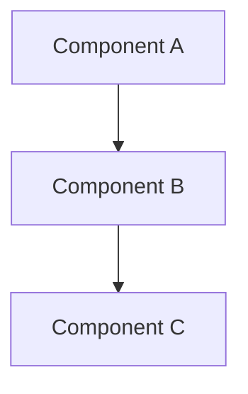
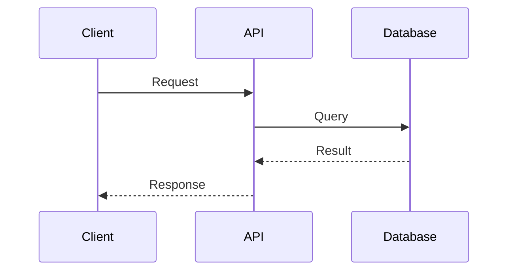

# Command: Generate

## Purpose

Creates comprehensive documentation from codebase analysis, matching project structure and conventions.

## Usage

```bash
/docs:generate $ARGUMENTS
```

**Arguments**:

- `$1` (type): Documentation type (api, user, developer, or all) (optional)
- `$2` (--output): Output directory for generated docs (optional)
- `$3` (--include-examples): Include code examples in documentation (optional)

**$ARGUMENTS Examples**:

- `$ARGUMENTS = "api --output=docs/api"` - Generate API docs in specific directory
- `$ARGUMENTS = "user --include-examples"` - User documentation with examples
- `$ARGUMENTS = "all"` - Generate all documentation types

## Process

1. Analyze project structure to understand architecture and patterns based on $ARGUMENTS type
2. Extract information from code, configurations, and existing documentation
3. Generate contextually appropriate documentation for the project type
4. Follow established documentation standards and formats
5. **README.md Synchronization**: Update README.md with new documentation structure and links
6. Validate README links match actual documentation files and sections
7. Ensure consistency with existing style and conventions

## Mermaid Diagram Integration

Use Mermaid charts to enhance documentation clarity:

**Architecture Diagrams**:



**Sequence Diagrams for API Flows**:



**When to Include Mermaid**:

- System architecture overviews
- Component relationships
- Data flow diagrams
- Process workflows

## Agent Integration

- **Domain Analyst**: documentation-analyst - Can be invoked to assess documentation completeness and identify gaps before generation

## Examples

```bash
