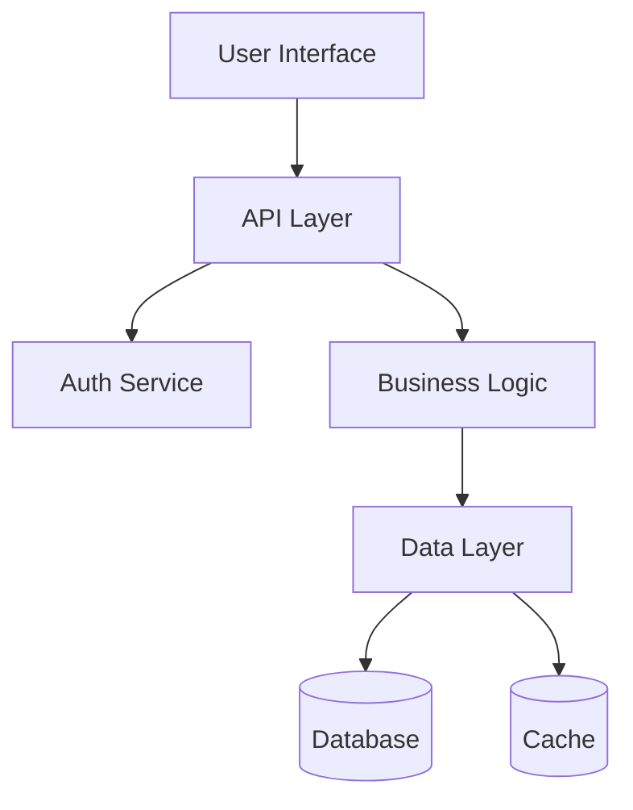
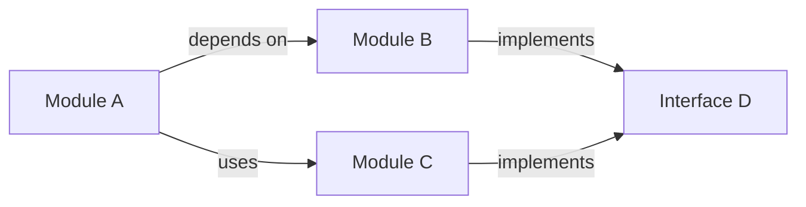
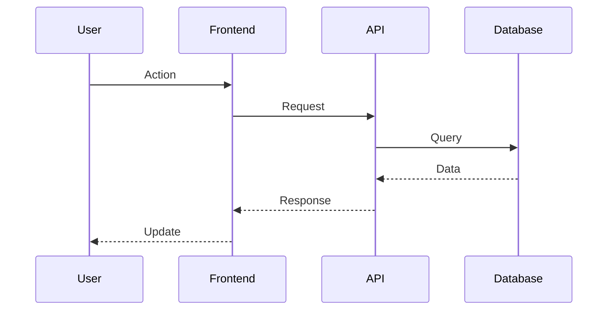

# Command: Architecture

## EXECUTION INSTRUCTIONS (START HERE)

### ⚠️ MANDATORY: Read This BEFORE Proceeding

**YOU MUST:**
1. ✓ Parse input from $ARGUMENTS
2. ✓ Execute core operation
3. ✓ Generate or update required outputs
4. ✓ Report status and results

**YOU MUST NOT:**
- ✗ Do nothing silently
- ✗ Skip required operations
- ✗ Leave work incomplete

---

## Framework Structure (S-Tier Pattern)

### APE Framework (General Purpose)

**A**ction: Analyze entire application architecture via parallel multi-perspective analysis (structure, patterns, data-flow, dependencies via Task tool), component mapping (modules/packages/responsibilities/relationships), pattern recognition (MVC/MVP/Observer/Factory/custom conventions), system integration analysis (request-response flows, data pipelines, shared state), Mermaid diagram generation (system/component/sequence/data-flow diagrams)

**P**urpose: Provide comprehensive system understanding through architectural overview, identify design patterns and conventions for consistency, document component relationships and integration points, support onboarding and knowledge transfer, enable informed architectural decisions and extensions, visualize architecture through clear diagrams

**E**xpectation: Comprehensive architectural analysis with high-level system diagram, component map with responsibilities, key architectural decisions and trade-offs, data flow descriptions and interaction patterns, Mermaid diagrams (system architecture, component interaction, data flow, deployment), improvement recommendations, focus-specific deep-dives if requested (data-flow/modules/patterns/dependencies)

## Analysis Options

| Option | Action | Recommendation |
|--------|--------|-----------------|
| **A** | Analyze full application architecture from codebase | **← Recommended** for comprehensive understanding |
| **B** | Focus on specific subsystem or component | For targeted analysis of one area |
| **C** | Analyze patterns and dependencies only | For high-level overview without full structure |

Your choice (A/B/C)?

## Next Steps

| Step | Action | Details |
|------|--------|---------|
| 1 | Review generated architecture diagram | Understand components, layers, and dependencies |
| 2 | Identify refactoring opportunities | Note anti-patterns or architectural issues |
| 3 | Document architectural decisions | Create guide for future maintainers |
| 4 | Continue analysis or refactor | Implement improvements based on findings |

What would you like to do next?

## Quality Standards (CARE)

**Target**: 85+ overall (Completeness >95% component coverage, Accuracy >90% pattern identification, Relevance >85% actionable insights, Efficiency <60s typical analysis)

## Explicit Constraints

**IN SCOPE**: Architectural analysis (structure/patterns/data-flow/dependencies), parallel multi-perspective analysis (via Task tool), component mapping (modules/responsibilities/relationships/interfaces), pattern recognition (common + custom patterns), system integration analysis (flows/pipelines/communication), Mermaid diagram generation (system/component/sequence/data-flow), focus areas (data-flow/modules/patterns/dependencies), depth levels (overview/detailed/comprehensive)
**OUT OF SCOPE**: Code refactoring (analysis only), implementation changes, performance optimization (identify patterns only), security analysis (use security-analyst), detailed code review (use /explain:code), test generation

## Purpose

Analyzes entire application to understand architecture, patterns, and how components work together, providing comprehensive system overview.

## User Feedback

| Option | Action | Details |
|--------|--------|---------|
| A | Default workflow | [RECOMMENDED] |
| B | Alternative approach | For different use case |
| C | Skip | Exit without changes |

Your choice (A/B/C)?

## Next Steps

| Option | Action | Command |
|--------|--------|---------|
| 1 | Review output | Check generated content |
| 2 | Iterate or refine | Run command again [RECOMMENDED] |
| 3 | Continue workflow | Proceed to next step |
| 4 | Get help | Use /claude:guru for guidance |

What would you like to do next?


## Usage

```bash
/explain:architecture $ARGUMENTS
```

**Arguments**:

- `$1` (focus): Specific architectural aspect (data-flow, modules, patterns, dependencies) (optional)
- `$2` (--depth): Analysis depth (overview, detailed, comprehensive) (optional)
- `$3` (--format): Output format (text, diagram, markdown) (optional)
- `$4` (--include-dependencies): Include external dependency analysis (optional)

**$ARGUMENTS Examples**:

- `$ARGUMENTS = "data-flow --format=diagram"` - Generate data flow diagram
- `$ARGUMENTS = "--depth=comprehensive --include-dependencies"` - Full analysis with dependencies
- `$ARGUMENTS = "modules --format=markdown"` - Module documentation in markdown

## Process

1. **Parallel Architecture Analysis**: Use Task() to examine different architectural dimensions:

   ```python
   Task("analyze-structure", "Map directory structure, modules, and component organization")
   Task("analyze-patterns", "Identify design patterns, architectural styles, and conventions")
   Task("analyze-data-flow", "Trace data flow and communication patterns between components")
   Task("analyze-dependencies", "Map internal and external dependencies and relationships")
   ```

2. **Component Mapping**: Build comprehensive understanding of system structure based on $ARGUMENTS focus:
   - Identify main modules, packages, and their responsibilities
   - Map component relationships and interfaces
   - Analyze layering and separation of concerns
   - Document entry points and main execution flows

3. **Pattern Recognition**: Identify architectural and design patterns:
   - Recognize common patterns (MVC, MVP, Observer, Factory, etc.)
   - Identify custom architectural conventions
   - Analyze code organization principles
   - Document configuration and setup patterns

4. **System Integration Analysis**: Understand how components work together:
   - Trace request/response flows
   - Map data transformation pipelines
   - Identify shared state and communication mechanisms
   - Analyze error handling and logging strategies

5. **Documentation Generation**: Create clear architectural overview:
   - High-level system diagram and component map
   - Key architectural decisions and trade-offs
   - Data flow descriptions and interaction patterns
   - Recommendations for improvements or extensions

## Mermaid Diagram Integration

Always include Mermaid diagrams when explaining architecture:

**System Architecture Diagrams**:



**Component Interaction Diagrams**:



**Data Flow Diagrams**:



**When to Include Mermaid**:

- High-level system architecture
- Module dependencies and relationships
- Request/response flows
- Data transformation pipelines
- Service communication patterns
- Deployment architecture

## Agent Integration

- **Specialist Options**: documenter specialist can be spawned for analyzing and documenting complex system architectures with clear explanations

## Parallelization Patterns

**Multi-Perspective Analysis**: Simultaneously analyze structure, patterns, data flow, and dependencies to build complete architectural picture.

**Cross-Component Tracing**: Run parallel analysis across different components to understand integration patterns and communication flows.

## Examples

```bash
# Comprehensive architecture analysis
/explain:architecture --depth=comprehensive

# Focus on data flow patterns
/explain:architecture data-flow --format=diagram

# Include external dependencies
/explain:architecture --include-dependencies
```
