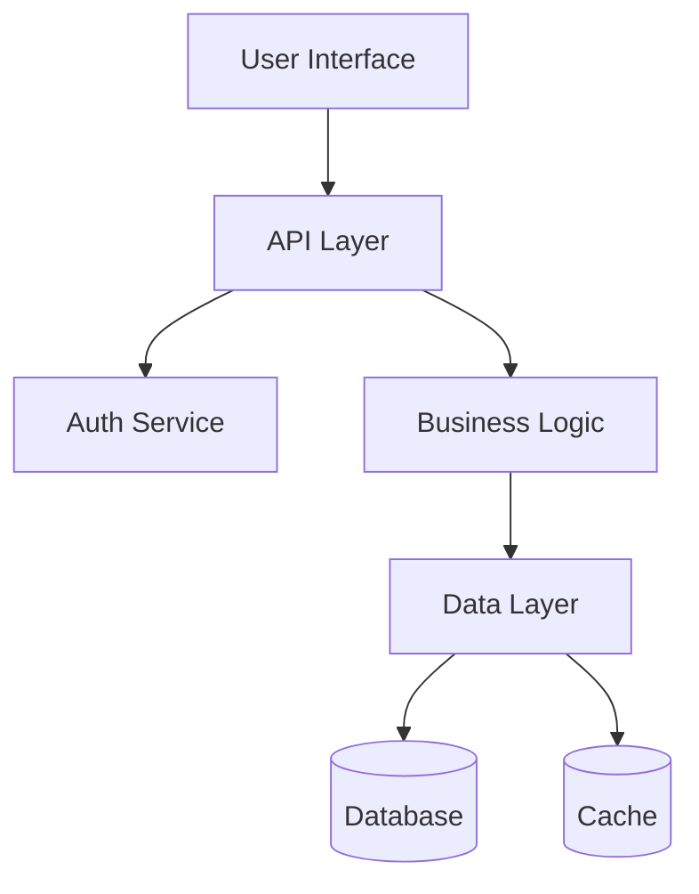
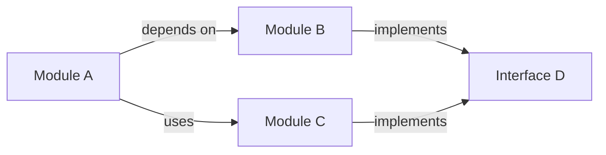
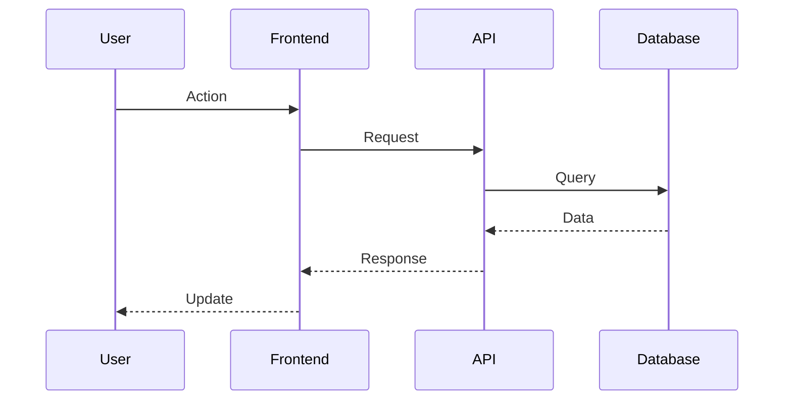

# Command: Architecture

## Purpose

Analyzes entire application to understand architecture, patterns, and how components work together, providing comprehensive system overview.

## Usage

```bash
/explain:architecture $ARGUMENTS
```

**Arguments**:

- `$1` (focus): Specific architectural aspect (data-flow, modules, patterns, dependencies) (optional)
- `$2` (--depth): Analysis depth (overview, detailed, comprehensive) (optional)
- `$3` (--format): Output format (text, diagram, markdown) (optional)
- `$4` (--include-dependencies): Include external dependency analysis (optional)

**$ARGUMENTS Examples**:

- `$ARGUMENTS = "data-flow --format=diagram"` - Generate data flow diagram
- `$ARGUMENTS = "--depth=comprehensive --include-dependencies"` - Full analysis with dependencies
- `$ARGUMENTS = "modules --format=markdown"` - Module documentation in markdown

## Process

1. **Parallel Architecture Analysis**: Use Task() to examine different architectural dimensions:

   ```python
   Task("analyze-structure", "Map directory structure, modules, and component organization"),
   Task("analyze-patterns", "Identify design patterns, architectural styles, and conventions"),
   Task("analyze-data-flow", "Trace data flow and communication patterns between components"),
   Task("analyze-dependencies", "Map internal and external dependencies and relationships")
   ```

2. **Component Mapping**: Build comprehensive understanding of system structure based on $ARGUMENTS focus:
   - Identify main modules, packages, and their responsibilities
   - Map component relationships and interfaces
   - Analyze layering and separation of concerns
   - Document entry points and main execution flows

3. **Pattern Recognition**: Identify architectural and design patterns:
   - Recognize common patterns (MVC, MVP, Observer, Factory, etc.)
   - Identify custom architectural conventions
   - Analyze code organization principles
   - Document configuration and setup patterns

4. **System Integration Analysis**: Understand how components work together:
   - Trace request/response flows
   - Map data transformation pipelines
   - Identify shared state and communication mechanisms
   - Analyze error handling and logging strategies

5. **Documentation Generation**: Create clear architectural overview:
   - High-level system diagram and component map
   - Key architectural decisions and trade-offs
   - Data flow descriptions and interaction patterns
   - Recommendations for improvements or extensions

## Mermaid Diagram Integration

Always include Mermaid diagrams when explaining architecture:

**System Architecture Diagrams**:



**Component Interaction Diagrams**:



**Data Flow Diagrams**:



**When to Include Mermaid**:

- High-level system architecture
- Module dependencies and relationships
- Request/response flows
- Data transformation pipelines
- Service communication patterns
- Deployment architecture

## Agent Integration

- **Specialist Options**: documenter specialist can be spawned for analyzing and documenting complex system architectures with clear explanations

## Parallelization Patterns

**Multi-Perspective Analysis**: Simultaneously analyze structure, patterns, data flow, and dependencies to build complete architectural picture.

**Cross-Component Tracing**: Run parallel analysis across different components to understand integration patterns and communication flows.

## Examples

```bash
# Comprehensive architecture analysis
/explain:architecture $ARGUMENTS
# where $ARGUMENTS = "--depth=comprehensive"

# Focus on data flow patterns
/explain:architecture $ARGUMENTS
# where $ARGUMENTS = "data-flow --format=diagram"

# Include external dependencies
/explain:architecture $ARGUMENTS
# where $ARGUMENTS = "--include-dependencies"
