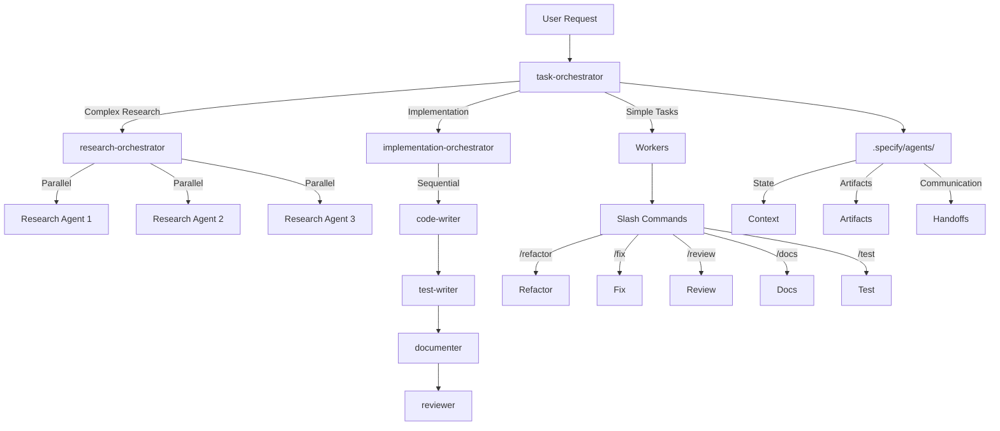
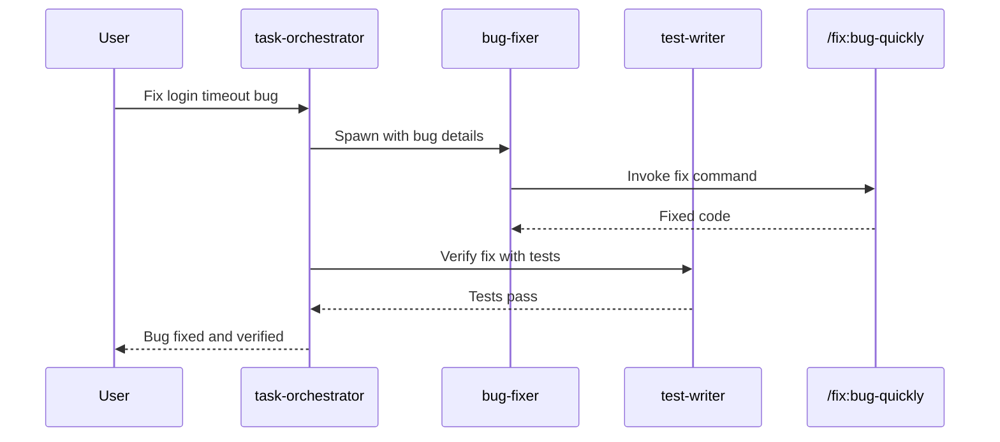
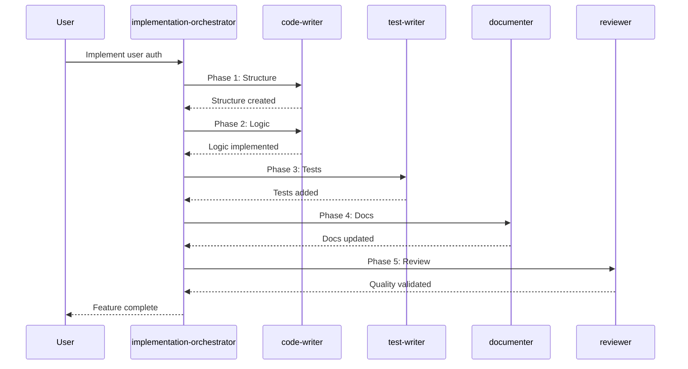

# Agent Orchestra Framework Documentation

## Overview

The Agent Orchestra Framework is a multi-agent system implementation for Claude Code that follows Anthropic's proven patterns for parallel execution and task coordination. It replaces the previous domain-based MECE agents with task-focused orchestrators and workers.

## Architecture



## Core Components

### 1. Orchestrators (3 agents)

#### task-orchestrator
- **Role**: General task coordinator
- **Analyzes**: Task complexity (simple/moderate/complex)
- **Spawns**: 1-5 workers based on needs
- **Uses**: TodoWrite for tracking, SlashCommand for delegation

#### research-orchestrator
- **Role**: Parallel information gathering
- **Pattern**: Breadth-first search
- **Spawns**: 3-10+ agents simultaneously
- **Strength**: No interference between parallel agents

#### implementation-orchestrator
- **Role**: Sequential code changes
- **Pattern**: Depth-first execution
- **Manages**: File dependencies and state
- **Ensures**: Consistency and proper order

### 2. Workers (5 specialized agents)

#### code-writer
- **Focus**: Code generation only
- **Commands**: `/refactor:large-scale`, `/implement`
- **NO**: Testing, documentation, or review

#### test-writer
- **Focus**: Test creation only
- **Commands**: `/test`, `/spec-kit:tasks`
- **Detects**: Framework automatically

#### bug-fixer
- **Focus**: Debugging only
- **Commands**: `/fix:bug-quickly`, `/analyze:potential-issues`
- **Process**: Reproduce → Isolate → Fix → Verify

#### reviewer
- **Focus**: Code analysis only
- **Commands**: `/review:code`, `/review:security`
- **Parallel**: Can run multiple review types

#### documenter
- **Focus**: Documentation only
- **Commands**: `/docs:generate`, `/docs:api`
- **Formats**: README, API, inline comments

## Execution Patterns

### Parallel Pattern [P]
```
research-orchestrator spawns:
  [P] Agent 1: Search codebase
  [P] Agent 2: Check documentation
  [P] Agent 3: Analyze dependencies
  [P] Agent 4: Review best practices
  [P] Agent 5: Security scan
```

### Sequential Pattern
```
implementation-orchestrator coordinates:
  1. code-writer → Create structure
  2. code-writer → Implement logic (depends on 1)
  3. test-writer → Add tests (depends on 2)
  4. documenter → Update docs (depends on 3)
```

### Hybrid Pattern
```
Phase 1 (Parallel research):
  [P] Research existing patterns
  [P] Analyze requirements
Phase 2 (Sequential implementation):
  1. Design solution
  2. Implement code
  3. Add tests
```

## Memory System

Located in `.specify/agents/`:

```
.specify/agents/
├── context/              # Task state
│   ├── task-state.json  # Current execution
│   └── worker-states/   # Agent progress
├── artifacts/           # Work products
│   └── [session-id]/   # Session artifacts
└── handoffs/           # Agent communication
    └── [task-id].md    # Handoff documents
```

### State Tracking Example
```json
{
  "task_id": "auth-feature-2025",
  "orchestrator": "implementation-orchestrator",
  "complexity": "moderate",
  "phases": {
    "setup": "complete",
    "implementation": "in_progress",
    "testing": "pending"
  },
  "workers_active": ["code-writer"],
  "slash_commands_used": ["/implement", "/refactor:large-scale"]
}
```

## Slash Command Integration

Workers use slash commands as atomic tools:

| Worker | Primary Commands | Purpose |
|--------|-----------------|---------|
| code-writer | `/refactor`, `/implement` | Code generation |
| test-writer | `/test`, `/spec-kit:tasks` | Test creation |
| bug-fixer | `/fix:bug-quickly`, `/analyze` | Debugging |
| reviewer | `/review:code`, `/review:security` | Quality checks |
| documenter | `/docs:generate`, `/docs:api` | Documentation |

## Workflow Examples

### Bug Fix Workflow


### Feature Implementation


## Benefits

1. **50% Faster Execution**: Parallel agents for independent tasks
2. **Better Focus**: Each agent has single responsibility
3. **Slash Command Reuse**: Leverages existing 45 commands
4. **State Persistence**: Memory system tracks progress
5. **Cleaner Context**: Narrow agent prompts reduce tokens

## Migration from MECE Agents

| Old MECE Agent | New Approach |
|----------------|--------------|
| backend-engineering | task-orchestrator → code-writer |
| frontend-engineering | task-orchestrator → code-writer |
| quality-engineering | task-orchestrator → reviewer + test-writer |
| devops-engineering | Keep as specialist (rare use) |
| product-strategy | research-orchestrator → multiple agents |
| security-compliance | reviewer with `/review:security` |
| developer-experience | documenter with `/docs` commands |
| maintenance-support | bug-fixer with `/fix` commands |

## Best Practices

1. **Start Simple**: Use task-orchestrator for most requests
2. **Let Orchestrators Decide**: They analyze complexity
3. **Preserve State**: Use memory for long tasks
4. **Parallel When Possible**: Research benefits most
5. **Sequential When Needed**: Code changes require order

## Important Constraints

- **NO automatic git operations**: All git commands require explicit user consent
- **Slash commands are tools**: Agents use them, not vice versa
- **Memory in .specify/agents/**: Separate from spec-kit features
- **Worker focus**: Each worker does ONE thing only

## Future Enhancements

- Add more specialist workers as needed
- Create domain-specific orchestrators
- Enhance memory with vector storage
- Add agent performance metrics
- Build agent communication protocols