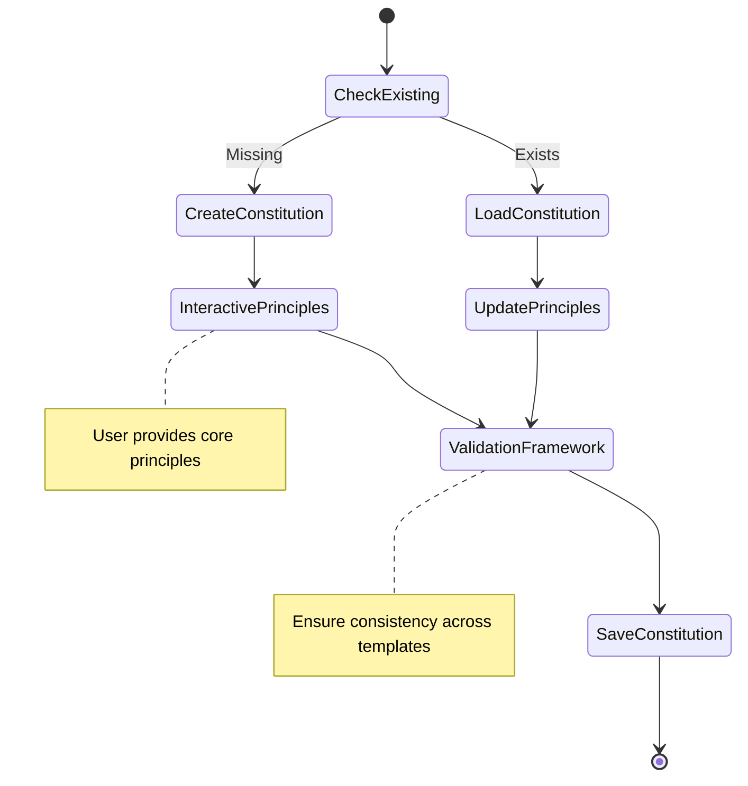
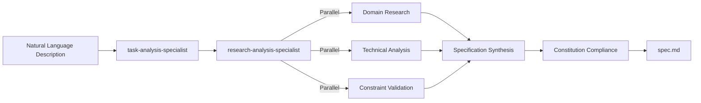
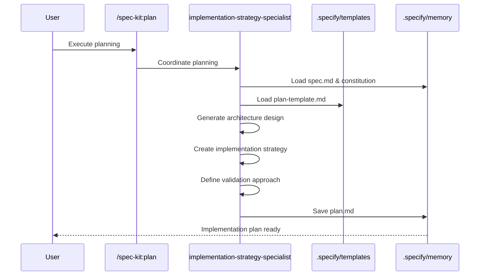
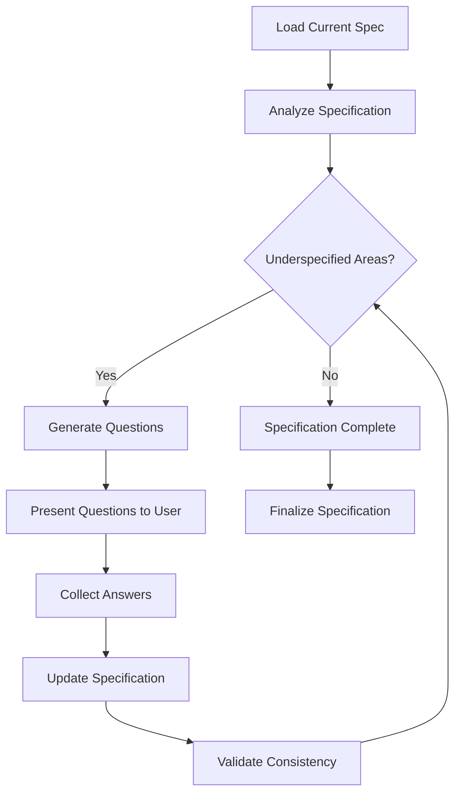
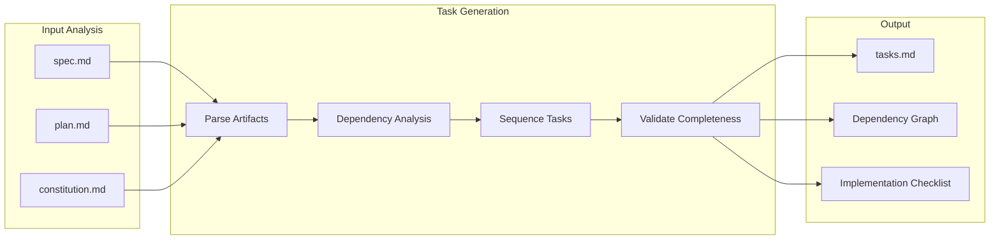
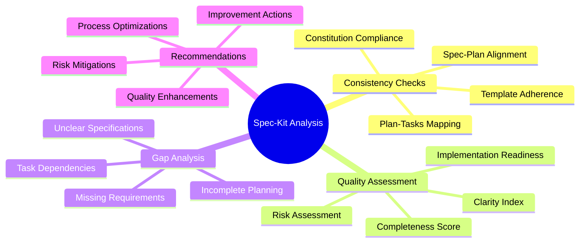
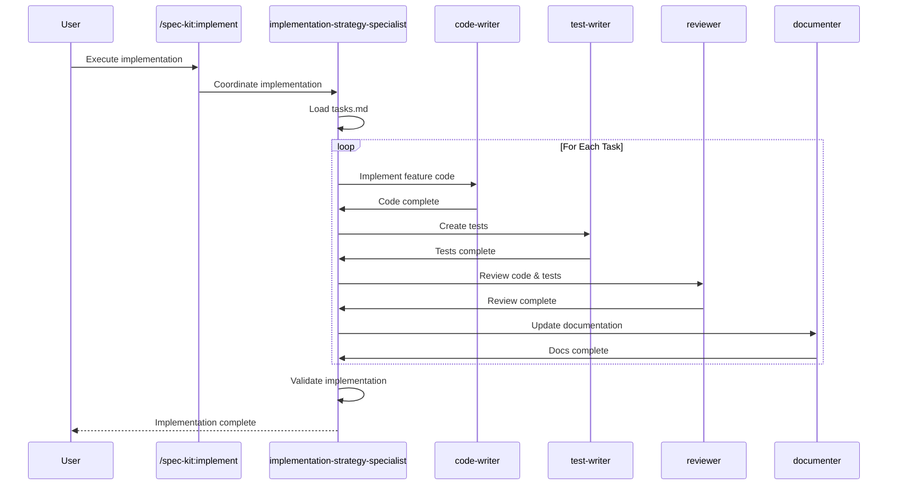
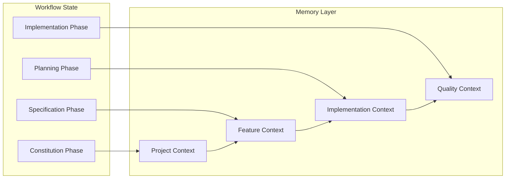
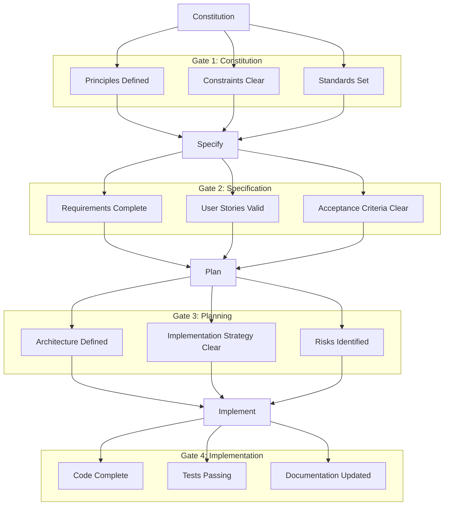

# Spec-Kit Workflow Documentation

## Overview

The Spec-Kit workflow is a comprehensive feature development system that
guides projects from initial concept to implementation. It provides structured templates, validation frameworks,
and integration with the Agent Specialist Framework to ensure consistent, high-quality feature development.

## Complete Workflow Architecture

```mermaid
flowchart TD
    Start([New Feature Request]) --> Constitution[/spec-kit:constitution]
    Constitution --> |Project Principles| Specify[/spec-kit:specify]
    Specify --> |Feature Specification| Plan[/spec-kit:plan]
    Plan --> |Implementation Plan| Clarify[/spec-kit:clarify]
    Clarify --> |Refined Specification| Tasks[/spec-kit:tasks]
    Tasks --> |Task Breakdown| Analyze[/spec-kit:analyze]
    Analyze --> |Quality Validation| Implement[/spec-kit:implement]
    Implement --> |Working Feature| Done([Complete])

    subgraph "Validation Points"
        V1[Constitution Validation]
        V2[Specification Quality]
        V3[Implementation Feasibility]
        V4[Requirement Clarity]
        V5[Task Completeness]
        V6[Cross-Artifact Consistency]
        V7[Implementation Success]
    end

    Constitution -.-> V1
    Specify -.-> V2
    Plan -.-> V3
    Clarify -.-> V4
    Tasks -.-> V5
    Analyze -.-> V6
    Implement -.-> V7

    subgraph "Memory System"
        Memory[.specify/ Directory]
        Constitution --> Memory
        Specify --> Memory
        Plan --> Memory
        Tasks --> Memory
        Memory --> Templates[Templates]
        Memory --> Agents[Agent Context]
    end
```

## Workflow Steps Detailed

### 1. Constitution (`/spec-kit:constitution`)

**Purpose**: Establish project principles and constraints

**Process Flow**:



**Output**: `constitution.md` with project principles, constraints, and validation rules

**Template Structure**:

```markdown
# Project Constitution

## Core Principles
1. [Principle 1]
2. [Principle 2]

## Technical Constraints
- [Constraint 1]
- [Constraint 2]

## Quality Standards
- [Standard 1]
- [Standard 2]

## Validation Rules
- [Rule 1]
- [Rule 2]
```

### 2. Specify (`/spec-kit:specify`)

**Purpose**: Create detailed feature specification from natural language description

**Agent Integration**:



**Output**: `spec.md` with comprehensive feature specification

**Template Structure**:

```markdown
# Feature Specification: [Feature Name]

## Overview
[Brief description and purpose]

## Requirements
### Functional Requirements
- [Requirement 1]
- [Requirement 2]

### Non-Functional Requirements
- Performance: [Specifications]
- Security: [Requirements]
- Usability: [Standards]

## User Stories
1. As a [user type], I want [goal] so that [benefit]
2. [Additional stories]

## Acceptance Criteria
- [Criterion 1]
- [Criterion 2]

## Constraints
- [Technical constraints]
- [Business constraints]

## Dependencies
- [Internal dependencies]
- [External dependencies]
```

### 3. Plan (`/spec-kit:plan`)

**Purpose**: Generate implementation plan using design templates

**Planning Flow**:



**Output**: `plan.md` with detailed implementation approach

**Template Structure**:

```markdown
# Implementation Plan: [Feature Name]

## Architecture Overview
[High-level design decisions]

## Implementation Strategy
### Phase 1: [Phase Name]
- [Task 1]
- [Task 2]

### Phase 2: [Phase Name]
- [Task 1]
- [Task 2]

## Technical Approach
### Technologies
- [Technology 1]: [Justification]
- [Technology 2]: [Justification]

### Design Patterns
- [Pattern 1]: [Usage]
- [Pattern 2]: [Usage]

## Risk Assessment
- [Risk 1]: [Mitigation]
- [Risk 2]: [Mitigation]

## Validation Strategy
- [Testing approach]
- [Quality gates]
```

### 4. Clarify (`/spec-kit:clarify`)

**Purpose**: Identify and resolve underspecified areas

**Clarification Process**:



**Question Categories**:

1. **Functional Gaps**: Missing requirements or behaviors
2. **Technical Details**: Implementation specifics needed
3. **User Experience**: Interface and interaction clarification
4. **Edge Cases**: Boundary conditions and error handling
5. **Integration Points**: External system interactions

**Output**: Updated `spec.md` with clarified requirements

### 5. Tasks (`/spec-kit:tasks`)

**Purpose**: Generate actionable, dependency-ordered task breakdown

**Task Generation Flow**:



**Task Categories**:

- **Setup Tasks**: Environment preparation
- **Core Implementation**: Primary feature development
- **Integration Tasks**: System integration points
- **Testing Tasks**: Validation and quality assurance
- **Documentation Tasks**: User and developer documentation
- **Deployment Tasks**: Release preparation

**Output**: `tasks.md` with ordered task list

### 6. Analyze (`/spec-kit:analyze`)

**Purpose**: Cross-artifact consistency and quality analysis

**Analysis Framework**:



**Analysis Outputs**:

1. **Consistency Report**: Alignment between artifacts
2. **Quality Metrics**: Objective quality scores
3. **Gap Identification**: Areas needing attention
4. **Recommendations**: Actionable improvements

### 7. Implement (`/spec-kit:implement`)

**Purpose**: Execute implementation plan with Agent Specialist Framework coordination

**Implementation Orchestration**:



## Memory System Architecture

### Directory Structure

```text
.specify/
├── memory/
│   ├── constitution.md      # Project principles
│   ├── spec.md             # Feature specification
│   ├── plan.md             # Implementation plan
│   └── tasks.md            # Task breakdown
├── templates/
│   ├── spec-template.md    # Specification template
│   ├── plan-template.md    # Planning template
│   ├── tasks-template.md   # Task template
│   └── agent-file-template.md
├── agents/
│   ├── context/            # Agent memory context
│   ├── handoffs/           # Inter-agent communication
│   └── state/              # Persistent agent state
└── artifacts/
    ├── diagrams/           # Generated diagrams
    ├── documentation/      # Generated docs
    └── validation/         # Quality reports
```

### Memory Persistence Patterns

**Context Preservation**:



## Integration with Agent Specialist Framework

### Agent Workflow Mapping

| Spec-Kit Command | Primary Agent | Secondary Agents | Purpose |
|------------------|---------------|------------------|---------|
| constitution | task-analysis-specialist | documenter | Principle establishment |
| specify | research-analysis-specialist | Multiple parallel | Requirement gathering |
| plan | implementation-strategy-specialist | code-writer | Architecture design |
| clarify | task-analysis-specialist | research-analysis-specialist | Gap resolution |
| tasks | implementation-strategy-specialist | - | Task breakdown |
| analyze | reviewer | documenter | Quality validation |
| implement | implementation-strategy-specialist | All execution specialists | Feature creation |

### Coordination Patterns

**Research Phase** (specify, clarify):

```python
# Parallel information gathering
research_analysis_specialist.spawn([
    research_agent_1("domain_analysis"),
    research_agent_2("technical_requirements"),
    research_agent_3("constraint_validation"),
    research_agent_4("user_story_development")
])
```

**Implementation Phase** (implement):

```python
# Sequential implementation
implementation_strategy_specialist.execute([
    code_writer("core_feature_implementation"),
    test_writer("comprehensive_test_suite"),
    reviewer("code_quality_review"),
    documenter("user_documentation")
])
```

## Quality Gates & Validation

### Gate Definitions



### Automated Validation

**Quality Metrics**:

```python
def validate_specification_quality(spec_md):
    metrics = {
        'completeness': calculate_completeness_score(spec_md),
        'clarity': assess_requirement_clarity(spec_md),
        'testability': evaluate_testability(spec_md),
        'consistency': check_internal_consistency(spec_md)
    }
    return metrics

def gate_validation(phase, artifacts):
    rules = load_constitution_rules()
    results = []

    for rule in rules[phase]:
        result = validate_rule(rule, artifacts)
        results.append(result)

    return all(results)
```

## Advanced Usage Patterns

### Iterative Development

```bash
# Initial specification
claude /spec-kit:specify "User authentication system"

# Refine through multiple clarification rounds
claude /spec-kit:clarify
# [Answer questions]

claude /spec-kit:clarify
# [Answer more questions]

# Generate plan when specification is complete
claude /spec-kit:plan
claude /spec-kit:tasks
claude /spec-kit:analyze
claude /spec-kit:implement
```

### Partial Workflow Usage

```bash
# Use only planning components
claude /spec-kit:constitution
claude /spec-kit:plan
claude /implement  # Direct implementation

# Use only quality components
claude /spec-kit:analyze
claude /review:comprehensive
```

### Cross-Feature Integration

```bash
# Build on existing constitution
claude /spec-kit:specify "Payment integration" --use-existing-constitution

# Reference existing features
claude /spec-kit:plan --reference-feature "user-auth"
```

## Troubleshooting & Best Practices

### Common Issues

**Incomplete Specifications**:

- Use multiple clarification rounds
- Review against constitution principles
- Validate with domain experts

**Planning Complexity**:

- Break into smaller features
- Use iterative planning approach
- Focus on MVP first

**Implementation Bottlenecks**:

- Review task dependencies
- Parallelize independent work streams
- Use incremental delivery

### Best Practices

1. **Constitution First**: Always establish project principles before feature work
2. **Iterative Refinement**: Use multiple clarify rounds for complex features
3. **Quality Gates**: Don't skip analysis phase
4. **Memory Preservation**: Keep all artifacts for reference
5. **Agent Coordination**: Let analysis specialists handle complex workflows

The Spec-Kit workflow provides a structured, validated approach to feature development that
integrates seamlessly with the Agent Specialist Framework for comprehensive, high-quality software delivery.
