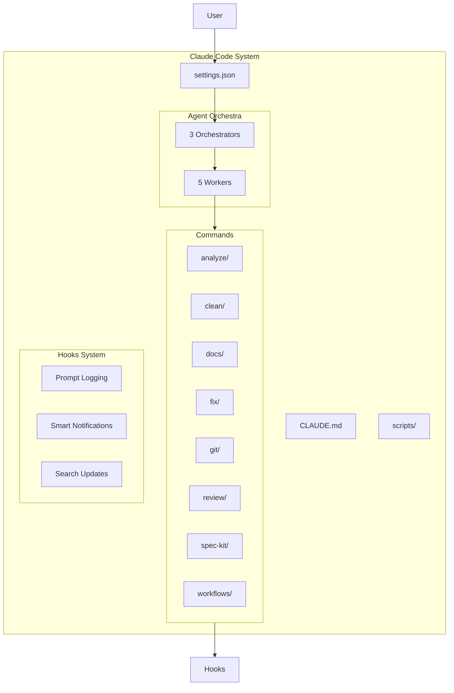

# Developer Guide - Claude Code Command System

## Architecture Overview

The Claude Code Command System is built on the **Agent Orchestra Framework**, a task-focused coordination system that replaces traditional domain-based agents with specialized orchestrators and workers.

### System Components



## Agent Orchestra Framework

### Orchestrators (Coordination Layer)

#### 1. task-orchestrator
**Purpose**: General task coordination and delegation
- Analyzes task complexity
- Delegates to appropriate workers
- Manages TodoWrite tracking
- Uses SlashCommand for delegation

#### 2. research-orchestrator
**Purpose**: Parallel information gathering
- Spawns multiple research agents
- Coordinates breadth-first search patterns
- Aggregates findings from parallel streams
- No interference between parallel agents

#### 3. implementation-orchestrator
**Purpose**: Sequential code changes
- Manages file dependencies
- Ensures proper execution order
- Maintains state consistency
- Handles complex multi-file changes

### Workers (Execution Layer)

#### 1. code-writer
- **Focus**: Code generation only
- **Commands**: `/refactor:large-scale`, `/implement`
- **Constraints**: No testing, documentation, or review

#### 2. test-writer
- **Focus**: Test creation only
- **Commands**: `/test`, `/spec-kit:tasks`
- **Capabilities**: Auto-detects test frameworks

#### 3. bug-fixer
- **Focus**: Debugging only
- **Commands**: `/fix:bug-quickly`, `/analyze:potential-issues`
- **Process**: Reproduce → Isolate → Fix → Verify

#### 4. reviewer
- **Focus**: Code analysis only
- **Commands**: `/review:code`, `/review:security`
- **Capabilities**: Can run multiple review types in parallel

#### 5. documenter
- **Focus**: Documentation only
- **Commands**: `/docs:generate`, `/docs:api`
- **Formats**: README, API docs, inline comments

## Development Standards

### Creating New Commands

#### 1. Command Structure
```
commands/{category}/{command-name}.md
```

#### 2. Command Format
```markdown
# Command: {action-verb} {object}

## Purpose
Single clear sentence describing what this command does.

## Usage
```
{command-name} [arguments]
```

## Agent Integration
- Primary agent: {agent-name}
- Secondary agents: {if-any}

## Examples
{Real usage examples}

## Integration Points
{How this connects to other commands}
```

#### 3. Naming Conventions
- **Action verb + clear object**: `analyze:performance`, `clean:code-comments`
- **No redundant prefixes**: Use category folders, not command prefixes
- **Consistent patterns**: Follow existing commands in the same category

#### 4. Categories (16 total)
- `analyze/` - Analysis and investigation
- `build/` - Building and packaging
- `clean/` - Cleanup operations
- `create/` - Code generation
- `debug/` - Debugging tools
- `deploy/` - Deployment operations
- `docs/` - Documentation
- `explain/` - Code understanding
- `fix/` - Bug fixes
- `git/` - Git operations
- `operations/` - File operations
- `review/` - Code review
- `spec-kit/` - Feature workflow
- `test/` - Testing
- `to-do/` - Task management
- `workflows/` - Multi-step workflows

### Creating New Agents

#### 1. Agent Types
- **Orchestrators**: Coordinate complex tasks
- **Workers**: Execute specific functions
- **Specialists**: Domain-specific expertise

#### 2. Agent File Structure
```
agents/{type}/{agent-name}.md
```

#### 3. Agent Definition Format
```markdown
# Agent: {agent-name}

## Role
{Single sentence describing purpose}

## Capabilities
- {Specific capability 1}
- {Specific capability 2}

## Commands
- {Primary slash commands this agent uses}

## Model Requirements
- **Model**: {opus/sonnet/haiku}
- **Reasoning**: {Why this model level}

## Think Commands Support
- **think**: {Basic analysis}
- **think hard**: {Deep analysis}
- **ultra think**: {Comprehensive planning}

## Integration
{How this agent works with others}

## Usage Patterns
{Common workflows using this agent}
```

#### 4. Agent Constraints
- **Single Responsibility**: Each agent has one clear focus
- **No Overlap**: Agents should not duplicate functionality
- **Clear Boundaries**: Well-defined interaction points
- **Tool Integration**: Use SlashCommand for delegation

### Hook Development

#### 1. Hook Types (3 supported)
- **UserPromptSubmit**: Triggered on every user input
- **Stop**: Triggered when tasks complete
- **PreToolUse**: Triggered before specific tools

#### 2. Hook Implementation
```python
# scripts/{hook-name}.py
import os
import sys
from datetime import datetime

def execute_hook():
    """Hook implementation"""
    try:
        # Your hook logic here
        pass
    except Exception as e:
        print(f"Hook error: {e}", file=sys.stderr)

if __name__ == "__main__":
    execute_hook()
```

#### 3. Hook Registration (settings.json)
```json
{
  "hooks": {
    "UserPromptSubmit": [{
      "hooks": [{
        "type": "command",
        "command": "python -c \"import os; exec(open(os.path.expanduser('~/.claude/scripts/your-hook.py')).read())\""
      }]
    }]
  }
}
```

#### 4. Hook Best Practices
- **Fast execution**: Hooks should complete quickly
- **Error handling**: Always catch and log exceptions
- **Resource cleanup**: Clean up temporary files
- **Security**: Never log sensitive information

### Security Guidelines

#### 1. Permission Management
```json
{
  "permissions": {
    "allow": ["Safe operations"],
    "deny": ["Sensitive patterns"]
  }
}
```

#### 2. Git Operations Constraints
- **CRITICAL**: Only `/git/*` commands can perform Git operations
- **All other agents**: Must use SlashCommand to delegate Git operations
- **No direct Git**: Agents cannot call git commands directly
- **Explicit consent**: All Git operations require user approval

#### 3. Secret Protection
- **Blocked patterns**: `.env*`, `*.key`, `*.pem`, `secrets/`, `credentials/`
- **No logging**: Never log API keys, tokens, or passwords
- **Environment variables**: Use secure environment variable patterns

### Testing Guidelines

#### 1. Command Testing
```bash
# Test command existence
ls commands/{category}/{command}.md

# Test command format
grep -E "^# Command:" commands/{category}/{command}.md

# Test agent integration
grep -E "Primary agent:" commands/{category}/{command}.md
```

#### 2. Agent Testing
```bash
# Test agent definitions
ls agents/{type}/{agent}.md

# Test model requirements
grep -E "Model:" agents/{type}/{agent}.md

# Test integration points
grep -E "Commands:" agents/{type}/{agent}.md
```

#### 3. Integration Testing
- Test Agent Orchestra coordination
- Verify command delegation works
- Ensure Git constraints are enforced
- Validate hook execution

## Advanced Customization

### Model Selection Strategy
- **Opus**: Planning-heavy orchestrators (task, research, implementation)
- **Sonnet**: Balanced workers (code-writer, reviewer)
- **Haiku**: Simple workers (bug-fixer for obvious issues)

### Think Commands Integration
```markdown
## Think Commands Support
- **think**: Basic analysis and straightforward problem solving
- **think hard**: Deep analysis, complex reasoning, multi-step problems
- **ultra think**: Comprehensive planning, architectural decisions, complex debugging
```

### Orchestrator Delegation Logic
```python
# Pseudocode for orchestrator decision-making
def delegate_task(task_complexity, task_type):
    if complexity == "simple":
        return direct_worker_assignment()
    elif complexity == "moderate":
        return sequential_worker_coordination()
    elif complexity == "complex":
        return parallel_orchestrator_coordination()
```

### Extension Points

#### 1. New Command Categories
1. Create new category folder: `commands/{new-category}/`
2. Add category to CLAUDE.md command list
3. Update documentation
4. Create first command in category

#### 2. New Agent Types
1. Define in appropriate folder: `agents/{type}/`
2. Follow Agent Orchestra patterns
3. Ensure no overlap with existing agents
4. Document integration points

#### 3. Custom Workflows
1. Create in `commands/workflows/`
2. Use `run-{workflow-name}.md` format
3. Orchestrate multiple commands
4. Document step dependencies

## Quality Standards

### Code Quality
- **Consistency**: Follow existing patterns
- **Documentation**: Every command and agent documented
- **Testing**: Validate functionality before deployment
- **Security**: Enforce permission and Git constraints

### Documentation Quality
- **Clear Purpose**: Every component has obvious purpose
- **Usage Examples**: Real-world usage patterns
- **Integration Points**: How components work together
- **Troubleshooting**: Common issues and solutions

### Maintenance
- **Regular Reviews**: Audit commands and agents for overlap
- **Performance Monitoring**: Track command execution times
- **User Feedback**: Incorporate usage patterns
- **Security Updates**: Keep permissions current

## Migration Patterns

### From MECE to Agent Orchestra
1. **Identify domain agent**: Map old MECE agent to new pattern
2. **Extract responsibilities**: Break into orchestrator/worker tasks
3. **Update references**: Change agent calls to orchestrator calls
4. **Test integration**: Ensure coordination works
5. **Update documentation**: Reflect new patterns

### Command Evolution
1. **Deprecation**: Mark old commands as deprecated
2. **Migration path**: Provide clear upgrade instructions
3. **Backward compatibility**: Maintain for transition period
4. **Documentation**: Update all references
5. **Cleanup**: Remove deprecated commands after transition

This guide provides the foundation for extending and customizing the Claude Code Command System. Follow these patterns to maintain consistency and quality across the system.