# Developer Workflows with Agent Orchestra

This guide provides practical workflows for developers using the Agent Orchestra framework and command system across different project scenarios. All 49 commands across 13 categories are demonstrated in real workflow contexts.

## Table of Contents

- [🎯 Quick Reference](#-quick-reference)
  - [Project Types](#project-types)
  - [Core Workflows](#core-workflows)
  - [Command Categories (50 Total Commands)](#command-categories-50-total-commands)
- [📊 Visual Workflow Overview](#-visual-workflow-overview)
- [🌱 Greenfield Project Workflows](#-greenfield-project-workflows)
  - [Visual: Greenfield Development Flow](#visual-greenfield-development-flow)
  - [Starting a New Project](#starting-a-new-project)
    - [1. Project Foundation Setup](#1-project-foundation-setup-4-commands)
    - [2. Architecture Planning - Complex Projects](#2-architecture-planning---complex-projects-7-commands)
    - [3. First Feature Development Options](#3-first-feature-development-options)
  - [Complete Example: E-commerce Platform from Scratch](#complete-example-e-commerce-platform-from-scratch)
- [🏗️ Brownfield Project Workflows](#️-brownfield-project-workflows)
  - [Visual: Brownfield Analysis & Improvement Flow](#visual-brownfield-analysis--improvement-flow)
  - [Taking Over an Existing Project](#taking-over-an-existing-project)
    - [1. Project Discovery Phase](#1-project-discovery-phase-all-3-analyze-commands)
    - [2. Understanding Phase](#2-understanding-phase-all-explain--docs-commands)
    - [3. Quality Assessment](#3-quality-assessment-all-review--workflows-commands)
    - [4. Planning Phase](#4-planning-phase-all-to-do-commands)
    - [5. Standardization Phase](#5-standardization-phase-clean--refactor-commands)
  - [Complete Example: Legacy React App Handover](#complete-example-legacy-react-app-handover)
  - [Brownfield Success Metrics](#brownfield-success-metrics)
- [➕ Feature Addition Workflows](#-feature-addition-workflows)
  - [Visual: Feature Complexity Decision Tree](#visual-feature-complexity-decision-tree)
  - [Adding Features to Existing Projects](#adding-features-to-existing-projects)
    - [Simple Features: Direct Implementation](#simple-features-direct-implementation-4-6-commands)
    - [Medium Features: Hybrid Approach](#medium-features-hybrid-approach-8-12-commands)
    - [Complex Features: Full Spec-Kit](#complex-features-full-spec-kit-15-commands)
  - [Complete Example: Adding Payment System](#complete-example-adding-payment-system-complex-feature)
  - [Feature Addition Command Usage by Complexity](#feature-addition-command-usage-by-complexity)
  - [Feature Development Patterns](#feature-development-patterns)
- [🔧 Maintenance & Bug Fix Workflows](#-maintenance--bug-fix-workflows)
  - [Visual: Maintenance Decision Flow](#visual-maintenance-decision-flow)
  - [Quick Bug Fixes](#quick-bug-fixes-3-5-commands)
  - [Performance Optimization Workflow](#performance-optimization-workflow-8-12-commands)
  - [Security Updates Workflow](#security-updates-workflow-6-8-commands)
  - [Complex Bug Investigation](#complex-bug-investigation-10-15-commands)
- [🔄 Workflow Decision Matrix](#-workflow-decision-matrix)
  - [When to Use Spec-Kit](#when-to-use-spec-kit)
  - [When to Use Direct Commands](#when-to-use-direct-commands)
  - [When to Use Hybrid Approach](#when-to-use-hybrid-approach)
- [🎨 Custom Workflow Examples](#-custom-workflow-examples)
  - [Rapid Prototyping Workflow](#rapid-prototyping-workflow)
  - [Code Review & Handoff Workflow](#code-review--handoff-workflow)
  - [Release Preparation Workflow](#release-preparation-workflow)
  - [Technical Debt Reduction Workflow](#technical-debt-reduction-workflow)
- [🚀 Best Practices](#-best-practices)
  - [Command Sequencing](#command-sequencing)
  - [Agent Utilization](#agent-utilization)
  - [Quality Gates](#quality-gates)
  - [Common Anti-Patterns to Avoid](#common-anti-patterns-to-avoid)
- [📋 Workflow Checklists](#-workflow-checklists)
  - [Greenfield Project Checklist](#greenfield-project-checklist)
  - [Brownfield Handover Checklist](#brownfield-handover-checklist)
  - [Feature Addition Checklist](#feature-addition-checklist)
- [🎭 Complete Command Showcase](#-complete-command-showcase)
  - [All 49 Commands in Context](#all-49-commands-in-context)
  - [Command Integration Patterns](#command-integration-patterns)
  - [Command Usage Statistics by Workflow Type](#command-usage-statistics-by-workflow-type)
  - [Universal Command Combinations](#universal-command-combinations)

## 🎯 Quick Reference

### Project Types
- **Greenfield**: Starting from scratch
- **Brownfield**: Inheriting existing codebase
- **Feature Addition**: Adding to existing project
- **Maintenance**: Bug fixes and optimization

### Core Workflows
- **Full Spec-Kit**: Complete 7-step feature development
- **Direct Implementation**: Bypass planning for simple tasks
- **Hybrid Approach**: Mix spec-kit with direct commands

### Command Categories (49 Total Commands)
```
analyze/     (3) → clean/      (4) → docs/       (6) → explain/    (2)
fix/         (2) → git/        (1) → implement/  (2) → plan/       (1)
refactor/    (6) → review/     (3) → spec-kit/   (7) → to-do/      (5)
workflows/   (7)
```

## 📊 Visual Workflow Overview


## 🌱 Greenfield Project Workflows

### Visual: Greenfield Development Flow


### Starting a New Project

#### 1. Project Foundation Setup (4 Commands)
```bash
# docs/ category - Initialize project structure (6 commands total)
/docs:generate                    # Create comprehensive documentation structure
/docs:api                        # Generate API documentation templates

# git/ category - Version control setup (1 command total)
/git:commit "Initial project structure"

# clean/ category - Development standards (4 commands total)
/clean:apply-style-rules         # Set up code formatting
/clean:improve-readability       # Optimize initial code clarity

# review/ category - Security foundation (3 commands total)
/review:security --setup         # Initialize security practices
```

#### 2. Architecture Planning - Complex Projects (7 Commands)
```bash
# spec-kit/ category - Complete planning workflow (7 commands total)
/spec-kit:constitution "Define project principles and standards"
/spec-kit:specify "Core application architecture"
/spec-kit:plan "Implementation roadmap"
/spec-kit:clarify "Architecture decisions and constraints"
/spec-kit:analyze "Cross-artifact consistency check"
```

#### 3. First Feature Development Options

**Option A: Full Spec-Kit Workflow (All 7 spec-kit commands)**
```bash
/spec-kit:specify "User authentication system"
/spec-kit:plan
/spec-kit:clarify "OAuth vs JWT vs sessions"
/spec-kit:tasks
/spec-kit:analyze
/spec-kit:implement
```

**Option B: Direct Implementation (implement + test + docs)**
```bash
# implement/ category (2 commands total)
/implement:small "Basic landing page"
/implement:spec-kit-tasks "if using existing tasks"

# test/ category (1 command total)
/test:write "landing page tests"

# docs/ category
/docs:update
```

### Complete Example: E-commerce Platform from Scratch

#### Phase 1: Foundation (9 Commands)


```bash
# 1. Documentation foundation (docs/)
/docs:generate                   # Initial project docs
/docs:api                       # API structure
/docs:extract-external "e-commerce best practices"

# 2. Project constitution (spec-kit/)
/spec-kit:constitution "E-commerce platform principles"

# 3. Code standards (clean/)
/clean:apply-style-rules
```

#### Phase 2: Core Architecture (5 Commands)
```bash
# spec-kit/ category - Full planning
/spec-kit:specify "Product catalog and user management"
/spec-kit:plan
/spec-kit:clarify "data relationships and user flows"
/spec-kit:analyze
```

#### Phase 3: Implementation Cycles (12+ Commands)
```bash
# Cycle 1: Core features
/spec-kit:tasks
/spec-kit:implement
/review:security
/test:write "authentication tests"

# Cycle 2: Additional features (implement/)
/implement:small "Shopping cart UI"
/implement:small "Product search"

# Cycle 3: Optimization (refactor/ + clean/)
/refactor:optimize "database queries"
/refactor:modernize "component patterns"
/clean:improve-readability

# Final polish (workflows/)
/workflows:run-cleanup-workflow
/workflows:run-docs-workflow
```

#### Complete Command Usage Matrix
| Category | Commands Used | Purpose |
|----------|---------------|---------|
| **docs/** | 4/6 | Documentation foundation |
| **spec-kit/** | 6/7 | Architecture & planning |
| **implement/** | 2/2 | Feature development |
| **clean/** | 3/4 | Code quality |
| **review/** | 2/3 | Security & quality |
| **test/** | 1/1 | Testing |
| **refactor/** | 2/6 | Optimization |
| **workflows/** | 2/7 | Automation |
| **git/** | 1/1 | Version control |

**Total: 23/49 commands used in greenfield workflow**

## 🏗️ Brownfield Project Workflows

### Visual: Brownfield Analysis & Improvement Flow

```mermaid
graph TD
    A[Inherited Project] --> B[Discovery Phase]
    B --> C[/analyze:dependencies/]
    B --> D[/analyze:performance/]
    B --> E[/analyze:potential-issues/]

    C --> F[Understanding Phase]
    D --> F
    E --> F

    F --> G[/explain:codebase/]
    F --> H[/explain:architecture/]
    F --> I[/docs:extract-external/]

    G --> J[Assessment Phase]
    H --> J
    I --> J

    J --> K[/workflows:run-comprehensive-review/]
    J --> L[/review:security/]

    K --> M[Planning Phase]
    L --> M

    M --> N[/to-do:create-task/ x5]
    M --> O[/to-do:prioritize-tasks/]

    N --> P[Improvement Phase]
    O --> P

    P --> Q[/fix:bug-quickly/]
    P --> R[/refactor:large-scale/]
    P --> S[/clean:improve-readability/]

    Q --> T[Validation Phase]
    R --> T
    S --> T

    T --> U[/review:code/]
    T --> V[/docs:generate/]
    T --> W[/git:commit/]
```

### Taking Over an Existing Project

#### 1. Project Discovery Phase (All 3 analyze/ commands)
```bash
# analyze/ category - Complete codebase analysis (3 commands total)
/analyze:dependencies           # Audit package versions and security
/analyze:performance           # Identify bottlenecks and optimization opportunities
/analyze:potential-issues      # Find bugs, code smells, and technical debt

# Initial documentation review
/docs:extract-external "current framework best practices"
/docs:api "document existing API endpoints"
```

#### 2. Understanding Phase (All explain/ + docs/ commands)
```bash
# explain/ category - Codebase comprehension (2 commands total)
/explain:codebase "overall architecture and patterns"
/explain:architecture "data flow and component relationships"

# docs/ category - Knowledge extraction
/docs:extract-external "framework migration guides"
/docs:update "gaps in current documentation"
```

#### 3. Quality Assessment (All review/ + workflows/ commands)
```bash
# workflows/ category - Comprehensive analysis (7 commands total)
/workflows:run-comprehensive-review    # Multi-perspective code review
/workflows:run-security-audit         # Security vulnerability assessment
/workflows:run-docs-workflow --mode=audit  # Documentation coverage

# review/ category - Detailed quality checks (3 commands total)
/review:security --audit              # Security-focused review
/review:code "critical business logic"  # Code quality assessment
```

#### 4. Planning Phase (All to-do/ commands)
```bash
# to-do/ category - Task management (5 commands total)
/to-do:create-task "Fix security vulnerabilities from review"
/to-do:create-task "Optimize performance bottlenecks"
/to-do:create-task "Update outdated dependencies"
/to-do:create-task "Improve test coverage"
/to-do:prioritize-tasks "by business impact"
```

#### 5. Standardization Phase (clean/ + refactor/ commands)
```bash
# clean/ category - Code standards (4 commands total)
/clean:apply-style-rules              # Consistent formatting
/clean:improve-readability            # Enhance code clarity
/clean:remove-unused-code             # Remove dead code
/clean:organize-imports              # Sort and clean imports

# refactor/ category - Structural improvements (6 commands total)
/refactor:large-scale "Apply consistent patterns"
/refactor:modernize "legacy code patterns"
/refactor:optimize "performance bottlenecks"
```

### Complete Example: Legacy React App Handover

#### Phase 1: Discovery & Analysis (8 Commands)


```bash
# 1. Technical analysis (analyze/)
/analyze:dependencies "outdated packages and security issues"
/analyze:performance "bundle size and render performance"
/analyze:potential-issues "React anti-patterns and bugs"

# 2. Codebase understanding (explain/)
/explain:codebase "component architecture and state management"
/explain:architecture "data flow patterns and API integration"

# 3. Knowledge gathering (docs/)
/docs:extract-external "React 18 best practices and migration guide"
/docs:extract-external "modern state management patterns"
/docs:api "document existing API contracts"
```

#### Phase 2: Quality Assessment (6 Commands)
```bash
# Comprehensive review workflow
/workflows:run-comprehensive-review
/workflows:run-security-audit

# Detailed security and code review
/review:security "authentication and data handling"
/review:code "critical business logic components"
```

#### Phase 3: Improvement Planning (5 Commands)
```bash
# Task creation and prioritization (to-do/)
/to-do:create-task "Migrate to React 18 and modern patterns"
/to-do:create-task "Fix security vulnerabilities in auth flow"
/to-do:create-task "Optimize bundle size and performance"
/to-do:create-task "Add comprehensive test coverage"
/to-do:prioritize-tasks "by security risk and business impact"
```

#### Phase 4: Systematic Improvements (12 Commands)
```bash
# Critical fixes first (fix/)
/fix:bug-quickly "console errors in development"
/fix:bug-quickly "memory leaks in useEffect hooks"

# Modernization (refactor/)
/refactor:modernize "class components to hooks"
/refactor:modernize "legacy state management to modern patterns"
/refactor:optimize "bundle splitting and lazy loading"
/refactor:large-scale "consistent component patterns"

# Code quality (clean/)
/clean:apply-style-rules
/clean:improve-readability "complex business logic"
/clean:remove-unused-code
/clean:organize-imports

# Testing (test/)
/test:write "critical user flows and business logic"

# Final documentation (docs/)
/docs:generate "updated component and API documentation"
```

#### Complete Brownfield Command Usage Matrix
| Category | Commands Used | Purpose |
|----------|---------------|---------|
| **analyze/** | 3/3 | Complete codebase analysis |
| **explain/** | 2/2 | Architecture understanding |
| **docs/** | 5/6 | Knowledge extraction & updates |
| **workflows/** | 3/7 | Systematic quality assessment |
| **review/** | 3/3 | Quality & security validation |
| **to-do/** | 5/5 | Complete task management |
| **fix/** | 2/2 | Critical issue resolution |
| **refactor/** | 6/6 | Complete modernization |
| **clean/** | 4/4 | Full code standardization |
| **test/** | 1/1 | Test coverage |
| **git/** | 1/1 | Version control |

**Total: 35/49 commands used in brownfield workflow**

### Brownfield Success Metrics


## ➕ Feature Addition Workflows

### Visual: Feature Complexity Decision Tree

```mermaid
graph TD
    A[New Feature Request] --> B{Assess Complexity}

    B -->|Simple<br/>Single component<br/>No architecture impact| C[Direct Implementation]
    B -->|Medium<br/>Multiple components<br/>Some integration| D[Hybrid Approach]
    B -->|Complex<br/>System-wide impact<br/>Architecture changes| E[Full Spec-Kit]

    C --> F[/implement:small/]
    F --> G[/test:write/]
    G --> H[/review:code/]
    H --> I[/docs:update/]

    D --> J[/plan:save-plan-to-markdown/]
    J --> K[/implement:small/ x3]
    K --> L[/workflows:run-cleanup-workflow/]

    E --> M[/spec-kit:specify/]
    M --> N[/spec-kit:clarify/]
    N --> O[/spec-kit:plan/]
    O --> P[/spec-kit:tasks/]
    P --> Q[/spec-kit:implement/]

    I --> R[Feature Complete]
    L --> R
    Q --> S[/review:security/]
    S --> T[/docs:api/]
    T --> R
```

### Adding Features to Existing Projects

#### Simple Features: Direct Implementation (4-6 Commands)


```bash
# implement/ category - Direct development (2 commands total)
/implement:small "Add export button to user list"

# test/ category - Validation (1 command total)
/test:write "export functionality tests"

# review/ category - Quality check (3 commands total)
/review:code "new export feature"

# docs/ category - Documentation (6 commands total)
/docs:update "user guide with export feature"

# git/ category - Version control (1 command total)
/git:commit "Add user list export functionality"
```

#### Medium Features: Hybrid Approach (8-12 Commands)


```bash
# plan/ category - Planning phase (1 command total)
/plan:save-plan-to-markdown "Search functionality with filters"

# implement/ category - Iterative development
/implement:small "basic search input component"
/implement:small "filter dropdown with categories"
/implement:small "result pagination and sorting"

# clean/ category - Code quality
/clean:apply-style-rules
/clean:improve-readability "search components"

# workflows/ category - Final polish
/workflows:run-cleanup-workflow

# review/ + docs/ + git/
/review:code "search functionality"
/docs:update "search feature documentation"
/git:commit "Add comprehensive search with filtering"
```

#### Complex Features: Full Spec-Kit (15+ Commands)
```bash
# spec-kit/ category - Complete planning workflow (7 commands total)
/spec-kit:specify "Real-time notifications system"
/spec-kit:clarify "integration with existing auth and websockets"
/spec-kit:plan "implementation phases and dependencies"
/spec-kit:analyze "consistency with existing patterns"
/spec-kit:tasks "detailed implementation breakdown"
/spec-kit:implement "full feature implementation"

# Additional quality and integration
/review:security "websocket connections and auth"
/review:code "notification components and logic"
/test:write "notification system integration tests"
/docs:api "notification endpoints and events"
/docs:update "user notification preferences guide"
```

### Complete Example: Adding Payment System (Complex Feature)

#### Phase 1: Specification & Planning (5 Commands)


```bash
# Complete spec-kit planning
/spec-kit:specify "Stripe payment integration with webhooks"
/spec-kit:clarify "refund handling, dispute management, and edge cases"
/spec-kit:plan "security compliance and PCI requirements"
/spec-kit:analyze "security and compliance requirements"
```

#### Phase 2: Implementation & Security (8 Commands)
```bash
# Core implementation
/spec-kit:tasks "payment flow breakdown"
/spec-kit:implement "complete payment system"

# Security-first validation (critical for payments)
/review:security "payment handling code and data flow"
/review:security "webhook validation and processing"
/analyze:potential-issues "payment security vulnerabilities"

# Testing (critical for payments)
/test:write "payment integration tests"
/test:write "webhook processing tests"
/test:write "refund and dispute handling tests"
```

#### Phase 3: Documentation & Compliance (6 Commands)
```bash
# API documentation (required for payment systems)
/docs:api "payment endpoints and webhook specifications"
/docs:api "error codes and response formats"

# User documentation
/docs:update "user payment guide and troubleshooting"
/docs:generate "payment compliance documentation"

# Final review and commit
/workflows:run-security-audit "payment system"
/git:commit "Add Stripe payment integration with security compliance"
```

### Feature Addition Command Usage by Complexity

#### Simple Features (5-7 commands)
| Category | Commands | Usage Rate |
|----------|----------|------------|
| **implement/** | 1/2 | 50% |
| **test/** | 1/1 | 100% |
| **review/** | 1/3 | 33% |
| **docs/** | 1/6 | 17% |
| **git/** | 1/1 | 100% |

#### Medium Features (8-12 commands)
| Category | Commands | Usage Rate |
|----------|----------|------------|
| **plan/** | 1/1 | 100% |
| **implement/** | 2/2 | 100% |
| **clean/** | 2/4 | 50% |
| **review/** | 1/3 | 33% |
| **workflows/** | 1/7 | 14% |
| **docs/** | 2/6 | 33% |
| **git/** | 1/1 | 100% |

#### Complex Features (15+ commands)
| Category | Commands | Usage Rate |
|----------|----------|------------|
| **spec-kit/** | 6/7 | 86% |
| **review/** | 3/3 | 100% |
| **test/** | 1/1 | 100% |
| **analyze/** | 1/3 | 33% |
| **docs/** | 4/6 | 67% |
| **workflows/** | 1/7 | 14% |
| **git/** | 1/1 | 100% |

### Feature Development Patterns

```mermaid
graph TD
    A[Feature Request] --> B{Risk Assessment}

    B -->|Low Risk<br/>UI Only| C[Quick Implementation]
    B -->|Medium Risk<br/>Business Logic| D[Planned Implementation]
    B -->|High Risk<br/>Security/Integration| E[Full Specification]

    C --> F["/implement:small<br/>/test:write<br/>/review:code"]
    D --> G["/plan:save-plan-to-markdown<br/>Multiple /implement:small<br/>/workflows:run-cleanup-workflow"]
    E --> H["/spec-kit:specify → clarify → plan → tasks → implement<br/>/review:security<br/>/docs:api"]

    F --> I[5-7 Commands]
    G --> J[8-12 Commands]
    H --> K[15+ Commands]
```



## 🔧 Maintenance & Bug Fix Workflows

### Visual: Maintenance Decision Flow


### Quick Bug Fixes (3-5 Commands)


```bash
# fix/ category - Rapid resolution (2 commands total)
/fix:bug-quickly "login button not responding"
/fix:bug-quickly "session timeout handling"

# test/ category - Validation (1 command total)
/test:write "login button test"

# review/ category - Quality check (3 commands total)
/review:code "authentication changes"

# git/ category - Version control (1 command total)
/git:commit "Fix login button responsiveness"
```

### Performance Optimization Workflow (8-12 Commands)


```bash
# analyze/ category - Performance analysis (3 commands total)
/analyze:performance "page load times and bundle size"
/analyze:dependencies "bundle size optimization opportunities"
/analyze:potential-issues "performance bottlenecks"

# refactor/ category - Optimization implementation (6 commands total)
/refactor:optimize "image loading performance"
/refactor:optimize "database query efficiency"
/refactor:optimize "component rendering patterns"

# clean/ category - Code cleanup (4 commands total)
/clean:improve-readability "complex performance-critical code"
/clean:remove-unused-code "dead code affecting bundle size"

# Validation
/analyze:performance "verify improvements"
/workflows:run-cleanup-workflow
```

### Security Updates Workflow (6-8 Commands)


```bash
# review/ category - Security assessment (3 commands total)
/review:security --audit "comprehensive security review"
/review:security "verify fixes"

# analyze/ category - Vulnerability analysis (3 commands total)
/analyze:dependencies "security vulnerabilities"
/analyze:potential-issues "security weaknesses"

# fix/ category - Security fixes (2 commands total)
/fix:bug-quickly "XSS vulnerability in comments"
/fix:bug-quickly "CSRF protection gaps"

# workflows/ category - Security validation (7 commands total)
/workflows:run-security-audit "final security verification"

# git/ category - Secure commit (1 command total)
/git:commit "Fix security vulnerabilities in user input handling"
```

### Complex Bug Investigation (10-15 Commands)


```bash
# Investigation phase (analyze/ + explain/)
/analyze:potential-issues "intermittent data corruption bug"
/explain:codebase "data handling and persistence logic"
/explain:architecture "data flow through application layers"

# Knowledge gathering (docs/)
/docs:extract-external "database transaction best practices"

# Resolution phase (fix/ + test/ + review/)
/fix:bug-quickly "race condition in data updates"
/test:write "concurrent data access tests"
/review:code "data handling improvements"

# Documentation phase (docs/ + git/)
/docs:update "troubleshooting guide for data issues"
/git:commit "Fix race condition in concurrent data updates"
```

## 🔄 Workflow Decision Matrix

### When to Use Spec-Kit
✅ **Use Full Spec-Kit When:**
- Feature affects multiple components
- Architecture decisions required
- Complex business logic
- Team collaboration needed
- Compliance requirements
- Integration with external systems

### When to Use Direct Commands
✅ **Use Direct Approach When:**
- Simple UI changes
- Bug fixes
- Documentation updates
- Style improvements
- Quick prototypes
- Maintenance tasks

### When to Use Hybrid Approach
✅ **Use Hybrid When:**
- Medium complexity features
- Iterative development
- Prototype to production
- Time constraints with quality needs
- Partial team involvement

## 🎨 Custom Workflow Examples

### Rapid Prototyping Workflow
```bash
# Fast iteration for MVP
/implement:small "user registration form"
/implement:small "basic dashboard"
/implement:small "data visualization"
/clean:apply-style-rules
/docs:generate "MVP documentation"
```

### Code Review & Handoff Workflow
```bash
# Before handoff to another developer
/workflows:run-comprehensive-review
/docs:generate "updated project documentation"
/clean:improve-readability
/review:security "final security check"
/git:commit "Prepare for handoff"
```

### Release Preparation Workflow
```bash
# Pre-release checklist
/analyze:performance "production readiness"
/review:security "final security audit"
/test:write "missing test coverage"
/docs:generate "release documentation"
/workflows:run-cleanup-workflow
/git:commit "Release candidate ready"
```

### Technical Debt Reduction Workflow
```bash
# Systematic debt reduction
/analyze:potential-issues "identify technical debt"
/refactor:large-scale "modernize legacy patterns"
/clean:improve-readability "complex code sections"
/refactor:optimize "performance bottlenecks"
/workflows:run-cleanup-workflow
```

## 🚀 Best Practices

### Command Sequencing
1. **Analysis** before implementation
2. **Planning** for complex features
3. **Implementation** in small iterations
4. **Review** and cleanup after changes
5. **Documentation** updates with features

### Agent Utilization
- **research-orchestrator**: For multi-source analysis
- **implementation-orchestrator**: For complex feature builds
- **task-orchestrator**: For workflow coordination
- **reviewer**: For quality assurance
- **documenter**: For knowledge capture

### Quality Gates
- Run `/analyze:performance` before major releases
- Use `/review:security` for any authentication/payment code
- Apply `/clean:apply-style-rules` regularly
- Update documentation with `/docs:generate` after features

### Common Anti-Patterns to Avoid
❌ **Don't:**
- Skip analysis on complex features
- Use spec-kit for simple changes
- Ignore security reviews on sensitive code
- Skip documentation updates
- Commit without running cleanup workflows

✅ **Do:**
- Match workflow complexity to feature complexity
- Use appropriate agents for specific tasks
- Maintain consistent code quality
- Keep documentation current
- Plan complex features before implementing

## 📋 Workflow Checklists

### Greenfield Project Checklist
- [ ] `/docs:generate` for initial structure
- [ ] `/spec-kit:constitution` for project standards
- [ ] `/clean:apply-style-rules` setup
- [ ] Core architecture planning
- [ ] First feature implementation
- [ ] Security setup with `/review:security`

### Brownfield Handover Checklist
- [ ] `/analyze:dependencies` audit
- [ ] `/workflows:run-comprehensive-review`
- [ ] `/explain:codebase` understanding
- [ ] Quality improvement plan
- [ ] Documentation updates
- [ ] Security assessment

### Feature Addition Checklist
- [ ] Complexity assessment (simple/medium/complex)
- [ ] Appropriate workflow selection
- [ ] Implementation execution
- [ ] Testing and review
- [ ] Documentation updates
- [ ] Cleanup and commit

## 🎭 Complete Command Showcase

### All 49 Commands in Context

This section demonstrates how every command in the system fits into real development workflows.

#### Analysis Commands (3/3) - Project Understanding


```bash
# Complete analysis workflow
/analyze:dependencies "audit all packages for vulnerabilities and updates"
/analyze:performance "identify bottlenecks in critical user paths"
/analyze:potential-issues "detect code smells and architectural problems"
```

#### Clean Commands (4/4) - Code Quality


```bash
# Complete code cleaning workflow
/clean:apply-style-rules                # Automated formatting
/clean:improve-readability "complex business logic"  # Manual optimization
/clean:remove-unused-code              # Dead code elimination
/clean:organize-imports                # Import optimization
```

#### Documentation Commands (6/6) - Knowledge Management


```bash
# Complete documentation workflow
/docs:generate "comprehensive project documentation"
/docs:api "REST and GraphQL endpoint documentation"
/docs:extract-external "current framework best practices"
/docs:update "feature guides and troubleshooting"
```

#### Explain Commands (2/2) - Code Understanding


```bash
# Complete explanation workflow
/explain:codebase "component relationships and data flow"
/explain:architecture "high-level system design and patterns"
```

#### Fix Commands (2/2) - Issue Resolution
```mermaid
graph LR
    A[Issue Detected] --> B[/fix:bug-quickly/]
    B --> C[Issue Resolved]
```

```bash
# Complete fix workflow
/fix:bug-quickly "critical production bug"
/fix:bug-quickly "security vulnerability"
```

#### Implementation Commands (2/2) - Feature Development
```mermaid
graph TD
    A[Feature Development] --> B{Use Spec-Kit?}
    B -->|Yes| C[/implement:spec-kit-tasks/]
    B -->|No| D[/implement:small/]
    C --> E[Structured Implementation]
    D --> F[Direct Implementation]
```

```bash
# Complete implementation workflow
/implement:small "simple UI component"
/implement:spec-kit-tasks "complex feature from planned tasks"
```

#### Plan Commands (1/1) - Strategic Planning
```mermaid
graph LR
    A[Feature Planning] --> B[/plan:save-plan-to-markdown/]
    B --> C[Structured Plan Document]
```

```bash
# Planning workflow
/plan:save-plan-to-markdown "microservices migration strategy"
```

#### Refactor Commands (6/6) - Code Improvement
```mermaid
graph TD
    A[Refactoring Phase] --> B[/refactor:large-scale/]
    A --> C[/refactor:modernize/]
    A --> D[/refactor:optimize/]
    A --> E[/refactor:extract-components/]
    A --> F[/refactor:rename-safely/]
    A --> G[/refactor:reorganize-structure/]

    B --> H[Architectural Changes]
    C --> I[Modern Patterns]
    D --> J[Performance Gains]
    E --> K[Component Reuse]
    F --> L[Clear Naming]
    G --> M[Logical Organization]
```

```bash
# Complete refactoring workflow
/refactor:large-scale "migrate to new architecture pattern"
/refactor:modernize "legacy class components to hooks"
/refactor:optimize "database queries and API calls"
/refactor:extract-components "reusable UI components"
/refactor:rename-safely "improve variable and function names"
/refactor:reorganize-structure "logical file and folder structure"
```

#### Review Commands (3/3) - Quality Assurance
```mermaid
graph TD
    A[Quality Review] --> B[/review:security/]
    A --> C[/review:code/]
    B --> D[Security Validation]
    C --> E[Code Quality Check]
    D --> F[Quality Gates Passed]
    E --> F
```

```bash
# Complete review workflow
/review:security "authentication and data handling"
/review:code "business logic and critical paths"
```

#### Spec-Kit Commands (7/7) - Feature Development Lifecycle
```mermaid
graph TD
    A[Feature Start] --> B[/spec-kit:constitution/]
    B --> C[/spec-kit:specify/]
    C --> D[/spec-kit:clarify/]
    D --> E[/spec-kit:plan/]
    E --> F[/spec-kit:tasks/]
    F --> G[/spec-kit:analyze/]
    G --> H[/spec-kit:implement/]
    H --> I[Feature Complete]
```

```bash
# Complete spec-kit workflow
/spec-kit:constitution "establish project principles"
/spec-kit:specify "detailed feature requirements"
/spec-kit:clarify "resolve ambiguities and edge cases"
/spec-kit:plan "implementation strategy and phases"
/spec-kit:tasks "actionable development tasks"
/spec-kit:analyze "cross-artifact consistency check"
/spec-kit:implement "execute complete implementation"
```

#### Task Management Commands (5/5) - Project Organization
```mermaid
graph TD
    A[Task Management] --> B[/to-do:create-task/]
    B --> C[/to-do:list-tasks/]
    C --> D[/to-do:prioritize-tasks/]
    D --> E[/to-do:update-status/]
    E --> F[/to-do:archive-completed/]
    F --> G[Organized Workflow]
```

```bash
# Complete task management workflow
/to-do:create-task "implement user notification system"
/to-do:list-tasks "show all current tasks"
/to-do:prioritize-tasks "by business impact and dependencies"
/to-do:update-status "mark tasks as in progress or completed"
/to-do:archive-completed "clean up finished tasks"
```

#### Workflow Commands (7/7) - Orchestrated Operations
```mermaid
graph TD
    A[Workflow Automation] --> B[/workflows:run-comprehensive-review/]
    A --> C[/workflows:run-security-audit/]
    A --> D[/workflows:run-cleanup-workflow/]
    A --> E[/workflows:run-docs-workflow/]

    B --> F[Quality Assurance]
    C --> G[Security Validation]
    D --> H[Code Cleanup]
    E --> I[Documentation Update]
```

```bash
# Complete workflow automation
/workflows:run-comprehensive-review "multi-perspective code review"
/workflows:run-security-audit "vulnerability assessment"
/workflows:run-cleanup-workflow "code quality optimization"
/workflows:run-docs-workflow --mode=generate "documentation refresh"
```

### Command Integration Patterns

#### Pattern 1: New Feature (Complex) - 20+ Commands
```mermaid
graph TD
    A[Feature Request] --> B[Spec-Kit Phase]
    B --> C["/spec-kit:specify<br/>/spec-kit:clarify<br/>/spec-kit:plan<br/>/spec-kit:tasks"]

    C --> D[Implementation Phase]
    D --> E["/spec-kit:implement<br/>/test:write<br/>/review:security<br/>/review:code"]

    E --> F[Quality Phase]
    F --> G["/clean:apply-style-rules<br/>/clean:improve-readability<br/>/refactor:optimize"]

    G --> H[Documentation Phase]
    H --> I["/docs:api<br/>/docs:update"]

    I --> J[Finalization]
    J --> K["/workflows:run-cleanup-workflow<br/>/git:commit"]
```

#### Pattern 2: Bug Investigation - 15+ Commands
```mermaid
graph TD
    A[Bug Report] --> B[Analysis Phase]
    B --> C["/analyze:potential-issues<br/>/explain:codebase<br/>/docs:extract-external"]

    C --> D[Resolution Phase]
    D --> E["/fix:bug-quickly<br/>/test:write<br/>/review:code"]

    E --> F[Validation Phase]
    F --> G["/analyze:performance<br/>/review:security<br/>/docs:update"]

    G --> H["/git:commit"]
```

#### Pattern 3: Project Handover - 25+ Commands
```mermaid
graph TD
    A[Project Handover] --> B[Discovery Phase]
    B --> C["/analyze:dependencies<br/>/analyze:performance<br/>/analyze:potential-issues<br/>/explain:codebase<br/>/explain:architecture"]

    C --> D[Assessment Phase]
    D --> E["/workflows:run-comprehensive-review<br/>/review:security<br/>/docs:extract-external"]

    E --> F[Improvement Phase]
    F --> G["/refactor:modernize<br/>/clean:apply-style-rules<br/>/clean:improve-readability<br/>/fix:bug-quickly"]

    G --> H[Documentation Phase]
    H --> I["/docs:generate<br/>/docs:api<br/>/docs:update"]

    I --> J["/workflows:run-cleanup-workflow<br/>/git:commit"]
```

### Command Usage Statistics by Workflow Type

| Workflow Type | Commands Used | Most Used Categories | Success Metrics |
|---------------|---------------|----------------------|------------------|
| **Greenfield** | 23/50 (46%) | spec-kit, docs, clean | Architecture foundation |
| **Brownfield** | 35/50 (70%) | analyze, refactor, review | Code modernization |
| **Feature Add** | 15-25/50 (30-50%) | implement, spec-kit, review | Feature delivery |
| **Maintenance** | 8-15/50 (16-30%) | fix, analyze, test | Issue resolution |

### Universal Command Combinations

#### Quality Gate (Always Use Together)
```bash
/clean:apply-style-rules
/review:code
/review:security
/git:commit
```

#### Analysis Trinity (Understanding Phase)
```bash
/analyze:dependencies
/analyze:performance
/analyze:potential-issues
```

#### Documentation Suite (Knowledge Capture)
```bash
/docs:generate
/docs:api
/docs:update
/docs:sync-claude-md
```

This documentation provides practical guidance for utilizing the Agent Orchestra framework effectively across different development scenarios while maintaining code quality and development velocity.