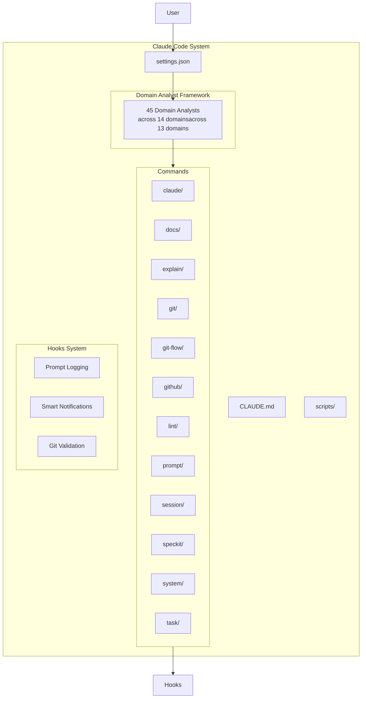

# Developer Guide - Claude Code Command System

## Architecture Overview

The Claude Code Command System is built on the **Domain Analyst Framework**, a comprehensive coordination system with
45 domain-specialized analysts for research, analysis, and recommendations.

### System Components



## Domain Analyst Framework

The system includes 45 domain-specialized analysts organized across 14 domains, providing comprehensive research and analysis capabilities:

### Domain Analyst Categories

- **API Analysis** (3): REST, GraphQL, and API documentation specialists
- **Database** (4): SQL, NoSQL, architecture, and schema design specialists
- **Frontend** (5): UI component, React, Next.js, accessibility, and design system specialists
- **Code Quality** (5): Python, TypeScript, JavaScript, C#, and general quality analysts
- **Infrastructure** (5): Terraform, cloud, network, DevOps, and monitoring specialists
- **Mobile** (3): React Native, Flutter, and iOS/Swift specialists
- **Documentation** (2): User documentation and Docusaurus specialists
- **UI/UX** (2): User interface and CLI interface specialists
- **Visualization** (1): Mermaid diagram specialists
- **Compliance** (1): GDPR/CCPA/LGPD compliance specialists
- **Standalone** (8): Architecture, security, performance, testing, refactoring, debugging, SEO, and product roadmap
- **Engineering** (1): Prompt engineering specialists
- **Research** (2): Codebase research and web research specialists
- **Meta** (3): Agent design, command design, and Git-Flow specialists

### Key Characteristics

- **Advisory-Only**: Analysts conduct research and analysis, returning actionable findings
- **Parallel Execution**: Main thread can invoke multiple analysts concurrently
- **Context Persistence**: Analysts persist findings to `.agent/Session-{name}/context/{agent-name}.md`
- **Recommendation Focused**: Provide strategic guidance without implementing changes
- **Domain Expertise**: Each analyst specializes in their domain for deep analysis

## Development Standards

### Creating New Commands

#### 1. Command Structure

```text
commands/{category}/{command-name}.md
```

#### 2. Command Format

````markdown
# Command: {action-verb} {object}

## Purpose
Single clear sentence describing what this command does.

## Usage
```bash
{command-name} [arguments]
```

## Agent Integration
- Primary agent: {agent-name}
- Secondary agents: {if-any}

## Examples
{Real usage examples}

## Integration Points
{How this connects to other commands}
````

#### 3. Naming Conventions

- **Action verb + clear object**: `analyze:performance`, `clean:code-comments`
- **No redundant prefixes**: Use category folders, not command prefixes
- **Consistent patterns**: Follow existing commands in the same category

#### 4. Categories (16 total)

- `analyze/` - Analysis and investigation
- `build/` - Building and packaging
- `clean/` - Cleanup operations
- `create/` - Code generation
- `debug/` - Debugging tools
- `deploy/` - Deployment operations
- `docs/` - Documentation
- `explain/` - Code understanding
- `fix/` - Bug fixes
- `git/` - Git operations
- `operations/` - File operations
- `review/` - Code review
- `speckit/` - Feature workflow
- `test/` - Testing
- `to-do/` - Task management
- `workflows/` - Multi-step workflows

#### 5. User Interaction Standards

Commands should follow the **interactive pattern** for consistent user experience:

**User Feedback Collection** (when command has multiple execution paths):
- Present options as A/B/C table
- Mark exactly ONE option as "Recommended"
- Include "Other" for custom input
- Include "Skip" for optional decisions

Example:
```markdown
## Your Choice

| Option | Action | Recommendation |
|--------|--------|-----------------|
| **A** | Full action | Comprehensive |
| **B** | Quick action | **← Recommended** |
| **C** | Preview | Review first |
| **Other** | Custom | Custom variations |

Your choice (A/B/C/Other/Skip): _
```

**Next Steps Table** (ALWAYS required):
- Provide 2-4 specific next actions
- Include exact commands (e.g., `/git:commit "msg"`)
- Mark ONE option as recommended for common path
- Close with: "What would you like to do next?"

Example:
```markdown
## Next Steps

| Step | Action | Details |
|------|--------|---------|
| **1** | Review changes | `git diff` |
| **2** | Commit | `/git:commit "message"` |
| **3** | Push | `/git:push` |

What would you like to do next?
```

For comprehensive guidance, see `INTERACTIVE_PATTERN_GUIDE.md` in specification directory.

### Creating New Agents

#### 1. Agent Types

- **Strategic Specialists**: Provide strategic planning and coordination guidance for complex tasks
- **Technical Specialists**: Provide domain-specific advisory guidance
- **Domain Specialists**: Specialized domain expertise (rare, for specific use cases)

#### 2. Agent File Structure

```text
agents/{type}/{agent-name}.md
```

**Directory Structure:**

- `agents/strategic-specialists/` - Strategic planning and coordination advisors
- `agents/technical-specialists/` - Domain-specific advisory specialists

#### 3. Agent Definition Format

```markdown
# Agent: {agent-name}

## Role
{Single sentence describing purpose}

## Capabilities
- {Specific capability 1}
- {Specific capability 2}

## Commands
- {Primary slash commands this agent uses}

## Model Requirements
- **Model**: {opus/sonnet/haiku}
- **Reasoning**: {Why this model level}

## Think Commands Support
- **think**: {Basic analysis}
- **think hard**: {Deep analysis}
- **ultra think**: {Comprehensive planning}

## Integration
{How this agent works with others}

## Usage Patterns
{Common workflows using this agent}
```

#### 4. Agent Constraints

- **Single Responsibility**: Each agent has one clear focus
- **No Overlap**: Agents should not duplicate functionality
- **Clear Boundaries**: Well-defined interaction points
- **Tool Integration**: Provide guidance on SlashCommand selection and usage

### Hook Development

#### 1. Hook Types (3 supported)

- **UserPromptSubmit**: Triggered on every user input
- **Stop**: Triggered when tasks complete
- **PreToolUse**: Triggered before specific tools

#### 2. Hook Implementation

```python
# scripts/{hook-name}.py
import os
import sys
from datetime import datetime

def execute_hook():
    """Hook implementation"""
    try:
        # Your hook logic here
        pass
    except Exception as e:
        print(f"Hook error: {e}", file=sys.stderr)

if __name__ == "__main__":
    execute_hook()
```

#### 3. Hook Registration (settings.json)

```json
{
  "hooks": {
    "UserPromptSubmit": [{
      "hooks": [{
        "type": "command",
        "command": "python -c \"import os; exec(open(os.path.expanduser('~/.claude/scripts/hooks/your-hook.py')).read())\""
      }]
    }]
  }
}
```

#### 4. Hook Best Practices

- **Fast execution**: Hooks should complete quickly
- **Error handling**: Always catch and log exceptions
- **Resource cleanup**: Clean up temporary files
- **Security**: Never log sensitive information

### Security Guidelines

#### 1. Permission Management

```json
{
  "permissions": {
    "allow": ["Safe operations"],
    "deny": ["Sensitive patterns"]
  }
}
```

#### 2. Git Operations Constraints

- **CRITICAL**: Only `/git/*` commands can perform Git operations
- **All specialists**: Provide advisory guidance on Git operations, actual execution via SlashCommand in main thread
- **No direct Git**: Agents cannot call git commands directly
- **Explicit consent**: All Git operations require user approval

#### 3. Secret Protection

- **Blocked patterns**: `.env*`, `*.key`, `*.pem`, `secrets/`, `credentials/`
- **No logging**: Never log API keys, tokens, or passwords
- **Environment variables**: Use secure environment variable patterns

### Testing Guidelines

#### 1. Command Testing

```bash
# Test command existence
ls commands/{category}/{command}.md

# Test command format
grep -E "^# Command:" commands/{category}/{command}.md

# Test agent integration
grep -E "Primary agent:" commands/{category}/{command}.md
```

#### 2. Agent Testing

```bash
# Test agent definitions
ls agents/{type}/{agent}.md

# Test model requirements
grep -E "Model:" agents/{type}/{agent}.md

# Test integration points
grep -E "Commands:" agents/{type}/{agent}.md
```

#### 3. Integration Testing

- Test Agent Specialist Framework consultation patterns
- Verify specialist advisory guidance is properly integrated
- Ensure Git constraints are enforced in main thread
- Validate hook execution

## Advanced Customization

### Model Selection Strategy

- **Opus**: Planning-heavy strategic specialists (task-analysis, research-analysis, implementation-strategy)
- **Sonnet**: Balanced technical specialists (code-writer, reviewer)
- **Haiku**: Simple technical specialists (bug-fixer for obvious issues)

### Think Commands Integration

```markdown
## Think Commands Support
- **think**: Basic analysis and straightforward problem solving
- **think hard**: Deep analysis, complex reasoning, multi-step problems
- **ultra think**: Comprehensive planning, architectural decisions, complex debugging
```

### Specialist Advisory Logic

```python
# Pseudocode for specialist advisory recommendations
def recommend_task_strategy(task_complexity, task_type):
    if complexity == "simple":
        return direct_technical_specialist_consultation()
    elif complexity == "moderate":
        return sequential_command_execution_with_specialist_guidance()
    elif complexity == "complex":
        return parallel_tool_execution_with_multiple_specialist_consultation()
```

### Extension Points

#### 1. New Command Categories

1. Create new category folder: `commands/{new-category}/`
2. Add category to CLAUDE.md command list
3. Update documentation
4. Create first command in category

#### 2. New Agent Types

1. Define in appropriate folder: `agents/{type}/`
2. Follow Agent Specialist Framework patterns
3. Ensure no overlap with existing agents
4. Document integration points

#### 3. Custom Workflows

1. Create in `commands/workflows/`
2. Use `run-{workflow-name}.md` format
3. Orchestrate multiple commands
4. Document step dependencies

## Quality Standards

### Code Quality

- **Consistency**: Follow existing patterns
- **Documentation**: Every command and agent documented
- **Testing**: Validate functionality before deployment
- **Security**: Enforce permission and Git constraints

### Documentation Quality

- **Clear Purpose**: Every component has obvious purpose
- **Usage Examples**: Real-world usage patterns
- **Integration Points**: How components work together
- **Troubleshooting**: Common issues and solutions

### Maintenance

- **Regular Reviews**: Audit commands and agents for overlap
- **Performance Monitoring**: Track command execution times
- **User Feedback**: Incorporate usage patterns
- **Security Updates**: Keep permissions current

## Migration Patterns

### From MECE to Agent Specialist Framework

1. **Identify domain agent**: Map old MECE agent to new specialist pattern
2. **Extract responsibilities**: Break into strategic/technical specialist advisory roles
3. **Update references**: Change agent execution calls to specialist consultation calls
4. **Test integration**: Ensure advisory consultation works properly
5. **Update documentation**: Reflect new advisory patterns

### Command Evolution

1. **Deprecation**: Mark old commands as deprecated
2. **Migration path**: Provide clear upgrade instructions
3. **Backward compatibility**: Maintain for transition period
4. **Documentation**: Update all references
5. **Cleanup**: Remove deprecated commands after transition

This guide provides the foundation for extending and
customizing the Claude Code Command System. Follow these patterns to maintain consistency and quality across the system.
