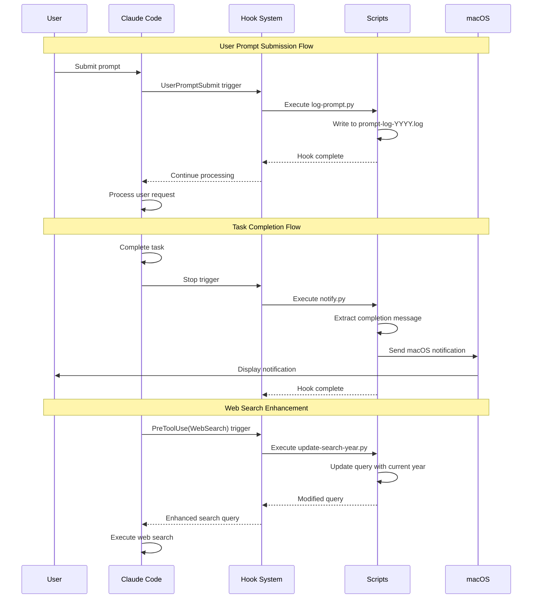
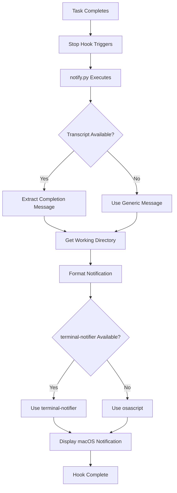
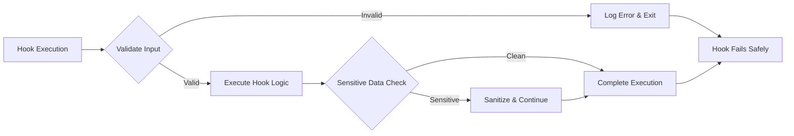
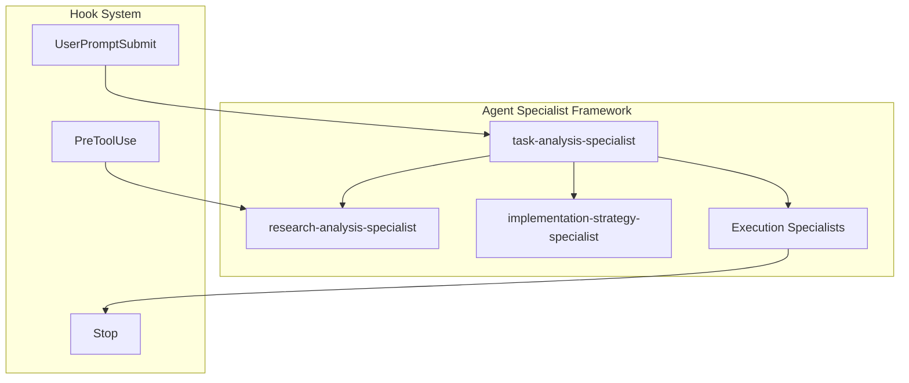

# Hooks System Documentation

## Overview

The Claude Code Command System includes a sophisticated hooks system that provides automated responses to user interactions and
system events. The hooks enable seamless integration with macOS notifications, prompt logging, and intelligent search enhancements.

## Hook Flow Architecture



## Hook Types & Implementation

### 1. UserPromptSubmit Hook

**Purpose**: Logs every user prompt for session tracking and analysis.

**Trigger**: Every time a user submits a prompt to Claude Code

**Implementation**:

```python
# scripts/hooks/log-prompt.py
import os
import sys
from datetime import datetime

def log_prompt():
    try:
        # Get the user's prompt from environment
        prompt = os.environ.get('CLAUDE_USER_PROMPT', '')
        timestamp = datetime.now().isoformat()

        # Log to yearly file
        log_dir = os.path.expanduser('~/.claude/logs')
        os.makedirs(log_dir, exist_ok=True)

        year = datetime.now().year
        log_file = f"{log_dir}/prompt-log-{year}.log"

        with open(log_file, 'a', encoding='utf-8') as f:
            f.write(f"[{timestamp}] {prompt}\n")

    except Exception as e:
        print(f"Logging error: {e}", file=sys.stderr)
```

**Configuration**:

```json
{
  "hooks": {
    "UserPromptSubmit": [{
      "hooks": [{
        "type": "command",
        "command": "python -c \"import os; exec(open(os.path.expanduser('~/.claude/scripts/hooks/log-prompt.py')).read())\""
      }]
    }]
  }
}
```

### 2. Stop Hook (Smart Notifications)

**Purpose**: Provides intelligent macOS notifications when tasks complete.

**Trigger**: When Claude Code finishes processing a user request

**Flow Diagram**:



**Implementation**:

```python
# scripts/hooks/notify.py
import os
import subprocess
from pathlib import Path

def send_notification():
    try:
        # Extract completion message from transcript
        message = extract_completion_message()
        title = "Claude Code Task Complete"

        # Get current directory for context
        cwd = os.getcwd()
        subtitle = f"Directory: {Path(cwd).name}"

        # Try terminal-notifier first, fallback to osascript
        if shutil.which('terminal-notifier'):
            subprocess.run([
                'terminal-notifier',
                '-title', title,
                '-subtitle', subtitle,
                '-message', message,
                '-sound', 'default'
            ])
        else:
            # Fallback to osascript
            script = f'''
            display notification "{message}"
            with title "{title}"
            subtitle "{subtitle}"
            '''
            subprocess.run(['osascript', '-e', script])

    except Exception as e:
        print(f"Notification error: {e}", file=sys.stderr)

def extract_completion_message():
    """Extract relevant completion info from transcript"""
    # Implementation extracts key completion details
    # Returns formatted message for notification
    pass
```

### 3. PreToolUse Hook (Search Enhancement)

**Purpose**: Automatically updates web search queries with current year for relevance.

**Trigger**: Before WebSearch tool execution

**Implementation**:

```python
# scripts/hooks/update-search-year.py
import os
import sys
import re
from datetime import datetime

def update_search_query():
    try:
        # Get the search query from environment
        query = os.environ.get('CLAUDE_TOOL_ARGS', '{}')
        current_year = datetime.now().year

        # Update query with current year if needed
        if should_add_year(query):
            updated_query = add_current_year(query, current_year)
            # Update environment for Claude Code to use
            os.environ['CLAUDE_TOOL_ARGS'] = updated_query

    except Exception as e:
        print(f"Search update error: {e}", file=sys.stderr)

def should_add_year(query):
    """Determine if query needs year context"""
    year_indicators = ['latest', 'current', 'recent', 'new', 'update']
    return any(indicator in query.lower() for indicator in year_indicators)

def add_current_year(query, year):
    """Add current year to search query"""
    return f"{query} {year}"
```

## Hook Development Patterns

### Security Considerations



**Security Guidelines**:

- **No Secret Logging**: Never log API keys, passwords, or tokens
- **Input Validation**: Validate all environment variables and inputs
- **Error Handling**: Fail gracefully without exposing sensitive information
- **Resource Limits**: Set timeouts and resource constraints
- **Sandboxing**: Run with minimal required permissions

### Performance Best Practices

**Execution Speed**:

- Hooks must complete in under 2 seconds
- Use asynchronous operations for I/O
- Cache frequently accessed data
- Minimize external dependencies

**Resource Management**:

```python
def hook_with_timeout():
    import signal

    def timeout_handler(signum, frame):
        raise TimeoutError("Hook execution timeout")

    signal.signal(signal.SIGALRM, timeout_handler)
    signal.alarm(2)  # 2 second timeout

    try:
        # Hook logic here
        pass
    finally:
        signal.alarm(0)  # Cancel timeout
```

### Error Handling Patterns

```python
def robust_hook():
    try:
        # Hook implementation
        execute_hook_logic()
    except FileNotFoundError as e:
        log_error(f"File not found: {e}")
    except PermissionError as e:
        log_error(f"Permission denied: {e}")
    except Exception as e:
        log_error(f"Unexpected error: {e}")
    finally:
        cleanup_resources()

def log_error(message):
    error_log = os.path.expanduser('~/.claude/logs/hook-errors.log')
    with open(error_log, 'a') as f:
        f.write(f"[{datetime.now().isoformat()}] {message}\n")
```

## Custom Hook Development

### Creating New Hooks

1. **Identify Trigger Point**:
   - UserPromptSubmit: Every user input
   - Stop: Task completion
   - PreToolUse: Before specific tools

2. **Implement Hook Script**:

```python
# scripts/custom-hook.py
import os
import sys

def execute_custom_hook():
    """Custom hook implementation"""
    try:
        # Your hook logic here
        handle_custom_event()
    except Exception as e:
        print(f"Custom hook error: {e}", file=sys.stderr)
        sys.exit(1)

def handle_custom_event():
    """Handle the specific event"""
    pass

if __name__ == "__main__":
    execute_custom_hook()
```

1. **Register in settings.json**:

```json
{
  "hooks": {
    "UserPromptSubmit": [{
      "hooks": [{
        "type": "command",
        "command": "python -c \"import os; exec(open(os.path.expanduser('~/.claude/scripts/hooks/custom-hook.py')).read())\""
      }]
    }]
  }
}
```

1. **Test Hook Execution**:

```bash
# Make script executable
chmod +x scripts/custom-hook.py

# Test directly
python ~/.claude/scripts/hooks/custom-hook.py

# Test through Claude Code
claude "test prompt"  # Should trigger hook
```

### Hook Debugging

**Debug Environment Variables**:

```bash
# Enable hook debugging
export CLAUDE_HOOK_DEBUG=1

# View available environment variables in hooks
env | grep CLAUDE_
```

**Common Debug Patterns**:

```python
def debug_hook():
    if os.environ.get('CLAUDE_HOOK_DEBUG'):
        debug_info = {
            'hook_name': 'custom-hook',
            'timestamp': datetime.now().isoformat(),
            'environment': {k: v for k, v in os.environ.items()
                          if k.startswith('CLAUDE_')},
            'working_dir': os.getcwd()
        }

        debug_file = os.path.expanduser('~/.claude/logs/hook-debug.log')
        with open(debug_file, 'a') as f:
            f.write(f"{json.dumps(debug_info, indent=2)}\n")
```

## Integration with Agent Orchestra

### Hook-Agent Coordination



**Hook-Aware Agents**:

- Agents can check for hook-generated data
- Hooks can influence agent behavior
- Coordinated logging and notification strategies

### Advanced Hook Patterns

**Conditional Hooks**:

```json
{
  "hooks": {
    "PreToolUse": [{
      "matcher": "WebSearch",
      "condition": "query_needs_update",
      "hooks": [{
        "type": "command",
        "command": "python ~/.claude/scripts/hooks/conditional-hook.py"
      }]
    }]
  }
}
```

**Chain Hooks**:

```python
def chain_hook():
    """Execute multiple hooks in sequence"""
    hooks = [
        'prepare_environment',
        'process_input',
        'generate_output',
        'cleanup'
    ]

    for hook_func in hooks:
        try:
            globals()[hook_func]()
        except Exception as e:
            print(f"Chain hook {hook_func} failed: {e}")
            break
```

## Troubleshooting

### Common Issues

**Hook Not Executing**:

1. Check script permissions: `ls -la scripts/`
2. Test Python execution: `python scripts/hook-name.py`
3. Verify settings.json syntax: Use JSON validator
4. Check hook registration: Restart Claude Code

**Notification Issues**:

1. Test terminal-notifier: `which terminal-notifier`
2. Test osascript: `osascript -e 'display notification "test"'`
3. Check macOS notification permissions
4. Verify script execution permissions

**Performance Problems**:

1. Add timing to hooks: `time python scripts/hook-name.py`
2. Check for blocking I/O operations
3. Profile memory usage
4. Optimize or async slow operations

**Debug Commands**:

```bash
# Test hook execution
CLAUDE_HOOK_DEBUG=1 python ~/.claude/scripts/hooks/notify.py

# Check hook logs
tail -f ~/.claude/logs/hook-errors.log

# Validate settings.json
python -c "import json; json.load(open('settings.json'))"
```

The hooks system provides powerful automation capabilities while maintaining security and
performance. Follow these patterns to create robust, maintainable hooks that enhance the Claude Code experience.
