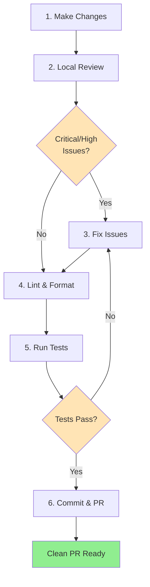
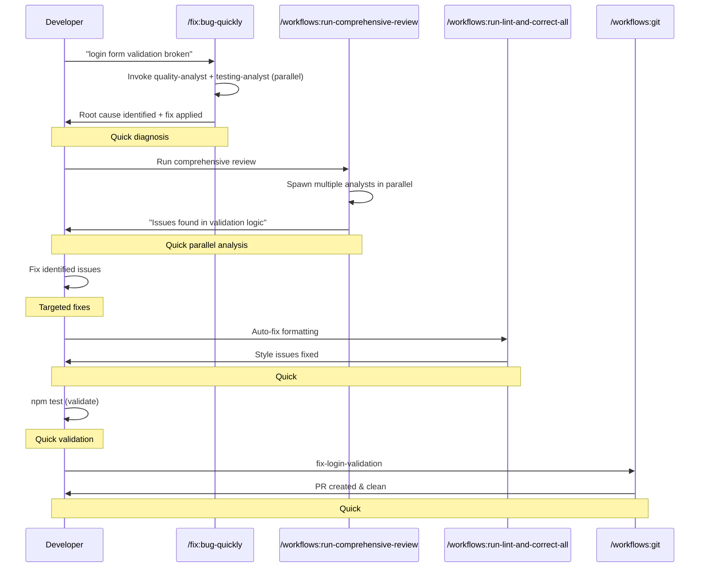
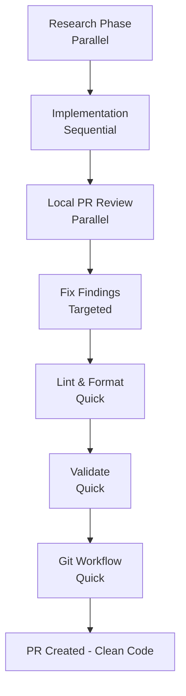
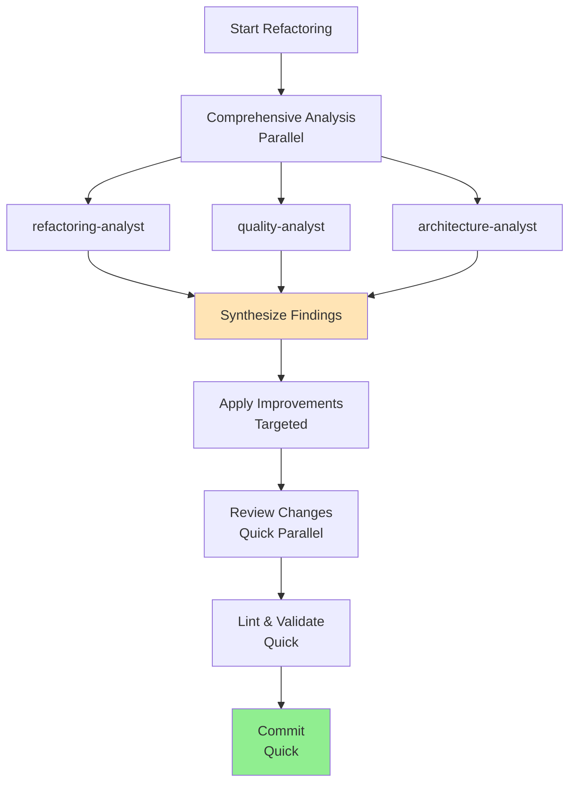
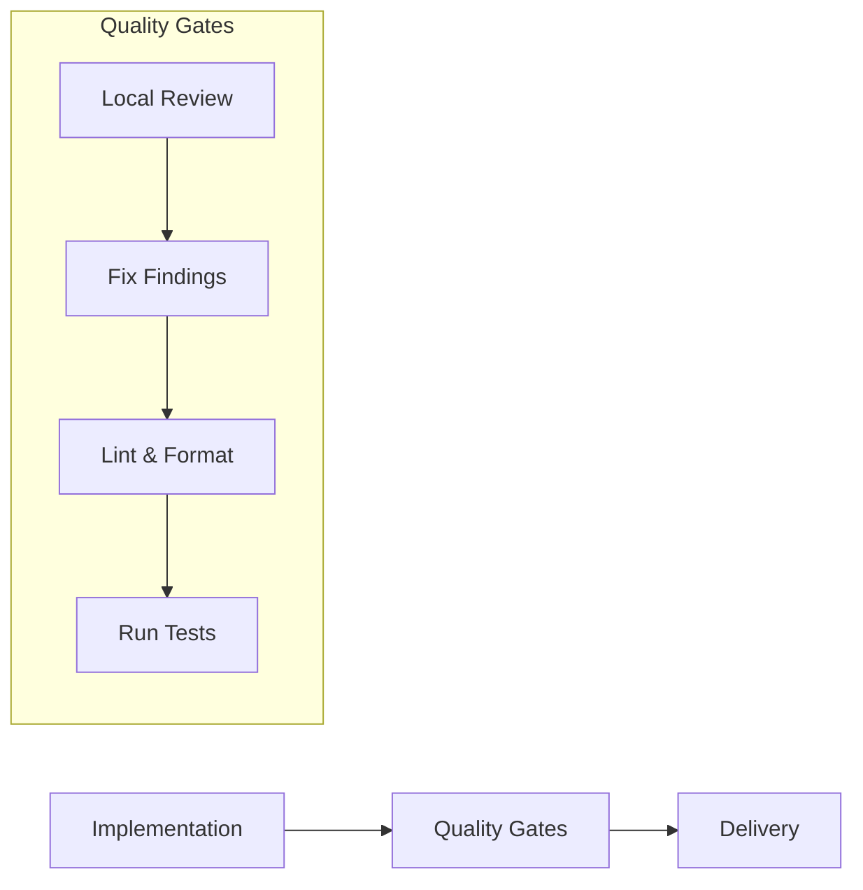
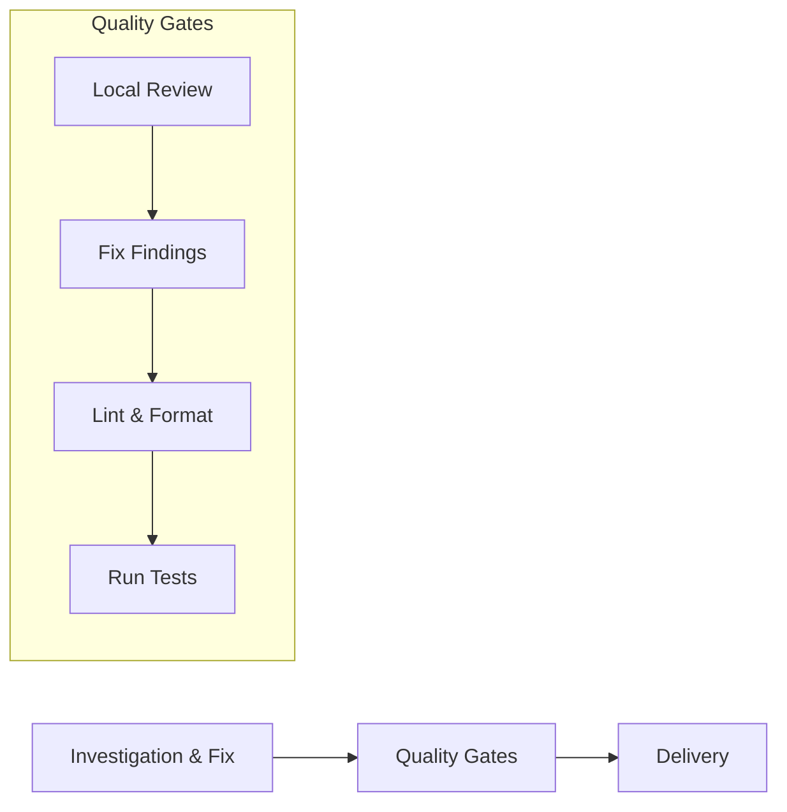
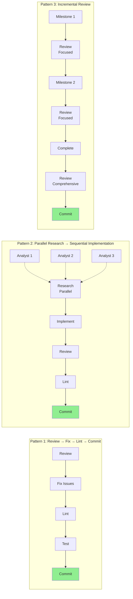

# Developer Workflows Guide

This document provides realistic workflow patterns using the Claude Code Command System, including local PR review and linting practices.

## Table of Contents

1. [Quick Reference](#quick-reference)
2. [The Review-Lint-Commit Pattern](#the-review-lint-commit-pattern)
3. [Bug Fix Workflow](#bug-fix-workflow)
4. [Feature Development Workflow](#feature-development-workflow)
5. [Refactoring Workflow](#refactoring-workflow)
6. [Daily Development Pattern](#daily-development-pattern)
7. [Performance Analysis](#performance-analysis)
8. [Best Practices](#best-practices)

---

## Quick Reference

### Current Command System (Comprehensive Command Library + Domain Analysts)

**Workflows (8)**: Orchestrate parallel analyst execution

- `/workflows:run-comprehensive-review` - Multi-perspective code review
- `/workflows:run-security-audit` - Security vulnerability assessment
- `/workflows:run-refactor-workflow` - Code quality improvements
- `/workflows:run-lint-and-correct-all` - Auto-fix formatting/style
- `/workflows:docs` - Idempotent documentation workflow
- `/workflows:run-cleanup-workflow` - Code cleanup orchestration
- `/workflows:run-complete-overhaul` - Comprehensive analysis
- `/workflows:run-optimization` - Performance optimization

**Git (8)**: Direct git operations

- `/workflows:git [branch]` - Complete flow: branch → commit → push → PR
- `/git:branch`, `/git:commit`, `/git:push`, `/git:pr`
- `/git:merge`, `/git:worktree`, `/git:worktree-consolidate`

**Development Commands**: See `docs/command-decision-guide.md` for complete catalog

**Domain Analysts**: 45 domain analysts across 14 domains for comprehensive analysis

- **Research**: research-codebase-analyst, research-web-analyst
- **Standalone**: architecture-analyst, security-analyst, performance-analyst, testing-analyst, refactoring-analyst, debugger-analyst, seo-analyst, product-roadmap-analyst
- **Code Quality**: code-python-analyst, code-typescript-analyst, code-javascript-analyst, code-csharp-analyst, code-quality-analyst
- **Frontend**: frontend-analyst, frontend-react-analyst, frontend-nextjs-analyst, frontend-accessibility-analyst, frontend-shadcn-analyst
- **API**: api-rest-analyst, api-graphql-analyst, api-docs-analyst
- **Database**: database-analyst, database-sql-analyst, database-nosql-analyst, database-architecture-analyst
- **Documentation**: docs-analyst, docs-docusaurus-analyst
- **Others**: Mobile (3), Infrastructure (5), UI/UX (2), Engineering (1), Meta (3)

---

## The Review-Lint-Commit Pattern

### Standard Pre-Commit Checklist (Every Commit)



```bash
# 1. Make your changes
→ Write code, fix bugs, implement features

# 2. Local PR review (quick analysis)
/workflows:run-comprehensive-review
→ Spawns multiple analysts in parallel
→ Returns findings: Critical, High, Medium, Low

# 3. Fix review findings
→ Address all Critical and High priority issues
→ Document or defer Medium/Low issues

# 4. Lint and format (quick)
/workflows:run-lint-and-correct-all
→ Auto-detects languages (Python, TypeScript, etc.)
→ Runs formatters in parallel (ruff, eslint, prettier)
→ Auto-fixes most style issues

# 5. Run tests (quick validation)
npm test  # or pytest, cargo test, etc.
→ Verify nothing broke

# 6. Commit and push (quick)
/workflows:git <branch-name>
→ Creates branch, commits, pushes, creates PR
→ PR is clean - team review is significantly faster
```

**Total Time**: Moderate time investment per commit
**Team Review Time**: Significantly faster than without local review
**PR Iterations**: Substantially fewer rounds needed

---

## Bug Fix Workflow

### Workflow Pattern: Investigation → Fix → Review → Lint → Commit



```bash
# Step 1: Investigate and fix (quick)
/fix:bug-quickly "login form validation not working"
→ Main thread invokes quality-analyst + testing-analyst in parallel
→ Identifies root cause
→ Applies fix with tests

# Step 2: Local PR review BEFORE committing (quick parallel analysis)
/workflows:run-comprehensive-review
→ Parallel analysis: quality, security, performance, testing
→ Returns: Issues found in validation logic

# Step 3: Fix review findings
→ Address the identified issues

# Step 4: Lint and format (quick)
/workflows:run-lint-and-correct-all
→ Auto-fixes formatting inconsistencies

# Step 5: Validate (quick)
npm test
→ All tests pass

# Step 6: Commit and create PR (quick)
/workflows:git fix-login-validation
→ Branch created, committed, pushed, PR created
→ PR URL: https://github.com/org/repo/pull/123
```

**Result**: Clean PR, significantly faster team review

---

## Feature Development Workflow

### Workflow Pattern: Research → Implement → Review → Refine → Commit



### Phase 1: Research & Planning (parallel execution for speed)

```bash
# Spawn multiple analysts concurrently
Task("research-analyst: Research authentication best practices and security requirements")
Task("frontend-analyst: Analyze existing auth UI patterns")
Task("database-analyst: Review schema design for user credentials")

→ All run in parallel (significantly faster than sequential execution)
→ Persist findings to .agent/context/*.md
→ Return concise summaries
```

### Phase 2: Implementation (sequential, structured)

```bash
# Structured development with speckit
/speckit:specify
→ Creates feature spec from requirements

/speckit:plan
→ Generates implementation plan

/speckit:tasks
→ Creates dependency-ordered tasks

/implement:speckit-tasks
→ Executes tasks with quality validation
```

### Phase 3: Local PR Review (parallel analysis) ⭐

```bash
# Review BEFORE committing - catches issues early
/workflows:run-comprehensive-review

→ Spawns multiple analysts in parallel:
  - quality-analyst (code quality, complexity)
  - security-analyst (vulnerabilities, OWASP Top 10)
  - performance-analyst (bottlenecks, inefficiencies)
  - testing-analyst (coverage, edge cases)
  - documentation-analyst (completeness, clarity)
  - accessibility-analyst (WCAG compliance)

→ Returns unified report:
  "Issues found across multiple dimensions"
```

### Phase 4: Address Review Findings (targeted fixes)

```bash
# Fix critical and high priority issues
→ Fix identified critical/high priority issues
→ Document why lower priority issues are deferred (or fix them)
→ Re-run review if major changes made
```

### Phase 5: Lint and Format (quick) ⭐

```bash
/workflows:run-lint-and-correct-all

→ Auto-detects project languages
→ Runs in parallel:
  - Python: ruff format + ruff check --fix
  - TypeScript: eslint --fix + prettier
  - Other: language-specific formatters
→ Auto-fixes style issues
```

### Phase 6: Final Validation (quick)

```bash
# Verify everything works after fixes + linting
npm test       # or pytest, cargo test, etc.
npm run build  # verify build succeeds
```

### Phase 7: Git Workflow (quick)

```bash
/workflows:git feature-auth-system

→ Creates branch: feature-auth-system
→ Commits changes with conventional format
→ Pushes to remote with tracking
→ Creates PR with auto-generated title/description
→ Returns: https://github.com/org/repo/pull/456
```

**Total Time**: Moderate to substantial development time
**Team Review Time**: Significantly faster than without local review
**Why**: PR is already clean - you caught issues locally

---

## Refactoring Workflow

### Quick Targeted Refactoring

```bash
# Step 1: Apply targeted refactoring (quick)
/refactor:apply src/ --type=remove-duplication
→ Invokes refactoring-analyst to identify duplication
→ Applies DRY principles
→ Extracts shared code

# Step 2: Review refactored code (quick parallel analysis)
/workflows:run-comprehensive-review
→ Verify refactoring improved quality
→ Check complexity metrics

# Step 3: Lint (quick)
/workflows:run-lint-and-correct-all
→ Ensure consistent formatting

# Step 4: Validate (quick)
npm test
→ Verify behavior preserved

# Step 5: Commit (quick)
/workflows:git refactor-remove-duplication
```

### Comprehensive Large-Scale Refactoring



```bash
# Step 1: Comprehensive analysis (parallel execution)
/workflows:run-refactor-workflow

→ Spawns 3 analysts concurrently:
  - refactoring-analyst (code smells, technical debt)
  - quality-analyst (complexity, maintainability)
  - architecture-analyst (design patterns, structure)
→ Main thread synthesizes findings
→ Applies improvements

# Step 2: Review changes (quick parallel analysis)
/workflows:run-comprehensive-review
→ Verify improvements effective

# Step 3: Lint and validate (quick)
/workflows:run-lint-and-correct-all
npm test

# Step 4: Commit (quick)
/workflows:git refactor-architecture
```

**Performance**: Significantly faster than sequential analysis

---

## Daily Development Pattern

### Morning: Feature Work Pattern



**Workflow Sequence:**

1. **Implementation Phase**: Write code for feature
2. **Quality Gate Phase**:
   - Local comprehensive review
   - Fix identified issues
   - Lint and format
   - Run tests
3. **Delivery Phase**: Commit and create PR

### Afternoon: Bug Fix Pattern



**Workflow Sequence:**

1. **Investigation & Fix Phase**: Use `/fix:bug-quickly`
2. **Quality Gate Phase**: Same as feature work
3. **Delivery Phase**: Commit and create PR

---

## Performance Analysis

### Workflow Comparison: With vs Without Local Review

```mermaid
graph TD
    subgraph "Without Local Review"
        A1[Commit] --> A2[Create PR]
        A2 --> A3[Wait for team review<br/>Substantial time]
        A3 --> A4[Address feedback]
        A4 --> A5[Team re-review]
        A5 --> A6[More feedback]
        A6 --> A7[Final approval]
    end

    subgraph "With Local Review"
        B1[Local review<br/>Quick parallel] --> B2[Fix issues locally]
        B2 --> B3[Lint & format<br/>Quick]
        B3 --> B4[Run tests<br/>Quick]
        B4 --> B5[Commit & PR<br/>Quick]
        B5 --> B6[Team review<br/>Quick - code is clean]
    end

    style A7 fill:#FFB6C1
    style B6 fill:#90EE90
```



### Without Local Review + Linting (Traditional Approach)

```text
1. Commit changes                    Quick
2. Create PR                         Quick
3. Wait for team review              Substantial time
4. Address PR feedback               Moderate time
5. Team re-review                    Substantial time
6. Address more feedback             Moderate time
7. Final approval                    Quick
────────────────────────────────────────
Total: Substantial total time, multiple PR iterations
```

### With Local Review + Linting (Recommended Approach)

```text
1. Local comprehensive review        Quick parallel analysis
2. Fix issues locally                Targeted fixes
3. Lint and format                   Quick
4. Run tests                         Quick
5. Commit and create PR              Quick
6. Team review (code is clean)       Quick
────────────────────────────────────────
Total: Moderate total time, minimal PR iterations
```

**Benefits**:

- Substantially faster overall delivery
- Higher code quality
- Substantially reduced team review burden
- Fewer PR iteration cycles

---

## Best Practices

### Before Every Commit

✅ **ALWAYS run local review first**

```bash
/workflows:run-comprehensive-review
```

✅ **ALWAYS fix critical/high priority issues**

```text
→ Fix all Critical issues (security, bugs)
→ Fix all High issues (performance, missing tests)
→ Document or defer Medium/Low issues
```

✅ **ALWAYS lint before committing**

```bash
/workflows:run-lint-and-correct-all
```

✅ **ALWAYS run tests**

```bash
npm test  # or pytest, cargo test, etc.
```

✅ **THEN commit with clean code**

```bash
/workflows:git <branch-name>
```

### During Feature Development

✅ Use parallel research for speed

```bash
Task("analyst-1: research X")
Task("analyst-2: research Y")
Task("analyst-3: research Z")
# Significantly faster than sequential execution
```

✅ Use speckit for structured development

```bash
/speckit:specify → plan → tasks → implement
```

✅ Review incrementally during development

```text
# Don't wait until the end - review as you go
```

### PR Creation

✅ Your PR should be clean when created

- All Critical issues fixed
- All High issues fixed
- Consistent formatting (linted)
- Tests passing
- Documentation updated

✅ Team review focuses on:

- High-level design decisions
- Architecture choices
- Business logic correctness
- NOT formatting, style, or obvious bugs (you caught those locally)

### Post-Merge

✅ Save review artifacts

```text
→ Keep .agent/context/*.md for reference
```

✅ Create tickets for deferred issues

```text
→ Track Medium/Low issues for future sprints
```

✅ Continuous improvement

```text
→ Learn from review findings
→ Update team standards
→ Share positive patterns
```

---

## Command Chaining Patterns



### Pattern 1: Review → Fix → Lint → Commit

```bash
/workflows:run-comprehensive-review
→ Review findings, fix issues
/workflows:run-lint-and-correct-all
→ Run tests
/workflows:git <branch>
```

### Pattern 2: Parallel Research → Sequential Implementation

```bash
# Research phase (parallel - significantly faster)
Task("research-analyst: ...")
Task("security-analyst: ...")
Task("performance-analyst: ...")

# Implementation phase (sequential)
→ Implement based on findings
→ Review, lint, test, commit
```

### Pattern 3: Incremental Review During Development

```bash
# After major milestone 1
/workflows:run-comprehensive-review --focus=security

# After major milestone 2
/workflows:run-comprehensive-review --focus=performance

# Before commit (comprehensive)
/workflows:run-comprehensive-review
```

---

## Analyst Usage Guide

### Direct Analyst Invocation

Instead of wrapper commands, invoke analysts directly:

```bash
# Security analysis
Task("security-analyst: Analyze authentication for OWASP Top 10 vulnerabilities")

# Performance analysis
Task("performance-analyst: Identify bottlenecks in API endpoints")

# Quality analysis
Task("quality-analyst: Assess code complexity and maintainability")
```

**Benefits**:

- More control over analysis scope
- Faster (no command overhead)
- Better context passing

### Analyst Coordination Pattern

```bash
# Main thread spawns analysts in parallel
Task("security-analyst: Authentication security review")
Task("testing-analyst: Test coverage assessment")
Task("documentation-analyst: API documentation completeness")

→ All run concurrently (significantly faster than sequential)
→ Each persists findings to .agent/context/*.md
→ Main thread reads artifacts and synthesizes
→ Implementation proceeds with full context
```

---

## Real-World Timing Expectations

### Small Bug Fix

- **Without review**: Quick implementation (but substantial team review time)
- **With review**: Moderate implementation time (but quick team review)
- **Net result**: Comparable total time, substantially higher quality

### Medium Feature

- **Without review**: Moderate implementation (but multiple PR iterations required)
- **With review**: Moderate to substantial implementation (but minimal PR iterations)
- **Net result**: Faster overall delivery, higher quality

### Large Refactoring

- **Without review**: Faster implementation (but risky, potential issues)
- **With review**: More thorough implementation (but safe, validated)
- **Net result**: Additional upfront time investment, substantially fewer bugs

---

## The Honest Truth

**Local review + linting adds moderate time per commit**
**BUT it saves substantial time on PR review iterations**
**AND it improves code quality significantly**
**AND it reduces team frustration with back-and-forth**

**Bottom line**: Moderate local time investment, substantial team review savings, significantly higher quality code.

---

## Additional Resources

- [Command Decision Guide](./command-decision-guide.md) - Choose the right command
- [Workflow vs Atomic Commands](./workflow-vs-atomic-commands.md) - Understand complementary architecture
- [Command Selection Guide](./user/command-selection-guide.md) - Complete command catalog
- [Agent Specialist Framework](./concepts/agent-specialist-framework.md) - Domain analyst patterns
- [GitHub Automation](./github-automation.md) - Git integration
- [MCP Tool Assignment](./MCP-TOOL-ASSIGNMENT-MATRIX.md) - External tool integration
