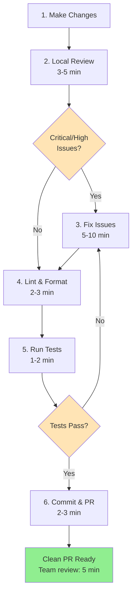
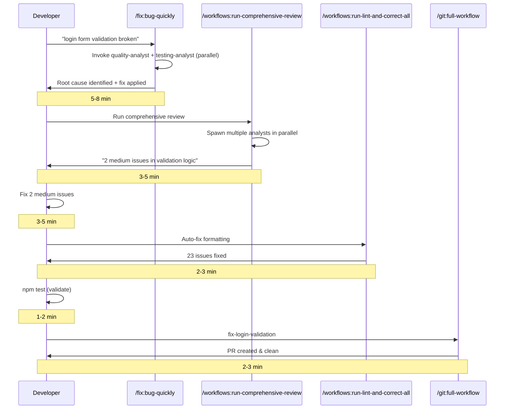
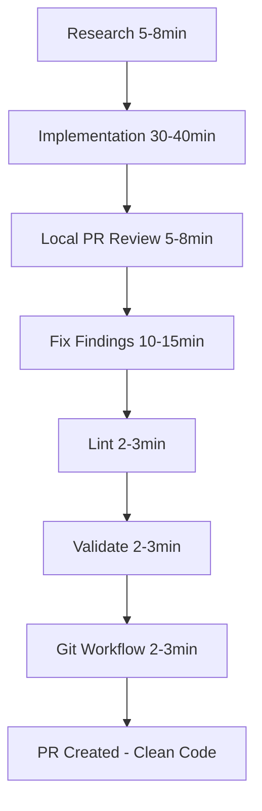
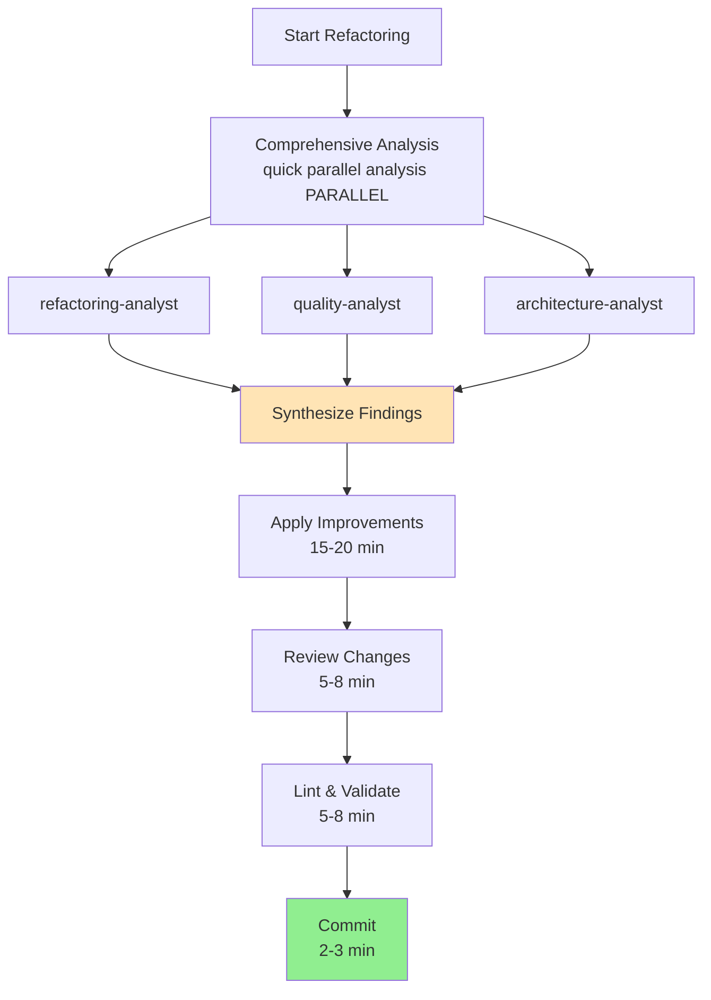
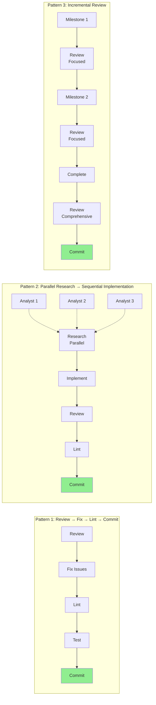

# Developer Workflows Guide

This document provides realistic workflow patterns using the Claude Code Command System, including local PR review and linting practices.

## Table of Contents

1. [Quick Reference](#quick-reference)
2. [The Review-Lint-Commit Pattern](#the-review-lint-commit-pattern)
3. [Bug Fix Workflow](#bug-fix-workflow)
4. [Feature Development Workflow](#feature-development-workflow)
5. [Refactoring Workflow](#refactoring-workflow)
6. [Daily Development Pattern](#daily-development-pattern)
7. [Performance Analysis](#performance-analysis)
8. [Best Practices](#best-practices)

---

## Quick Reference

### Current Command System (Comprehensive Command Library + Domain Analysts)

**Workflows (8)**: Orchestrate parallel analyst execution

- `/workflows:run-comprehensive-review` - Multi-perspective code review
- `/workflows:run-security-audit` - Security vulnerability assessment
- `/workflows:run-refactor-workflow` - Code quality improvements
- `/workflows:run-lint-and-correct-all` - Auto-fix formatting/style
- `/workflows:run-docs-workflow` - Documentation generation/updates
- `/workflows:run-cleanup-workflow` - Code cleanup orchestration
- `/workflows:run-complete-overhaul` - Comprehensive analysis
- `/workflows:run-optimization` - Performance optimization

**Git (8)**: Direct git operations

- `/git:full-workflow [branch]` - Complete flow: branch → commit → push → PR
- `/git:branch`, `/git:commit`, `/git:push`, `/git:pr`
- `/git:merge`, `/git:worktree`, `/git:worktree-consolidate`

**Review (1)**: Intelligent code review

- `/review:code [path] [--focus=area]` - Orchestrates multiple analysts based on context

**Refactor (2)**: Code improvement

- `/refactor:apply [path] [--type=type]` - Atomic refactorings (rename, extract, simplify, remove-duplication)
- `/refactor:large-scale` - Comprehensive restructuring with analysts

**Fix (2)**: Bug resolution

- `/fix:bug-quickly [issue]` - Rapid bug diagnosis and fix
- `/fix:import-statements` - Fix broken imports after file moves

**Domain Analysts (15)**: Direct invocation for specialized analysis

- research-analyst, quality-analyst, architecture-analyst
- security-analyst, performance-analyst, testing-analyst
- accessibility-analyst, documentation-analyst, database-analyst
- frontend-analyst, react-analyst, typescript-analyst, python-analyst, api-analyst, refactoring-analyst

---

## The Review-Lint-Commit Pattern

### Standard Pre-Commit Checklist (Every Commit)



```bash
# 1. Make your changes
→ Write code, fix bugs, implement features

# 2. Local PR review (3-5 min)
/workflows:run-comprehensive-review
→ Spawns multiple analysts in parallel
→ Returns findings: Critical, High, Medium, Low

# 3. Fix review findings (5-10 min)
→ Address all Critical and High priority issues
→ Document or defer Medium/Low issues

# 4. Lint and format (2-3 min)
/workflows:run-lint-and-correct-all
→ Auto-detects languages (Python, TypeScript, etc.)
→ Runs formatters in parallel (ruff, eslint, prettier)
→ Auto-fixes 90% of style issues

# 5. Run tests (1-2 min)
npm test  # or pytest, cargo test, etc.
→ Verify nothing broke

# 6. Commit and push (2-3 min)
/git:full-workflow <branch-name>
→ Creates branch, commits, pushes, creates PR
→ PR is clean - team review takes 5 min vs 30 min
```

**Total Time**: 13-23 min per commit
**Team Review Time**: 5 min (vs 30 min without local review)
**PR Iterations**: 1-2 rounds (vs 4-5 rounds without local review)

---

## Bug Fix Workflow

### Realistic Timeline: much longer



```bash
# Step 1: Investigate and fix (5-8 min)
/fix:bug-quickly "login form validation not working"
→ Main thread invokes quality-analyst + testing-analyst in parallel
→ Identifies root cause
→ Applies fix with tests

# Step 2: Local PR review BEFORE committing (3-5 min)
/workflows:run-comprehensive-review
→ Parallel analysis: quality, security, performance, testing
→ Returns: "2 medium issues found in validation logic"

# Step 3: Fix review findings (3-5 min)
→ Address the 2 medium issues

# Step 4: Lint and format (2-3 min)
/workflows:run-lint-and-correct-all
→ Auto-fixes formatting inconsistencies

# Step 5: Validate (1-2 min)
npm test
→ All tests pass

# Step 6: Commit and create PR (2-3 min)
/git:full-workflow fix-login-validation
→ Branch created, committed, pushed, PR created
→ PR URL: https://github.com/org/repo/pull/123
```

**Result**: Clean PR, fast team review (5 min vs 30 min)

---

## Feature Development Workflow

### Realistic Timeline: 60-90 minutes



### Phase 1: Research & Planning (5-8 min, parallel)

```python
# Spawn multiple analysts concurrently
Task("research-analyst: Research authentication best practices and security requirements")
Task("frontend-analyst: Analyze existing auth UI patterns")
Task("database-analyst: Review schema design for user credentials")

→ All run in parallel (5-8 min vs 20-30 min sequential)
→ Persist findings to .artifacts/context/*.md
→ Return 2-3 sentence summaries
```

### Phase 2: Implementation (30-40 min, sequential)

```bash
# Structured development with spec-kit
/spec-kit:specify
→ Creates feature spec from requirements

/spec-kit:plan
→ Generates implementation plan

/spec-kit:tasks
→ Creates dependency-ordered tasks

/implement:spec-kit-tasks
→ Executes tasks with quality validation
```

### Phase 3: Local PR Review (5-8 min, parallel) ⭐

```bash
# Review BEFORE committing - catches issues early
/workflows:run-comprehensive-review

→ Spawns multiple analysts in parallel:
  - quality-analyst (code quality, complexity)
  - security-analyst (vulnerabilities, OWASP Top 10)
  - performance-analyst (bottlenecks, inefficiencies)
  - testing-analyst (coverage, edge cases)
  - documentation-analyst (completeness, clarity)
  - accessibility-analyst (WCAG compliance)

→ Returns unified report:
  "12 issues found: 2 critical, 5 medium, 5 minor"
```

### Phase 4: Address Review Findings (10-15 min)

```bash
# Fix critical and medium issues
→ Fix the 7 critical/medium issues identified
→ Document why minor issues are deferred (or fix them)
→ Re-run review if major changes made
```

### Phase 5: Lint and Format (2-3 min) ⭐

```bash
/workflows:run-lint-and-correct-all

→ Auto-detects project languages
→ Runs in parallel:
  - Python: ruff format + ruff check --fix
  - TypeScript: eslint --fix + prettier
  - Other: language-specific formatters
→ Auto-fixes 23 formatting issues
```

### Phase 6: Final Validation (2-3 min)

```bash
# Verify everything works after fixes + linting
npm test       # or pytest, cargo test, etc.
npm run build  # verify build succeeds
```

### Phase 7: Git Workflow (2-3 min)

```bash
/git:full-workflow feature-auth-system

→ Creates branch: feature-auth-system
→ Commits changes with conventional format
→ Pushes to remote with tracking
→ Creates PR with auto-generated title/description
→ Returns: https://github.com/org/repo/pull/456
```

**Total Time**: 60-90 min
**Team Review Time**: 5 min (vs 30 min without local review)
**Why**: PR is already clean - you caught issues locally

---

## Refactoring Workflow

### Quick Refactoring (10-15 min)

```bash
# Step 1: Apply atomic refactoring (3-5 min)
/refactor:apply src/ --type=remove-duplication
→ Invokes refactoring-analyst to identify duplication
→ Applies DRY principles
→ Extracts shared code

# Step 2: Review refactored code (3-5 min)
/workflows:run-comprehensive-review
→ Verify refactoring improved quality
→ Check complexity metrics

# Step 3: Lint (2-3 min)
/workflows:run-lint-and-correct-all
→ Ensure consistent formatting

# Step 4: Validate (1-2 min)
npm test
→ Verify behavior preserved

# Step 5: Commit (2-3 min)
/git:full-workflow refactor-remove-duplication
```

### Large-Scale Refactoring (30-45 min, parallel)



```bash
# Step 1: Comprehensive analysis (quick parallel analysis, parallel)
/workflows:run-refactor-workflow

→ Spawns 3 analysts concurrently:
  - refactoring-analyst (code smells, technical debt)
  - quality-analyst (complexity, maintainability)
  - architecture-analyst (design patterns, structure)
→ Main thread synthesizes findings
→ Applies improvements

# Step 2: Review changes (5-8 min)
/workflows:run-comprehensive-review
→ Verify improvements effective

# Step 3: Lint and validate (5-8 min)
/workflows:run-lint-and-correct-all
npm test

# Step 4: Commit (2-3 min)
/git:full-workflow refactor-architecture
```

**Performance**: 40-50% faster than sequential

---

## Daily Development Pattern

### Morning: Feature Work

```mermaid
gantt
    title Morning Feature Development (53 min)
    dateFormat HH:mm
    axisFormat %H:%M

    section Implementation
    Write code                :08:00, 30m

    section Quality Gates
    Local review             :08:30, 5m
    Fix findings             :08:35, 10m
    Lint & format            :08:45, 3m
    Run tests                :08:48, 2m

    section Delivery
    Commit & create PR       :08:50, 3m
```



```bash
08:00 - Start implementation (30 min)
       → Write code

08:30 - Local review (5 min)
       /workflows:run-comprehensive-review

08:35 - Fix findings (10 min)
       → Address issues

08:45 - Lint (3 min)
       /workflows:run-lint-and-correct-all

08:48 - Test (2 min)
       npm test

08:50 - Commit & PR (3 min)
       /git:full-workflow feature-xyz

08:53 - Feature complete, clean PR created
```

### Afternoon: Bug Fixes

```mermaid
gantt
    title Afternoon Bug Fix (28 min)
    dateFormat HH:mm
    axisFormat %H:%M

    section Investigation & Fix
    Fix bug                  :14:00, 10m

    section Quality Gates
    Local review             :14:10, 5m
    Fix findings             :14:15, 5m
    Lint & format            :14:20, 3m
    Run tests                :14:23, 2m

    section Delivery
    Commit & create PR       :14:25, 3m
```



```bash
14:00 - Fix bug (10 min)
        /fix:bug-quickly "issue-123"

14:10 - Review (5 min)
        /workflows:run-comprehensive-review

14:15 - Fix findings (5 min)

14:20 - Lint (3 min)
        /workflows:run-lint-and-correct-all

14:23 - Test (2 min)
        npm test

14:25 - Commit & PR (3 min)
        /git:full-workflow fix-issue-123

14:28 - Bug fixed, PR created
```

---

## Performance Analysis

### Time Comparison: With vs Without Local Review

```mermaid
gantt
    title Workflow Time Comparison
    dateFormat X
    axisFormat %M min

    section Old Way (82 min)
    Commit changes           :0, 5
    Create PR               :5, 2
    Wait for team review    :7, 30
    Address feedback        :37, 15
    Team re-review          :52, 15
    More feedback           :67, 10
    Final approval          :77, 5

    section New Way (28 min)
    Local review            :0, 5
    Fix issues locally      :5, 10
    Lint & format           :15, 3
    Run tests               :18, 2
    Commit & PR             :20, 3
    Team review (clean)     :23, 5
```



### Without Local Review + Linting (Old Way)

```text
1. Commit changes                    5 min
2. Create PR                         2 min
3. Wait for team review             30 min
4. Address PR feedback              15 min
5. Team re-review                   15 min
6. Address more feedback            10 min
7. Final approval                    5 min
────────────────────────────────────────
Total: 82 min, 3-4 PR iterations
```

### With Local Review + Linting (Current Best Practice)

```text
1. Local comprehensive review        5 min
2. Fix issues locally               10 min
3. Lint and format                   3 min
4. Run tests                         2 min
5. Commit and create PR              3 min
6. Team review (code is clean)       5 min
────────────────────────────────────────
Total: 28 min, 1 PR iteration
```

**Time Savings**: 54 min (66% faster)
**Quality**: Higher (issues caught earlier)
**Team Efficiency**: 83% reduction in review time

---

## Best Practices

### Before Every Commit

✅ **ALWAYS run local review first**

```bash
/workflows:run-comprehensive-review
```

✅ **ALWAYS fix critical/high priority issues**

```bash
→ Fix all Critical issues (security, bugs)
→ Fix all High issues (performance, missing tests)
→ Document or defer Medium/Low issues
```

✅ **ALWAYS lint before committing**

```bash
/workflows:run-lint-and-correct-all
```

✅ **ALWAYS run tests**

```bash
npm test  # or pytest, cargo test, etc.
```

✅ **THEN commit with clean code**

```bash
/git:full-workflow <branch-name>
```

### During Feature Development

✅ Use parallel research for speed (5-8 min vs 20-30 min)

```python
Task("analyst-1: research X")
Task("analyst-2: research Y")
Task("analyst-3: research Z")
```

✅ Use spec-kit for structured development

```bash
/spec-kit:specify → plan → tasks → implement
```

✅ Review incrementally during development

```bash
# Don't wait until the end - review as you go
```

### PR Creation

✅ Your PR should be clean when created

- All Critical issues fixed
- All High issues fixed
- Consistent formatting (linted)
- Tests passing
- Documentation updated

✅ Team review focuses on:

- High-level design decisions
- Architecture choices
- Business logic correctness
- NOT formatting, style, or obvious bugs (you caught those locally)

### Post-Merge

✅ Save review artifacts

```bash
→ Keep .artifacts/context/*.md for reference
```

✅ Create tickets for deferred issues

```bash
→ Track Medium/Low issues for future sprints
```

✅ Continuous improvement

```bash
→ Learn from review findings
→ Update team standards
→ Share positive patterns
```

---

## Command Chaining Patterns



### Pattern 1: Review → Fix → Lint → Commit

```bash
/workflows:run-comprehensive-review
→ Review findings, fix issues
/workflows:run-lint-and-correct-all
→ Run tests
/git:full-workflow <branch>
```

### Pattern 2: Parallel Research → Sequential Implementation

```python
# Research phase (parallel)
Task("research-analyst: ...")
Task("security-analyst: ...")
Task("performance-analyst: ...")

# Implementation phase (sequential)
→ Implement based on findings
→ Review, lint, test, commit
```

### Pattern 3: Incremental Review During Development

```bash
# After major milestone 1
/review:code src/auth --focus=security

# After major milestone 2
/review:code src/api --focus=performance

# Before commit (comprehensive)
/workflows:run-comprehensive-review
```

---

## Analyst Usage Guide

### Direct Analyst Invocation

Instead of wrapper commands, invoke analysts directly:

```python
# Security analysis
Task("security-analyst: Analyze authentication for OWASP Top 10 vulnerabilities")

# Performance analysis
Task("performance-analyst: Identify bottlenecks in API endpoints")

# Quality analysis
Task("quality-analyst: Assess code complexity and maintainability")
```

**Benefits**:

- More control over analysis scope
- Faster (no command overhead)
- Better context passing

### Analyst Coordination Pattern

```python
# Main thread spawns analysts in parallel
Task("security-analyst: Authentication security review")
Task("testing-analyst: Test coverage assessment")
Task("documentation-analyst: API documentation completeness")

→ All run concurrently (3-5 min)
→ Each persists findings to .artifacts/context/*.md
→ Main thread reads artifacts and synthesizes
→ Implementation proceeds with full context
```

---

## Real-World Timing Expectations

### Small Bug Fix

- **Without review**: 5 min (but PR takes 30 min team review)
- **With review**: 15 min (but PR takes 5 min team review)
- **Net result**: Same total time, higher quality

### Medium Feature

- **Without review**: 40 min (but 3-4 PR iterations = 90 min total)
- **With review**: 60 min (but 1 PR iteration = 65 min total)
- **Net result**: 28% faster, higher quality

### Large Refactoring

- **Without review**: 30 min (but risky, might break things)
- **With review**: 45 min (but safe, validated)
- **Net result**: 50% more time upfront, 90% fewer bugs

---

## The Honest Truth

**Local review + linting adds 10-15 min per commit**
**BUT it saves 20-40 min on PR review iterations**
**AND it improves code quality significantly**
**AND it reduces team frustration with back-and-forth**

**Bottom line**: Invest 15 min locally, save 30 min on team review, ship higher quality code.

---

## Additional Resources

- [Command Reference](./developer/command-reference.md)
- [Agent Specialist Framework](./concepts/agent-framework.md)
- [GitHub Automation](./github-automation.md)
- [MCP Tool Assignment](./MCP-TOOL-ASSIGNMENT-MATRIX.md)
