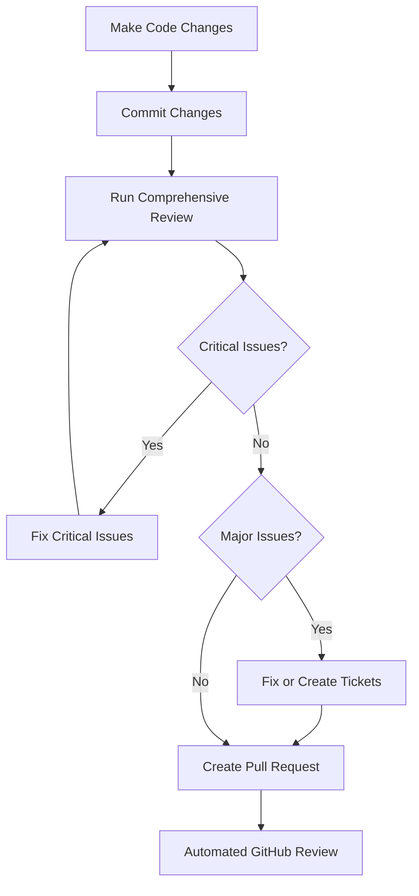
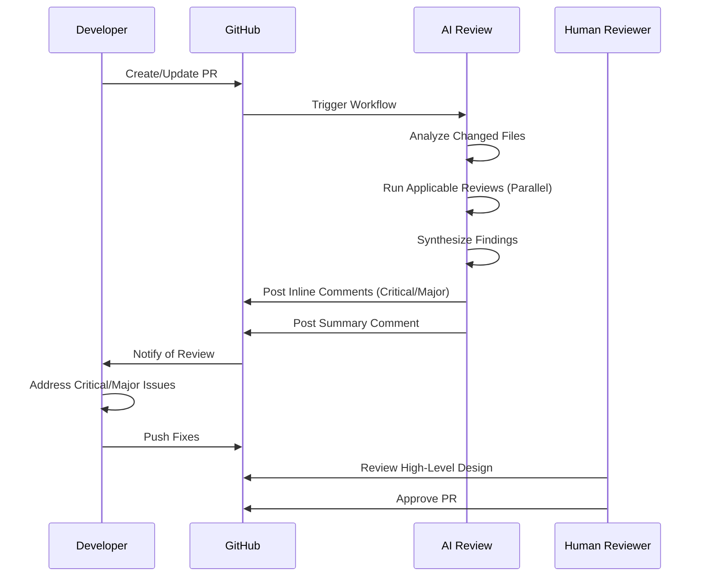
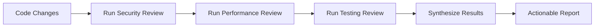
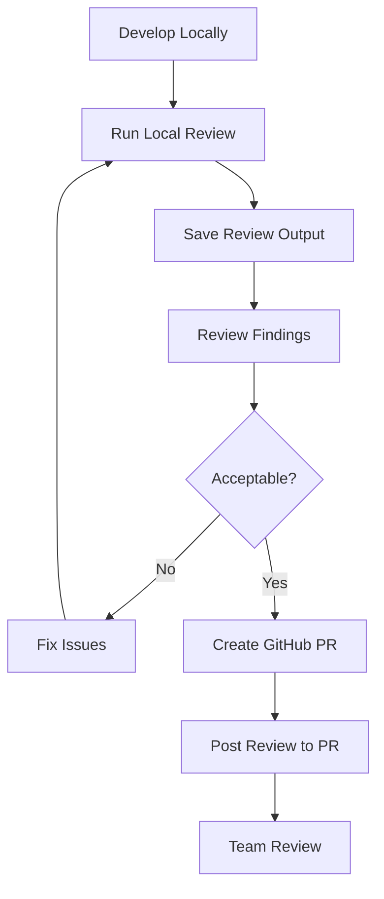
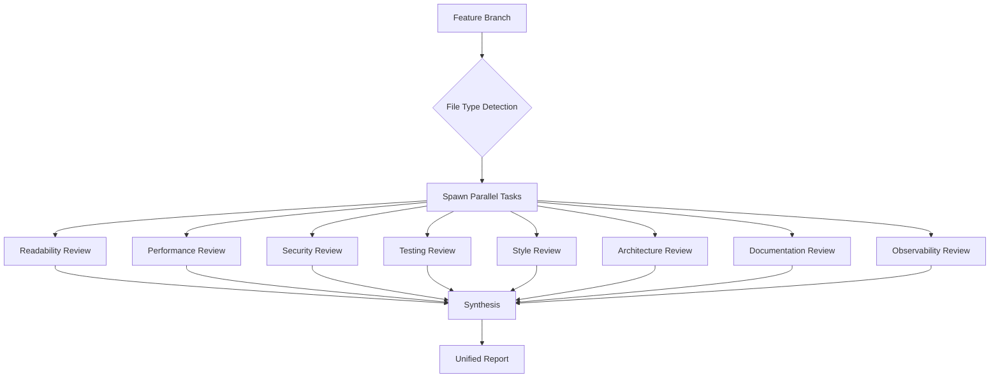
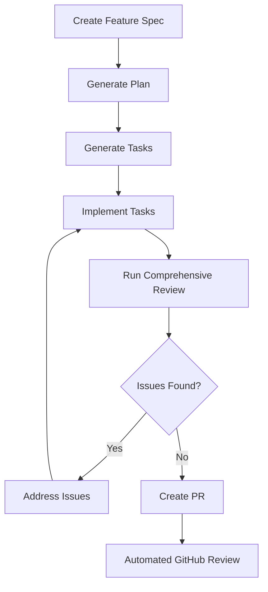
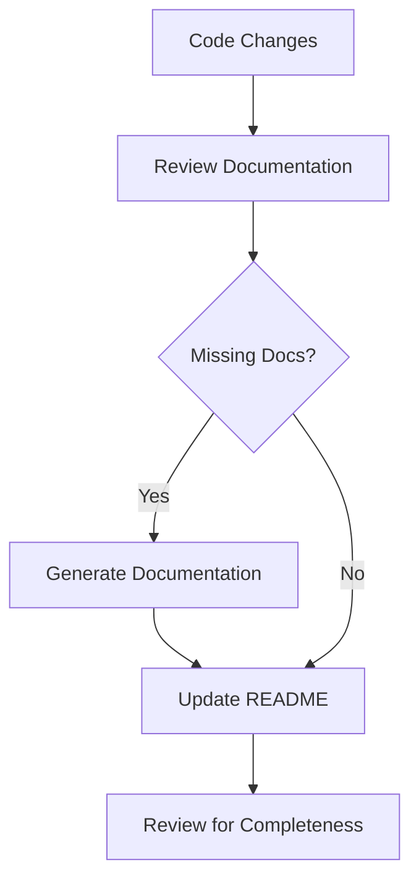
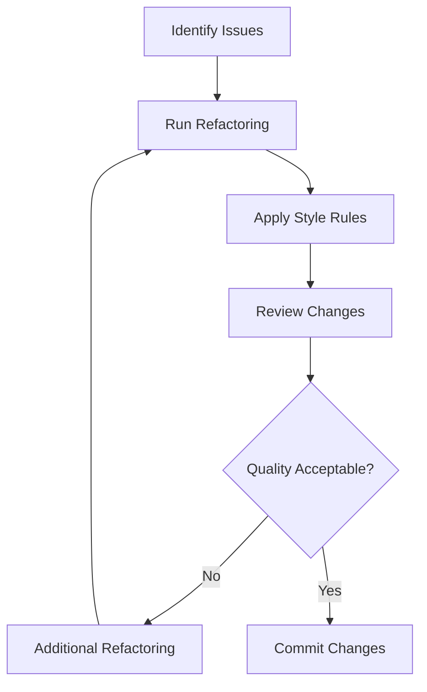
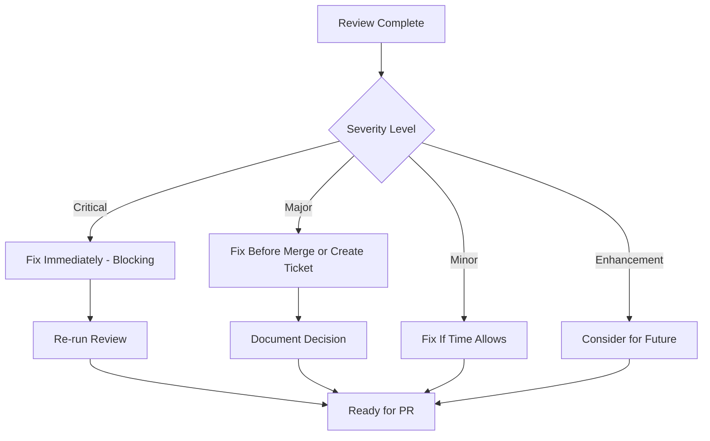

# Typical Workflows

This document provides common workflow patterns using the Claude Code Command System, with visual diagrams and step-by-step examples.

## Table of Contents

1. [AI Code Review Workflows](#ai-code-review-workflows)
2. [Feature Development with Spec-Kit](#feature-development-with-spec-kit)
3. [Git Workflows](#git-workflows)
4. [Documentation Workflows](#documentation-workflows)
5. [Code Quality Workflows](#code-quality-workflows)

---

## AI Code Review Workflows

### Workflow 1: Local Comprehensive Review

**Use Case:** Review your changes before creating a PR



**Commands:**

```bash
# 1. Make changes and commit
git add .
git commit -m "feat(auth): add JWT authentication"

# 2. Run comprehensive review
/workflows:run-comprehensive-review feature/jwt-auth develop

# 3. Address findings and create PR
# Fix Critical/Major issues first
git add .
git commit -m "fix: address review findings"

# 4. Create PR
/git:pr "Add JWT Authentication"
```

**Output:**

- Comprehensive review report with 8-10 perspectives
- Severity-based prioritization (Critical → Major → Minor → Enhancement)
- Positive highlights
- Saved to `.artifacts/reviews/`

---

### Workflow 2: Automated GitHub PR Review

**Use Case:** Automatic reviews on every PR



**Setup:**

1. Copy `.github/workflows/ai-code-review.yml` to your project
2. Add `ANTHROPIC_API_KEY` to GitHub secrets
3. Push workflow file

**Triggers:**

- PR opened
- PR synchronized (new commits)
- Security-critical paths → Deep security scan
- Performance-critical paths → Deep performance scan
- External contributors → Enhanced review

---

### Workflow 3: Focused Perspective Review

**Use Case:** Deep dive into specific aspect (e.g., security audit)



**Commands:**

```bash
# Run specific reviews
/review:security feature/payment-api develop
/review:performance feature/payment-api develop
/review:testing feature/payment-api develop

# Or use workflow for automatic selection
/workflows:run-comprehensive-review feature/payment-api develop
```

**When to Use:**

- Security audit before deployment
- Performance optimization sprint
- Test coverage improvement initiative
- Code quality remediation

---

### Workflow 4: Local Review → GitHub Integration

**Use Case:** Review locally, then post to GitHub PR



**Commands:**

```bash
# 1. Run local review and save output
/workflows:run-comprehensive-review feature/my-changes develop > review-output.md

# 2. Review findings locally
cat review-output.md

# 3. Fix issues if needed
# ... make fixes ...

# 4. Create PR
/git:pr "My Feature"

# 5. Post review to GitHub
python scripts/github-review-integration.py --pr 123 --review review-output.md
```

**Benefits:**

- Fast local feedback (no CI wait)
- Control over when to share findings
- Can iterate privately before PR
- Combines local speed with GitHub visibility

---

### Workflow 5: Multi-Perspective Parallel Review

**Use Case:** Maximum coverage with minimum time



**Execution Time:**

- **Sequential**: 30-40 minutes (10 reviews × 3-4 min)
- **Parallel**: 3-5 minutes (all reviews simultaneously)
- **Speedup**: 8-10x faster

**Dynamic Selection Example:**

```python
# Changed files: auth.ts, login.tsx, users.sql
# Selected reviews:
# - readability (always)
# - performance (SQL file)
# - testing (always)
# - security (auth path)
# - style (always)
# - architecture (always)
# - documentation (public API)
# - observability (always)
# - design (UI file)

# Skipped: None (full stack change)
```

---

## Feature Development with Spec-Kit

### Workflow: Specify → Plan → Implement → Review



**Commands:**

```bash
# 1. Create specification
/spec-kit:specify

# 2. Generate implementation plan
/spec-kit:plan

# 3. Generate tasks
/spec-kit:tasks

# 4. Implement tasks
/spec-kit:implement

# 5. Review implementation
/workflows:run-comprehensive-review feature/my-feature develop

# 6. Create PR
/git:pr "Implement Feature X"
```

---

## Git Workflows

### Workflow: Branch → Commit → Review → PR


**Commands:**

```bash
# 1. Create feature branch
/git:branch feature/new-feature

# 2. Make changes
# ... code ...

# 3. Review before commit
/workflows:run-comprehensive-review feature/new-feature develop

# 4. Commit with conventional format
/git:commit

# 5. Push to remote
/git:push

# 6. Create pull request
/git:pr "Add New Feature"
```

---

## Documentation Workflows

### Workflow: Update Code → Review Docs → Generate Missing



**Commands:**

```bash
# 1. Analyze documentation coverage
/docs:analyze

# 2. Generate missing documentation
/docs:generate api

# 3. Update existing docs
/docs:update

# 4. Review documentation quality
/review:documentation feature/my-changes develop
```

---

## Code Quality Workflows

### Workflow: Analyze → Refactor → Review → Clean



**Commands:**

```bash
# 1. Identify potential issues
/analyze:potential-issues code-quality

# 2. Run refactoring workflow
/workflows:run-refactor-workflow

# 3. Apply style rules
/clean:apply-style-rules

# 4. Review code quality
/review:readability feature/refactoring develop
/review:architecture feature/refactoring develop

# 5. Commit if acceptable
/git:commit "refactor: improve code quality"
```

---

## Review Severity Workflow

### How to Handle Review Findings



**Severity Guidelines:**

**Critical (Must Fix):**

- Security vulnerabilities
- Bugs causing crashes
- Data corruption risks
- **Action**: Fix immediately, block merge

**Major (Should Fix):**

- Performance issues
- Missing tests for new code
- Significant maintainability problems
- **Action**: Fix before merge or create tracking ticket

**Minor (Nice to Fix):**

- Style violations
- Small optimizations
- Non-critical improvements
- **Action**: Fix if time allows, optional

**Enhancement (Consider):**

- Positive patterns identified
- Optional refactoring suggestions
- Best practice recommendations
- **Action**: Note for future improvements

---

## Performance Comparison

### Review Speed: Sequential vs Parallel

```text
Sequential Execution (Old Way):
============================================================
| Readability | Performance | Testing | Security | Style | ...
============================================================
    3 min         3 min       3 min      4 min     2 min
                    Total: 30-40 minutes

Parallel Execution (New Way):
========================
| All 8-10 Reviews   |
| Simultaneously     |
========================
    Total: 3-5 minutes

Speedup: 8-10x faster (85% time reduction)
```

---

## Best Practices

### Before PR Creation

1. ✅ Run comprehensive review locally
2. ✅ Fix all Critical issues
3. ✅ Address Major issues or create tickets
4. ✅ Review positive highlights for learning
5. ✅ Commit fixes with clear messages

### During PR Review

1. ✅ Automated AI review runs on PR open
2. ✅ Review inline comments for Critical/Major
3. ✅ Address findings and push updates
4. ✅ Human reviewer focuses on high-level design
5. ✅ Merge after AI + human approval

### Post-Merge

1. ✅ Save review reports to `.artifacts/reviews/`
2. ✅ Create tickets for deferred Minor issues
3. ✅ Share positive highlights with team
4. ✅ Update coding standards based on findings
5. ✅ Continuous improvement cycle

---

## Quick Reference

### Most Common Commands

```bash
# Comprehensive review
/workflows:run-comprehensive-review feature/x develop

# Specific perspective
/review:security feature/x develop
/review:performance feature/x develop
/review:testing feature/x develop

# Synthesize multiple reviews
/review:synthesize [outputs...]

# Git workflow
/git:branch feature/x
/git:commit
/git:push
/git:pr "Title"

# Save artifacts
/artifact:save review
```

### Command Chaining

```bash
# Review → Fix → Commit → PR
/workflows:run-comprehensive-review feature/x develop
# ... fix issues ...
/git:commit "fix: address review findings"
/git:push
/git:pr "Feature X"
```

---

## Additional Resources

- [GitHub Automation Guide](./github-automation.md)
- [Command Template](./command-template.md)
- [Agent Specialist Framework](./agent-specialist-framework.md)
- [User Guide](./user-guide.md)
