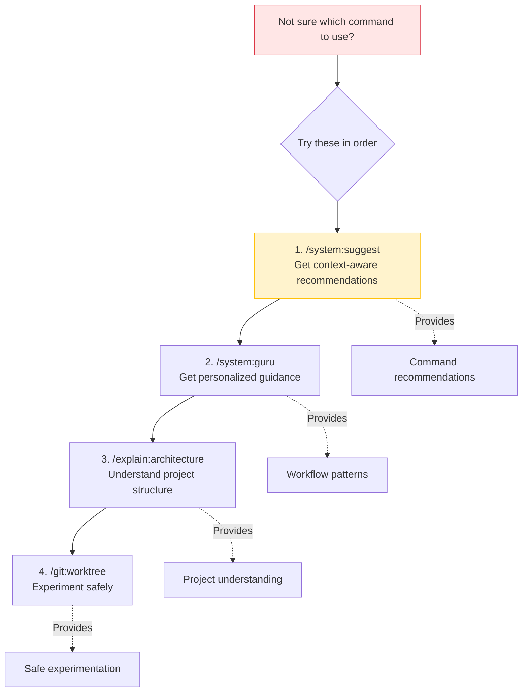

# Command Selection Guide

This guide provides visual decision trees to help you quickly find the right command for your task.

## Quick Command Selector

```mermaid
flowchart TD
    Start[What do you want to do?] --> Type{Task Type}

    Type -->|Write/modify code| Code[Code Development]
    Type -->|Find/understand code| Understand[Code Understanding]
    Type -->|Fix/improve quality| Quality[Quality & Review]
    Type -->|Git operations| Git[Git Workflow]
    Type -->|Documentation| Docs[Documentation]
    Type -->|System/setup| System[System Operations]

    Code --> CodeType{Complexity?}
    CodeType -->|Simple change| Direct[Direct implementation]
    CodeType -->|Feature with requirements| Spec[/spec-kit:specify]
    Spec --> Plan[/spec-kit:plan]
    Plan --> Implement[/spec-kit:implement]

    Understand --> UnderstandWhat{What to understand?}
    UnderstandWhat -->|Single file/function| ExplainCode[/explain:code]
    UnderstandWhat -->|Whole architecture| ExplainArch[/explain:architecture]
    UnderstandWhat -->|Find TODOs/issues| FindComments[/system:find-comments]

    Quality --> QualityType{What aspect?}
    QualityType -->|Comprehensive review| CompReview[/workflows:run-comprehensive-review]
    QualityType -->|Security audit| SecAudit[/workflows:run-security-audit]
    QualityType -->|Refactor code| Refactor[/workflows:run-refactor-workflow]
    QualityType -->|Optimize performance| Optimize[/workflows:run-optimization]
    QualityType -->|Fix linting| Lint[/lint:correct-all]

    Git --> GitType{Git operation?}
    GitType -->|Full workflow| GitWorkflow[/workflows:git]
    GitType -->|Just commit| GitCommit[/git:commit]
    GitType -->|Create PR| GitPR[/git:pr]
    GitType -->|Parallel work| GitWorktree[/git:worktree]
    GitType -->|Git-Flow| GitFlow[/git-flow:*]

    Docs --> DocsType{Documentation task?}
    DocsType -->|Full docs workflow| DocsWorkflow[/workflows:docs]
    DocsType -->|Update changelog| Changelog[/docs:changelog]

    System --> SystemType{System task?}
    SystemType -->|Not sure what command| Suggest[/system:suggest]
    SystemType -->|Setup MCP| SetupMCP[/system:setup-mcp]
    SystemType -->|Get guidance| Guru[/system:guru]
    SystemType -->|Start session| SessionStart[/system:session-start]

    style Spec fill:#d4ffe6,stroke:#00c851
    style Suggest fill:#fff3cd,stroke:#ffc107
    style CompReview fill:#cfe2ff,stroke:#0d6efd
```

## Git Workflow Decision Tree

```mermaid
flowchart TD
    GitStart[Git Operation Needed] --> Status{What's your status?}

    Status -->|Changes to commit| Commit{Ready to commit?}
    Status -->|Need to create PR| PR{Changes committed?}
    Status -->|Working on feature| Feature[Feature branch work]
    Status -->|Multiple features| Parallel[Parallel development]

    Commit -->|Need review first| Review[/workflows:run-comprehensive-review]
    Commit -->|Need linting| LintFirst[/lint:correct-all]
    Commit -->|Ready now| DirectCommit[/git:commit]

    Review --> LintFirst
    LintFirst --> DirectCommit

    PR -->|Yes| CreatePR[/git:pr]
    PR -->|No, do everything| FullWorkflow[/workflows:git]

    Feature --> BranchType{Workflow type?}
    BranchType -->|Git-Flow| GitFlowFeature[/git-flow:feature]
    BranchType -->|Conventional| RegularBranch[Create feature branch]

    Parallel -->|Multiple worktrees| Worktree[/git:worktree]
    Parallel -->|Consolidate worktrees| Consolidate[/git:worktree-consolidate]

    FullWorkflow --> Review2[Review code]
    Review2 --> Lint2[Run linters]
    Lint2 --> Commit2[Commit changes]
    Commit2 --> Push[Push to remote]
    Push --> CreatePR2[Create PR]

    style FullWorkflow fill:#d4ffe6,stroke:#00c851
    style DirectCommit fill:#cfe2ff,stroke:#0d6efd
```

## Feature Development Decision Tree

```mermaid
flowchart TD
    FeatureStart[New Feature to Build] --> Complexity{Feature complexity?}

    Complexity -->|Simple< 3 files/single component| Simple[Direct Implementation]
    Complexity -->|Moderate<br/>5-10 files/multiple components| Moderate[Guided Implementation]
    Complexity -->|Complex<br/>10+ files/multiple domains| Complex[Spec-Kit Workflow]

    Simple --> DirectCode[Write code directly]
    DirectCode --> SimpleReview[/workflows:run-comprehensive-review]
    SimpleReview --> SimpleCommit[/workflows:git]

    Moderate --> Research[Research first]
    Research --> ModImplement[Implement with guidance]
    ModImplement --> ModReview[/workflows:run-comprehensive-review]
    ModReview --> ModCommit[/workflows:git]

    Complex --> Specify[/spec-kit:specify]
    Specify --> Clarify{Need clarification?}
    Clarify -->|Yes| ClarifyCmd[/spec-kit:clarify]
    Clarify -->|No| PlanCmd[/spec-kit:plan]
    ClarifyCmd --> PlanCmd
    PlanCmd --> Tasks[/spec-kit:tasks]
    Tasks --> Analyze[/spec-kit:analyze]
    Analyze --> ImplCmd[/spec-kit:implement]

    style Complex fill:#d4ffe6,stroke:#00c851
    style Specify fill:#cfe2ff,stroke:#0d6efd
```

## Code Quality & Review Decision Tree

```mermaid
flowchart TD
    QualityStart[Quality Check Needed] --> When{When?}

    When -->|Before committing| PreCommit[Pre-Commit Check]
    When -->|During review| DuringReview[Review Process]
    When -->|Refactoring| Refactor[Refactoring Work]
    When -->|Performance issue| Perf[Performance Optimization]

    PreCommit --> Lint[/lint:correct-all]
    Lint --> QuickReview{Need review?}
    QuickReview -->|Yes| LocalReview[/workflows:run-comprehensive-review]
    QuickReview -->|No| ReadyCommit[Ready to commit]

    DuringReview --> ReviewType{Review focus?}
    ReviewType -->|Everything| CompReview[/workflows:run-comprehensive-review]
    ReviewType -->|Security only| SecReview[/workflows:run-security-audit]
    ReviewType -->|Code structure| RefacReview[/workflows:run-refactor-workflow]

    Refactor --> RefactorType{Refactor scope?}
    RefactorType -->|Large codebase| LargeRefactor[/workflows:run-refactor-workflow]
    RefactorType -->|Small changes| SmallRefactor[Direct refactor + review]

    Perf --> PerfScope{Performance scope?}
    PerfScope -->|Full stack| FullPerf[/workflows:run-optimization]
    PerfScope -->|Specific area| TargetPerf[Targeted optimization]

    style CompReview fill:#d4ffe6,stroke:#00c851
    style Lint fill:#fff3cd,stroke:#ffc107
```

## Bug Fix Decision Tree

```mermaid
flowchart TD
    BugStart[Bug to Fix] --> KnowCause{Know root cause?}

    KnowCause -->|Yes| DirectFix[Direct Fix]
    KnowCause -->|No| Investigate[Investigation Needed]

    Investigate --> InvestType{Investigation type?}
    InvestType -->|Security related| SecInvest[/workflows:run-security-audit]
    InvestType -->|Performance| PerfInvest[/workflows:run-optimization]
    InvestType -->|Code understanding| ExplainInvest[/explain:code or /explain:architecture]
    InvestType -->|Unknown| CompInvest[/workflows:run-comprehensive-review]

    SecInvest --> FoundCause[Root cause identified]
    PerfInvest --> FoundCause
    ExplainInvest --> FoundCause
    CompInvest --> FoundCause

    FoundCause --> DirectFix

    DirectFix --> FixCode[Write fix]
    FixCode --> TestFix[Test fix]
    TestFix --> ReviewFix{Need review?}
    ReviewFix -->|Critical/Security| MustReview[/workflows:run-security-audit]
    ReviewFix -->|Regular| OptionalReview[/workflows:run-comprehensive-review]
    ReviewFix -->|Simple| SkipReview[Skip review]

    MustReview --> CommitFix[/workflows:git]
    OptionalReview --> CommitFix
    SkipReview --> CommitFix

    style SecInvest fill:#ffe6e6,stroke:#dc3545
    style MustReview fill:#ffe6e6,stroke:#dc3545
    style DirectFix fill:#d4ffe6,stroke:#00c851
```

## Documentation Decision Tree

```mermaid
flowchart TD
    DocsStart[Documentation Needed] --> DocsWhat{What documentation?}

    DocsWhat -->|Complete docs| FullDocs[/workflows:docs]
    DocsWhat -->|API documentation| APIDocs[API documentation]
    DocsWhat -->|Changelog| ChangelogDoc[/docs:changelog]
    DocsWhat -->|Architecture explanation| ArchDoc[/explain:architecture]
    DocsWhat -->|Code explanation| CodeDoc[/explain:code]

    FullDocs --> DocsReview[Review generated docs]
    DocsReview --> DocsCommit[Commit documentation]

    APIDocs --> APIHow{How to document?}
    APIHow -->|Auto-generate| AutoAPI[Generate from code]
    APIHow -->|Manual| ManualAPI[Write manually]

    ChangelogDoc --> ChangelogOp{Changelog operation?}
    ChangelogOp -->|Add entry| AddEntry[/docs:changelog --add-entry]
    ChangelogOp -->|Create release| Release[/docs:changelog --release]
    ChangelogOp -->|View| View[/docs:changelog <version>]

    style FullDocs fill:#d4ffe6,stroke:#00c851
    style ChangelogDoc fill:#cfe2ff,stroke:#0d6efd
```

## MCP & System Setup Decision Tree

```mermaid
flowchart TD
    SetupStart[System Setup/Configuration] --> SetupWhat{What to setup?}

    SetupWhat -->|MCP servers| MCPSetup[/system:setup-mcp]
    SetupWhat -->|New session| Session[/system:session-start]
    SetupWhat -->|Need guidance| Guidance[/system:guru]
    SetupWhat -->|Not sure| NotSure[/system:suggest]

    MCPSetup --> MCPWhich{Which servers?}
    MCPWhich -->|All| AllMCP[Setup all MCP servers]
    MCPWhich -->|Specific| SpecificMCP[Setup specific server]

    Session --> SessionTopic{Session topic?}
    SessionTopic -->|Specific| WithTopic[/system:session-start topic-name]
    SessionTopic -->|General| NoTopic[/system:session-start]

    Guidance --> GuidanceWhat{Guidance on?}
    GuidanceWhat -->|Commands| CommandGuidance[Command recommendations]
    GuidanceWhat -->|Workflows| WorkflowGuidance[Workflow patterns]
    GuidanceWhat -->|Best practices| BestPractices[Best practices]

    NotSure --> SuggestAnalyze[Analyze context]
    SuggestAnalyze --> SuggestRec[Get recommendations]

    style MCPSetup fill:#d4ffe6,stroke:#00c851
    style NotSure fill:#fff3cd,stroke:#ffc107
```

## When Unsure: Start Here



## Command Categories Quick Reference

### Git & Version Control

- `/git:commit` - Smart commit with message generation
- `/git:push` - Safe push with validation
- `/git:pr` - Create pull request
- `/git:worktree` - Manage parallel development
- `/git-flow:*` - Git-Flow workflow commands
- `/workflows:git` - Complete git workflow (review → commit → PR)

### Code Quality & Review

- `/workflows:run-comprehensive-review` - Multi-perspective review
- `/workflows:run-security-audit` - Security-focused audit
- `/workflows:run-refactor-workflow` - Refactoring analysis
- `/workflows:run-optimization` - Performance optimization
- `/lint:correct-all` - Run all linters with auto-fix

### Feature Development

- `/spec-kit:specify` - Create feature specification
- `/spec-kit:plan` - Generate implementation plan
- `/spec-kit:implement` - Execute implementation
- `/spec-kit:clarify` - Ask clarification questions
- `/spec-kit:analyze` - Analyze consistency

### Code Understanding

- `/explain:code` - Explain specific code
- `/explain:architecture` - Explain system architecture
- `/system:find-comments` - Find TODOs and issues

### Documentation

- `/workflows:docs` - Complete documentation workflow
- `/docs:changelog` - Manage CHANGELOG.md

### System & Discovery

- `/system:suggest` - Get command recommendations
- `/system:guru` - Get personalized guidance
- `/system:setup-mcp` - Setup MCP servers
- `/system:session-start` - Initialize work session

### GitHub Integration

- `/github:create-issue` - Create GitHub issues
- `/github:get-issues` - Fetch and integrate issues

## Tips for Command Selection

### For Beginners

1. Start with `/system:suggest` to get recommendations
2. Use `/system:guru` for workflow guidance
3. Stick to high-level workflows (`/workflows:*`) initially
4. Use `/explain:architecture` to understand the project

### For Intermediate Users

1. Combine atomic commands for custom workflows
2. Use `/git:worktree` for parallel feature development
3. Run `/lint:correct-all` before commits
4. Use spec-kit for complex features

### For Advanced Users

1. Create custom command sequences
2. Use parallel agent invocation patterns
3. Leverage worktree consolidation for complex merges
4. Build custom workflows with SlashCommand delegation

## Common Workflow Patterns

### Daily Development

```bash
/system:session-start today
# ... make changes ...
/lint:correct-all
/workflows:run-comprehensive-review
/workflows:git "feature description"
```

### Bug Investigation & Fix

```bash
/explain:code problem-area
/workflows:run-security-audit  # if security-related
/workflows:run-optimization    # if performance-related
# ... fix bug ...
/workflows:git "fix bug description"
```

### Feature Development (Complex)

```bash
/spec-kit:specify "feature description"
/spec-kit:clarify  # if needed
/spec-kit:plan
/spec-kit:implement
```

### Code Review Before Merging

```bash
/workflows:run-comprehensive-review
/lint:correct-all
/workflows:run-security-audit  # for sensitive changes
/git:pr "PR title"
```

---

**Still unsure?** Run `/system:suggest` with your task description, and the system will analyze your context and recommend the best commands.
