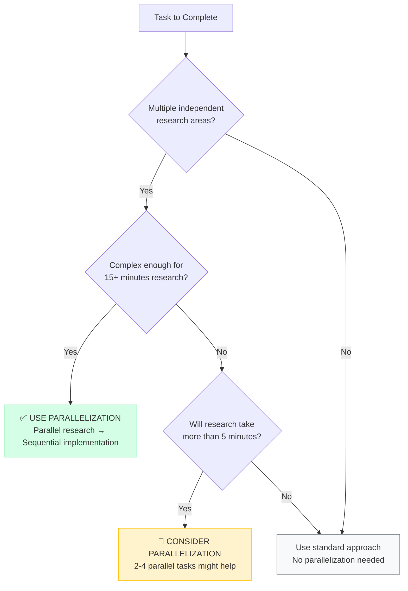

# When to Use Parallelization: Decision Framework

This framework helps you quickly decide whether your task will benefit from Claude Code's parallelization capabilities.

## Quick Decision Tree



## Task Complexity Assessment

### 🟢 Definitely Use Parallelization

**Characteristics:**

- ✅ 3+ independent research domains needed
- ✅ Research will take 15+ minutes if done sequentially
- ✅ Multiple information sources required
- ✅ Comprehensive understanding critical for success

**Examples:**

```text
✅ "Implement user authentication with security, performance, and integration research"
✅ "Investigate production bug with unknown root cause"
✅ "Review large PR across security, performance, and quality dimensions"
✅ "Analyze system architecture for performance bottlenecks"
✅ "Plan migration strategy requiring compatibility and risk analysis"
```

**Expected Performance Gain:** Substantial time savings

### 🟡 Consider Parallelization

**Characteristics:**

- ⚠️ 2-3 research areas that could be investigated separately
- ⚠️ Moderate complexity requiring 5-15 minutes research
- ⚠️ Some independent analysis possible
- ⚠️ Quality improvement important but not critical

**Examples:**

```text
🤔 "Add new API endpoint with security and testing considerations"
🤔 "Optimize specific component for performance"
🤔 "Update library dependencies with compatibility check"
🤔 "Refactor module with quality and maintainability review"
```

**Expected Performance Gain:** Moderate time savings

### 🔴 Skip Parallelization

**Characteristics:**

- ❌ Single, well-defined change needed
- ❌ Known solution or straightforward implementation
- ❌ Time-critical emergency fix required
- ❌ Sequential dependencies prevent parallel work

**Examples:**

```text
❌ "Fix typo in configuration file"
❌ "Update version number in package.json"
❌ "Add single CSS style to existing class"
❌ "Emergency fix for production outage"
❌ "Simple bug fix in known file location"
```

**Approach:** Use standard sequential development

## Domain Independence Assessment

### ✅ Independent Research Domains

These domains can be researched in parallel without affecting each other:

**Technical Domains:**

- Security analysis
- Performance optimization
- Code quality assessment
- Architecture evaluation
- Testing strategy
- Documentation requirements

**Information Sources:**

- External best practices research
- Existing codebase analysis
- Framework/library documentation
- Performance metrics analysis
- Error log investigation

**Analysis Types:**

- Static code analysis
- Configuration review
- Integration compatibility
- Dependency assessment

### ❌ Dependent Research Areas

These areas should be researched sequentially as they build on each other:

**Sequential Dependencies:**

- API design → Implementation strategy
- Database schema → Model implementation
- Test results → Bug fix strategy
- User feedback → Feature requirements
- Performance baseline → Optimization targets

## Task Size Guidelines

### Large Tasks (>45 minutes sequential)

**Parallelization Strategy:** 6-10 parallel research tasks

```python
# Example: Full feature implementation
Task("Security research and compliance requirements")
Task("Architecture analysis and integration planning")
Task("Performance implications and optimization strategies")
Task("Testing strategy and automation requirements")
Task("Documentation and API design standards")
Task("Error handling and monitoring requirements")
Task("User experience and frontend considerations")
Task("Data modeling and storage optimization")
```

### Medium Tasks (15-45 minutes sequential)

**Parallelization Strategy:** 3-5 parallel research tasks

```python
# Example: Component optimization
Task("Performance bottleneck analysis and metrics")
Task("Code quality and maintainability assessment")
Task("Testing coverage and automation gaps")
Task("Security vulnerability and compliance review")
```

### Small Tasks (5-15 minutes sequential)

**Parallelization Strategy:** 2-3 parallel research tasks

```python
# Example: Library update
Task("Compatibility analysis with existing dependencies")
Task("Security assessment and vulnerability review")
Task("Performance impact and optimization opportunities")
```

### Tiny Tasks (<5 minutes sequential)

**Parallelization Strategy:** No parallelization needed

## Context Complexity Analysis

### High Context Complexity (Use Parallelization)

- Unknown root causes requiring investigation
- Multiple system interactions
- Cross-cutting concerns (security, performance, maintainability)
- Integration between multiple services
- Legacy code that needs comprehensive understanding

### Low Context Complexity (Skip Parallelization)

- Well-understood codebase areas
- Isolated changes with clear boundaries
- Standard patterns with known solutions
- Simple configuration or content updates

## Performance vs Time Investment

### High ROI Scenarios (Definitely Parallelize)

```text
Research Time Saved: 60-85%
Examples:
- Complex feature development (25 min → 6 min)
- Production bug investigation (30 min → 5 min)
- Architecture analysis (60 min → 15 min)
- Comprehensive code review (20 min → 5 min)
```

### Medium ROI Scenarios (Consider Parallelizing)

```text
Research Time Saved: 30-50%
Examples:
- API endpoint with validation (15 min → 8 min)
- Performance optimization (12 min → 7 min)
- Library integration (10 min → 6 min)
```

### Low ROI Scenarios (Skip Parallelization)

```text
Overhead > Benefits
Examples:
- Simple fixes (2 min → 3 min with overhead)
- Known patterns (3 min → 4 min with overhead)
- Emergency fixes (time pressure overrides optimization)
```

## Special Considerations

### Emergency Situations

**Rule:** Skip parallelization for true emergencies

- Production outages require immediate action
- Security breaches need fast response
- Critical bugs blocking releases

**Exception:** If emergency investigation requires extensive debugging, use parallelization for diagnostic phase.

### Learning vs Delivery

**Learning Focus:** Use parallelization to understand new technologies or complex systems comprehensively
**Delivery Focus:** Balance parallelization benefits against project timeline pressure

### Team Collaboration

**Solo Work:** Parallelization provides maximum benefit
**Pair Programming:** Discuss parallelization strategy with pair
**Code Review:** Always beneficial for comprehensive review

### Resource Constraints

**High Computation Costs:** Consider whether 10 parallel tasks are cost-effective
**Time Constraints:** Factor in 2-3 minute overhead for parallel task coordination
**Context Limits:** Parallelization helps manage context by isolating research

## Decision Checklist

Before starting any task, ask:

### Research Assessment

- [ ] Will this require information from multiple independent sources?
- [ ] Are there 3+ different aspects to analyze (security, performance, quality)?
- [ ] Will research take more than 5 minutes if done sequentially?
- [ ] Is comprehensive understanding important for success?

### Implementation Assessment

- [ ] Can the research be done independently from implementation?
- [ ] Will implementation be sequential regardless of parallel research?
- [ ] Are there clear boundaries between research domains?
- [ ] Is this not an emergency requiring immediate action?

### Cost-Benefit Assessment

- [ ] Will substantial time savings justify brief coordination overhead?
- [ ] Is quality improvement worth the additional complexity?
- [ ] Do I have adequate time for the full parallel research cycle?

**If 8+ boxes checked:** ✅ Use parallelization
**If 4-7 boxes checked:** 🤔 Consider parallelization
**If <4 boxes checked:** ❌ Skip parallelization

## Common Mistakes to Avoid

### ❌ Over-Parallelizing Simple Tasks

```python
# Don't do this for simple changes:
Task("Research how to update a CSS color")
Task("Analyze security implications of changing button color")
Task("Investigate performance impact of blue vs red button")

# Instead: Just make the simple change
```

### ❌ Under-Utilizing Complex Opportunities

```text
# Don't do this for complex features:
"Let me add authentication... first I'll research security... then performance... then testing..."

# Instead: Parallel research across all domains simultaneously
```

### ❌ Parallelizing Dependent Research

```python
# Don't do this - these are dependent:
Task("Design the API structure")
Task("Implement the API based on the design")  # Depends on design

# Instead: Research external best practices in parallel, then design sequentially
```

---

This decision framework helps you maximize Claude Code's parallelization benefits while avoiding unnecessary overhead for simple tasks. When in
doubt, lean toward parallelization for any task requiring significant research or analysis.
