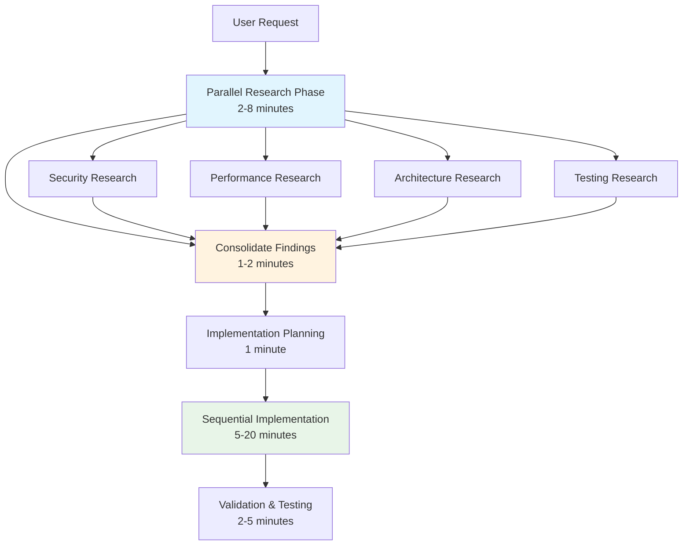

# From Research to Implementation: Transition Guide

This guide explains how to effectively transition from parallel research findings to sequential implementation, maximizing the benefits of Claude
Code's parallelization while maintaining code quality.

## The Research-Implementation Transition

### Overview of the Process



## Phase 1: Managing Parallel Research Results

### What to Expect During Research Phase

**Research Execution (2-8 minutes):**

```text
✅ Task 1 complete: Security analysis findings ready
✅ Task 2 complete: Performance implications assessed
✅ Task 3 complete: Architecture integration analyzed
⏳ Task 4 running: Testing strategy research in progress
```

**Quality Indicators:**

- Each task returns focused, specific findings
- No generic "research everything" responses
- Actionable recommendations rather than raw data
- Clear priorities and trade-offs identified

### Recognizing Good Research Results

**✅ High-Quality Research Output:**

```markdown
## Security Analysis Results
**Critical Findings:**
- Use bcrypt with 12 rounds for password hashing (current: plain text)
- Implement JWT with RS256 algorithm (not HS256)
- Add rate limiting: 5 attempts per minute per IP

**Implementation Priority:**
1. Fix password hashing (security critical)
2. Implement JWT properly (high impact)
3. Add rate limiting (medium impact)

**Code Examples:** [Specific implementation patterns provided]
**Integration Points:** [Exact files and functions to modify]
```

**❌ Poor Research Output:**

```markdown
## Security Analysis Results
- Security is important
- Use best practices
- Hash passwords
- Implement authentication

[Too generic, no specific recommendations]
```

### Handling Conflicting Research Results

**Common Conflicts:**

- Security recommends complex implementation vs Performance suggests simple approach
- Architecture suggests new patterns vs existing codebase uses different patterns
- Testing requirements conflict with implementation timeline

**Resolution Strategy:**

```markdown
## Conflict Resolution Example

**Conflict:** Security research recommends OAuth 2.0 + PKCE, but performance research shows JWT is faster for our use case.

**Resolution Process:**
1. **Assess Context:** Internal API with trusted clients → JWT appropriate
2. **Find Middle Ground:** Use JWT with proper security (RS256, short expiration)
3. **Plan Future:** Document OAuth migration path for external client support
4. **Implement:** JWT now with security best practices, OAuth later

**Decision:** Implement secure JWT with migration plan to OAuth when needed
```

### Consolidation Checklist

Before moving to implementation, verify:

- [ ] All research tasks completed successfully
- [ ] Findings are specific and actionable
- [ ] Conflicts identified and resolved
- [ ] Priorities clearly established
- [ ] Implementation approach decided
- [ ] Dependencies and order understood

## Phase 2: Implementation Planning

### Creating Implementation Order

**Dependency Analysis:**

```markdown
## Authentication Implementation Dependencies

**Must Go First:**
1. Database schema/models (nothing depends on this)
2. Core JWT service (all other auth depends on this)

**Depends on Previous:**
3. Auth middleware (depends on JWT service)
4. Protected routes (depends on middleware)
5. Error handling (depends on middleware)

**Can Be Parallel:**
- Documentation (no dependencies)
- Tests (can be written alongside)
```

**Risk Assessment:**

```markdown
## Implementation Risks & Mitigation

**High Risk:**
- Database schema changes → Create backup first
- Breaking existing routes → Implement gradual rollout

**Medium Risk:**
- JWT library integration → Test thoroughly in development
- Middleware conflicts → Review existing middleware first

**Low Risk:**
- Adding new routes → No existing functionality affected
- Documentation updates → No code impact
```

### Implementation Strategy Selection

**Strategy 1: Incremental Implementation**

```text
# Best for: Large features, production systems
1. Implement core functionality first
2. Test each piece thoroughly
3. Add features incrementally
4. Validate at each step

Example: Auth Core → Middleware → Routes → Advanced Features
```

**Strategy 2: Complete Feature Implementation**

```text
# Best for: New features, development environment
1. Implement all components
2. Test as complete system
3. Deploy when fully functional

Example: Complete auth system in development, then deploy to production
```

**Strategy 3: Parallel Development Tracks**

```text
# Best for: Independent components
1. Implement components separately
2. Integrate when both complete
3. Test integration thoroughly

Example: Backend auth + Frontend components developed separately
```

## Phase 3: Sequential Implementation

### Step-by-Step Implementation Process

**Implementation Template:**

```markdown
## Implementation Phase: [Feature Name]

**Current Status:** Starting implementation based on research findings
**Estimated Time:** [X] minutes
**Rollback Plan:** [How to undo if something goes wrong]

### Step 1: [First Component]
**What:** [Specific action]
**Why:** [Based on which research finding]
**Files:** [Exact files to modify]
**Validation:** [How to verify this step worked]

[Implementation happens]

✅ **Step 1 Complete:** [Brief validation]

### Step 2: [Next Component]
...
```

**Real Example:**

```markdown
## Implementation Phase: JWT Authentication

**Current Status:** Starting implementation based on security and performance research
**Estimated Time:** 15 minutes
**Rollback Plan:** Git commit before each step, can revert individual commits

### Step 1: User Model with Password Hashing
**What:** Add User model with bcrypt password hashing
**Why:** Security research identified plain text passwords as critical vulnerability
**Files:** models/User.js, package.json
**Validation:** Test password hash/verify cycle

[Creates User model with proper password hashing]

✅ **Step 1 Complete:** Password hashing working, tests passing

### Step 2: JWT Service Implementation
**What:** Create JWT service with RS256 algorithm
**Why:** Security research recommended RS256 over HS256 for production
**Files:** services/jwt-service.js, config/keys.js
**Validation:** Generate and verify test tokens

[Implements JWT service with proper algorithm]

✅ **Step 2 Complete:** JWT service generating/validating tokens correctly

### Step 3: Authentication Middleware
**What:** Create middleware for route protection
**Why:** Architecture research identified optimal integration points
**Files:** middleware/auth.js, routes/protected.js
**Validation:** Test protected route access

[Implements middleware with proper error handling]

✅ **Step 3 Complete:** Middleware protecting routes, proper error responses
```

### Progress Tracking During Implementation

**Continuous Validation:**

```text
After Each Step:
✅ Code compiles/runs without errors
✅ New functionality works as expected
✅ Existing functionality still works (no regressions)
✅ Tests pass (if applicable)
✅ Ready to proceed to next step
```

**Checkpoint Strategy:**

```markdown
## Implementation Checkpoints

**Minor Checkpoint** (Every 2-3 steps):
- Quick functionality test
- Verify no obvious regressions
- Continue implementation

**Major Checkpoint** (Every 5-7 steps or 10 minutes):
- Comprehensive testing
- Git commit with descriptive message
- Evaluate progress against plan
- Adjust strategy if needed

**Quality Gate** (Before final step):
- Full feature testing
- Integration testing
- Security verification
- Performance check
```

### Handling Implementation Problems

**When Implementation Doesn't Match Research:**

**Problem:** Research recommended Approach A, but implementation reveals it won't work
**Solution:**

```text
1. **Pause Implementation:** Don't force wrong approach
2. **Quick Research:** 2-3 minute targeted investigation
3. **Adjust Plan:** Update approach based on new information
4. **Continue:** Resume implementation with adjusted plan
5. **Learn:** Document for future similar situations
```

**Example:**

```markdown
**Issue:** Research recommended using Express built-in JWT middleware, but our Express version doesn't support it.

**Quick Resolution:**
1. Check Express version: 4.16 (middleware needs 4.18+)
2. Options: Upgrade Express OR use jsonwebtoken library
3. Decision: Use jsonwebtoken (less risky than major upgrade)
4. Continue: Implement JWT with alternative library
5. Note: Update research for future Express-based auth projects
```

## Phase 4: Validation and Completion

### Implementation Validation Process

**Functional Testing:**

```markdown
## Validation Checklist

**Core Functionality:**
- [ ] New feature works as designed
- [ ] All research requirements implemented
- [ ] Edge cases handled properly
- [ ] Error conditions handled gracefully

**Integration Testing:**
- [ ] Works with existing system
- [ ] No regressions in existing features
- [ ] Performance meets expectations
- [ ] Security requirements satisfied

**Quality Testing:**
- [ ] Code follows project standards
- [ ] Documentation updated if needed
- [ ] Tests added/updated as appropriate
- [ ] Ready for code review (if applicable)
```

**Research Validation:**

```markdown
## Research Findings Validation

**Security Research → Implementation:**
✅ Password hashing with bcrypt implemented
✅ JWT using RS256 algorithm implemented
✅ Rate limiting added to auth endpoints
✅ All security requirements from research satisfied

**Performance Research → Implementation:**
✅ JWT chosen over sessions for stateless scaling
✅ Token caching implemented for repeated validations
✅ Database queries optimized as recommended
✅ Performance targets from research achieved

**Architecture Research → Implementation:**
✅ Middleware pattern used as recommended
✅ Integration points implemented as planned
✅ Error handling follows existing patterns
✅ Architecture consistency maintained
```

### Success Metrics

**Time Performance:**

```markdown
## Implementation Performance

**Research Phase:** 4 minutes (4 parallel tasks)
**Implementation Phase:** 12 minutes (sequential)
**Validation Phase:** 3 minutes
**Total Time:** 19 minutes

**vs Sequential Approach:** ~35 minutes
**Time Savings:** 46% improvement
**Quality:** Higher (comprehensive research informed implementation)
```

**Quality Metrics:**

```markdown
## Quality Assessment

**Research Depth:** Comprehensive across 4 domains
**Implementation Accuracy:** All research findings applied correctly
**Integration Success:** No regressions, clean integration
**Future Maintainability:** Well-documented, follows patterns
```

## Common Transition Challenges

### Challenge 1: Information Overload

**Problem:** Research returns too much information to process effectively
**Solution:**

```text
1. Focus on highest priority findings first
2. Implement core functionality, defer nice-to-haves
3. Create follow-up TODO list for additional improvements
4. Don't try to implement everything in first iteration
```

### Challenge 2: Research-Implementation Mismatch

**Problem:** Research assumptions don't match actual codebase
**Solution:**

```text
1. Validate research assumptions early in implementation
2. Adapt recommendations to actual constraints
3. Document variances for future reference
4. Focus on principles rather than exact implementation
```

### Challenge 3: Implementation Complexity

**Problem:** Implementation is more complex than research suggested
**Solution:**

```text
1. Break complex steps into smaller sub-steps
2. Implement minimum viable version first
3. Iterate and improve incrementally
4. Don't abandon plan entirely, adapt it
```

### Challenge 4: Time Pressure

**Problem:** Implementation taking longer than expected
**Solution:**

```text
1. Prioritize critical requirements over nice-to-haves
2. Implement core functionality first
3. Create follow-up tasks for remaining items
4. Don't rush and introduce bugs
```

## Best Practices Summary

### Research Phase Best Practices

1. **Clear Task Boundaries:** Ensure research tasks don't overlap
2. **Specific Requirements:** Request actionable recommendations, not general advice
3. **Context Provision:** Give research tasks sufficient project context
4. **Quality Validation:** Verify research results before implementation

### Transition Phase Best Practices

1. **Conflict Resolution:** Address research conflicts before implementation
2. **Priority Setting:** Establish clear implementation order
3. **Risk Assessment:** Identify potential implementation challenges
4. **Rollback Planning:** Prepare for implementation problems

### Implementation Phase Best Practices

1. **Sequential Execution:** Implement one component at a time
2. **Continuous Validation:** Test after each major step
3. **Progress Tracking:** Monitor against research-based plan
4. **Quality Maintenance:** Don't sacrifice quality for speed

### Validation Phase Best Practices

1. **Comprehensive Testing:** Verify all research requirements met
2. **Integration Testing:** Ensure no regressions in existing functionality
3. **Performance Validation:** Confirm expected performance improvements
4. **Documentation:** Update documentation to reflect changes

---

The key to successful research-to-implementation transition is treating them as connected but distinct phases. Use parallel research to gather
comprehensive information quickly, then implement systematically based on consolidated findings. This approach maximizes both speed and quality
while minimizing implementation risks.
