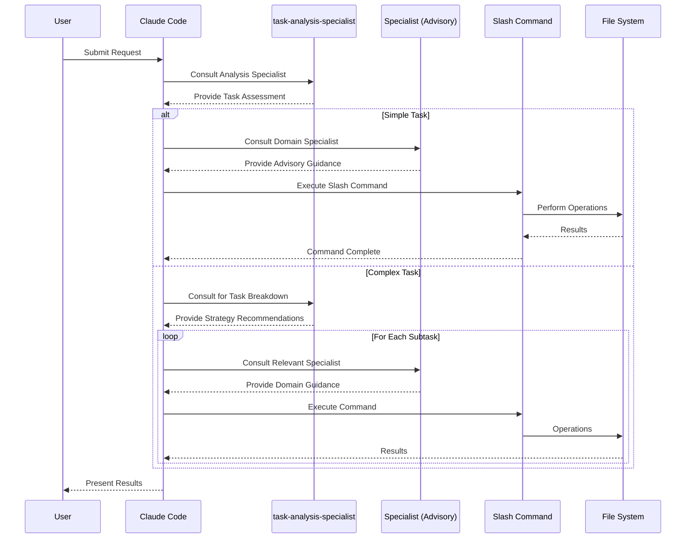
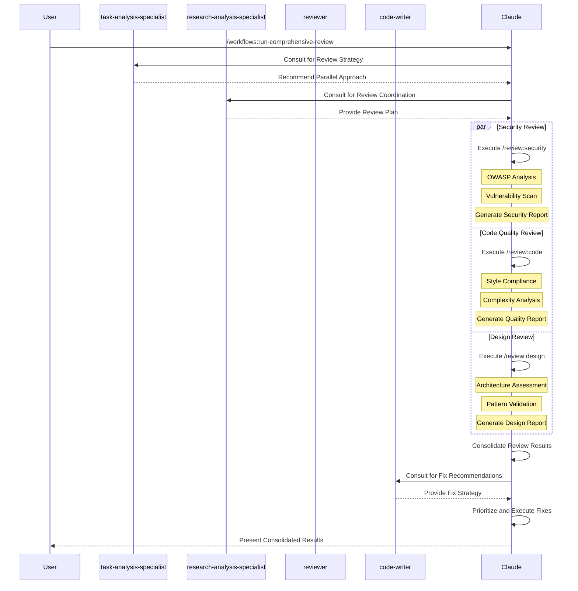
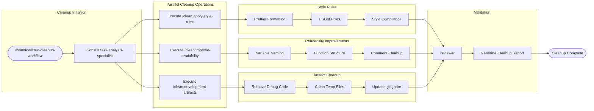
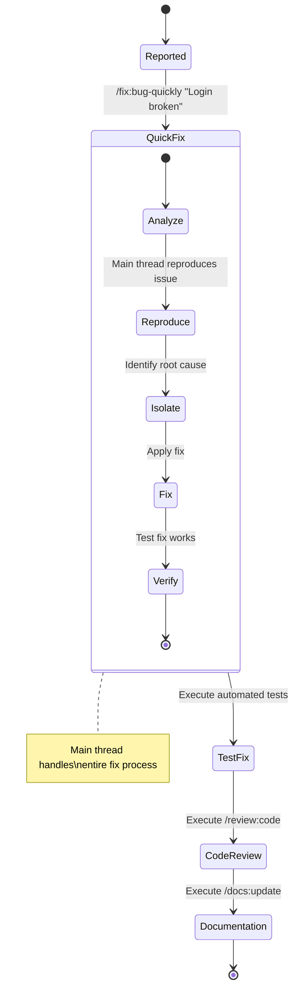
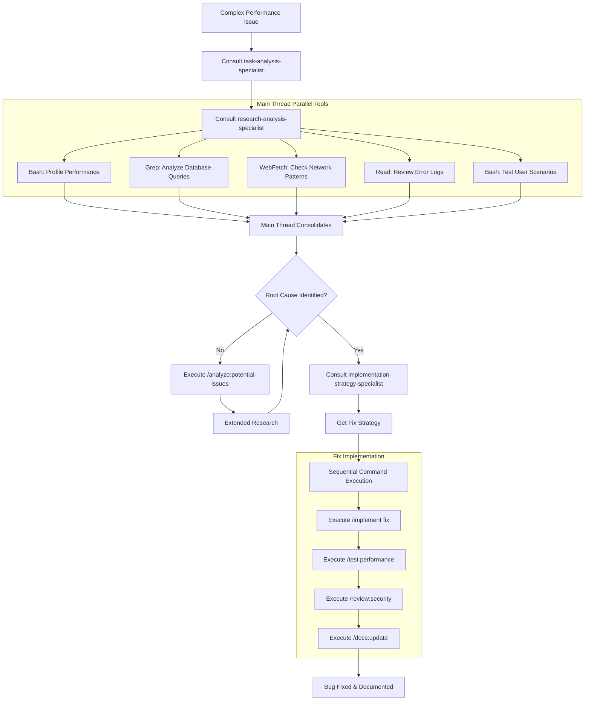
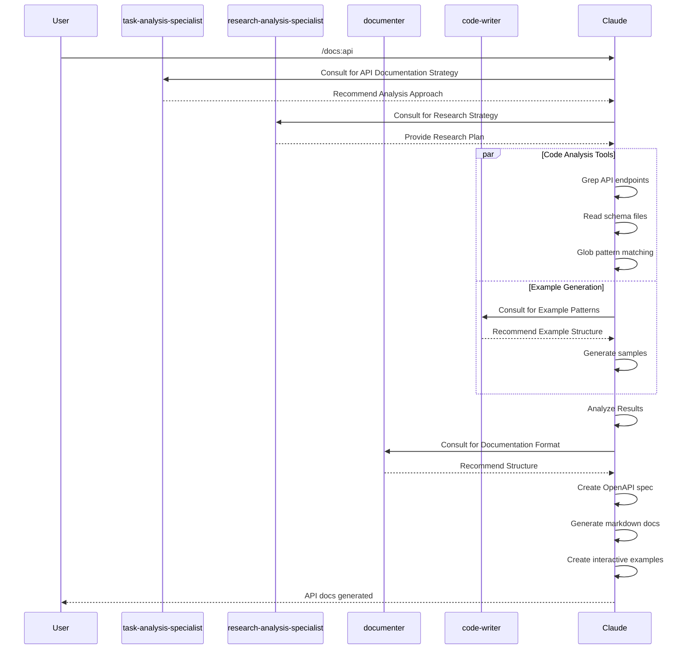
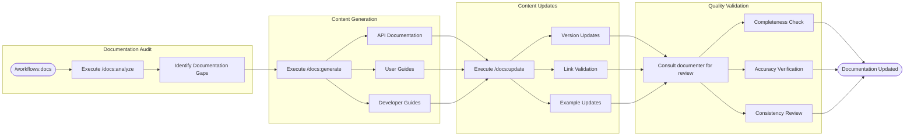
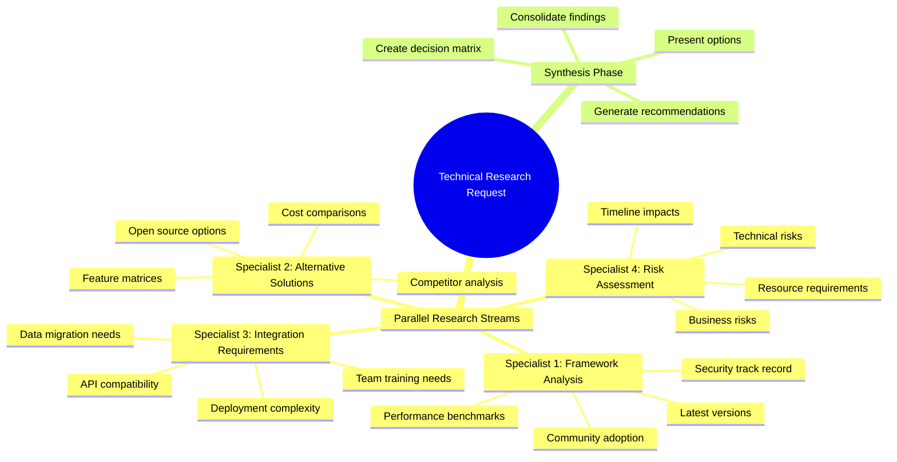
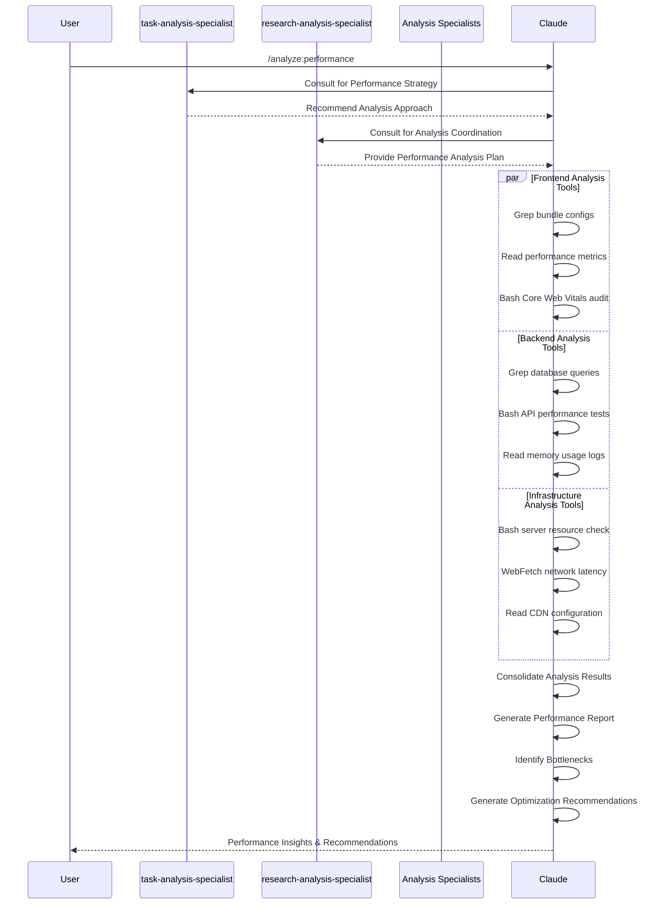
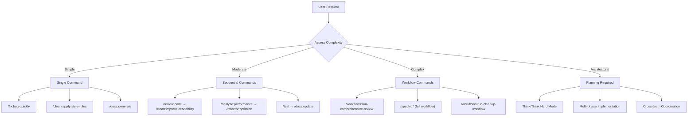

# Typical Workflows Documentation

## Overview

This document illustrates common development workflows using the Claude Code Command System, showing how users interact with
commands, specialist agents provide advisory consultation, and the system delivers results. Each workflow demonstrates the integration between user requests,
Agent Specialist Framework consultation, and command execution.

## Core Workflow Pattern



## Workflow Categories

### 1. Feature Development Workflows

#### Quick Feature Implementation

```mermaid
flowchart TD
    Start([User: "Add login button"]) --> Analyze{Complexity Assessment}

    Analyze -->|Simple| Direct[Main Thread consults code-writer]
    Direct --> Implement[Execute /implement:small]
    Implement --> CodeGen[Generate Code]
    CodeGen --> Review[Auto Review]
    Review --> Done1([Login Button Added])

    Analyze -->|Complex| Research[Main Thread consults research-analysis-specialist]
    Research --> Strategy[Get Research Strategy]
    Strategy --> Execute[Main Thread executes parallel tools]
    Execute --> R1[Read UI Patterns]
    Execute --> R2[Grep Auth Flows]
    Execute --> R3[WebFetch Security Docs]

    R1 --> Synthesize[Main Thread synthesizes]
    R2 --> Synthesize
    R3 --> Synthesize

    Synthesize --> Plan[Consult implementation-strategy-specialist]
    Plan --> Sequence[Execute Sequential Commands]

    Sequence --> S1[/implement UI Component]
    S1 --> S2[/implement Event Handlers]
    S2 --> S3[/test component coverage]
    S3 --> S4[/review:security]
    S4 --> S5[/docs:update]
    S5 --> Done2([Complex Feature Complete])
```

#### Full Spec-Kit Workflow

```mermaid
graph TB
    UserStory["User Story: E-commerce Checkout"] --> Constitution[/speckit:constitution]

    Constitution --> Principles{Project Principles}
    Principles --> P1[Security First]
    Principles --> P2[Performance Standards]
    Principles --> P3[Accessibility Requirements]

    P1 --> Specify[/speckit:specify]
    P2 --> Specify
    P3 --> Specify

    Specify --> Requirements{Requirements Analysis}
    Requirements --> Functional[Functional Requirements]
    Requirements --> NonFunc[Non-Functional Requirements]
    Requirements --> UserStories[User Stories]

    Functional --> Clarify1[/speckit:clarify Round 1]
    NonFunc --> Clarify1
    UserStories --> Clarify1

    Clarify1 --> Questions1[Questions about Edge Cases]
    Questions1 --> Answers1[User Provides Answers]
    Answers1 --> Clarify2[/speckit:clarify Round 2]

    Clarify2 --> Questions2[Questions about Integration]
    Questions2 --> Answers2[User Provides Answers]
    Answers2 --> Plan[/speckit:plan]

    Plan --> Architecture{Architecture Design}
    Architecture --> Frontend[Frontend Strategy]
    Architecture --> Backend[Backend Strategy]
    Architecture --> Database[Database Design]

    Frontend --> Tasks[/speckit:tasks]
    Backend --> Tasks
    Database --> Tasks

    Tasks --> TaskList{Task Breakdown}
    TaskList --> Setup[Setup Tasks]
    TaskList --> Core[Core Implementation]
    TaskList --> Integration[Integration Tasks]
    TaskList --> Testing[Testing Tasks]

    Setup --> Analyze[/speckit:analyze]
    Core --> Analyze
    Integration --> Analyze
    Testing --> Analyze

    Analyze --> Quality{Quality Assessment}
    Quality -->|Pass| Implement[/speckit:implement]
    Quality -->|Fail| FixIssues[Address Issues]
    FixIssues --> Analyze

    Implement --> Done([Checkout Feature Complete])
```

### 2. Code Quality Workflows

#### Comprehensive Code Review



#### Automated Cleanup Workflow



### 3. Bug Fix Workflows

#### Quick Bug Fix



#### Complex Bug Investigation



### 4. Documentation Workflows

#### API Documentation Generation



#### Comprehensive Documentation Update



### 5. Deployment & Operations Workflows

#### Deployment Pipeline

```mermaid
flowchart TD
    Deploy[/deploy production] --> PreCheck[Pre-deployment Checks]

    subgraph "Validation Phase"
        PreCheck --> Tests[/test all]
        Tests --> Security[/review:security]
        Security --> Build[/build production]
    end

    subgraph "Deployment Phase"
        Build --> BackupDB[Backup Database]
        BackupDB --> DeployCode[Deploy Code]
        DeployCode --> RunMigrations[Run Migrations]
        RunMigrations --> UpdateConfigs[Update Configurations]
    end

    subgraph "Verification Phase"
        UpdateConfigs --> HealthCheck[Health Checks]
        HealthCheck --> SmokeTests[Smoke Tests]
        SmokeTests --> MonitoringCheck[Monitoring Validation]
    end

    subgraph "Rollback Decision"
        MonitoringCheck --> Success{Deployment Successful?}
        Success -->|Yes| Complete[Deployment Complete]
        Success -->|No| Rollback[Automated Rollback]
        Rollback --> Investigate[/analyze:potential-issues]
    end

    Complete --> Notify[Send Success Notifications]
    Investigate --> Report[Generate Failure Report]
```

### 6. Research & Analysis Workflows

#### Technical Research



#### Performance Analysis



## Workflow Selection Guide

### Task Complexity Assessment



### Agent Selection Matrix

| Task Type | Domain Analysts Used | Commands Used |
|-----------|----------------------|---------------|
| **Quick Fixes** | debugger-analyst, code-quality-analyst | Manual fixes → /git:commit |
| **Research Tasks** | research-codebase-analyst, research-web-analyst | /explain:*, domain analysts |
| **Implementation** | architecture-analyst, relevant domain analysts | /speckit:implement, manual implementation |
| **Code Review** | Multiple domain analysts in parallel | /workflows:run-comprehensive-review |
| **Documentation** | docs-analyst (multi-perspective), architecture-analyst | /workflows:docs, /docs:changelog |
| **Cleanup Operations** | code-quality-analyst, refactoring-analyst | /workflows:run-cleanup-workflow, /lint:correct-all |
| **Complex Features** | All relevant domain analysts | /speckit:* (full workflow) |

## Best Practices

### Workflow Optimization

1. **Start Simple**: Use single commands for straightforward tasks
2. **Scale Up**: Move to workflows for complex operations
3. **Parallel When Possible**: Use main thread parallel tools for independent tasks
4. **Sequential When Dependent**: Use specialist advisory guidance for ordered operations
5. **Quality Gates**: Include review and analysis steps in complex workflows

### Common Anti-Patterns

❌ **Micro-management**: Breaking simple tasks into unnecessary steps
❌ **Workflow Overuse**: Using complex workflows for simple operations
❌ **Skipping Analysis**: Implementing without understanding requirements
❌ **Ignoring Dependencies**: Running dependent tasks in parallel
❌ **No Quality Gates**: Deploying without review and testing

### Success Metrics

- **Completion Rate**: Percentage of workflows completing successfully
- **Time to Completion**: Average workflow execution time
- **Quality Scores**: Code quality improvements after workflows
- **User Satisfaction**: Feedback on workflow effectiveness
- **Error Reduction**: Decrease in post-workflow issues

These typical workflows demonstrate how the Claude Code Command System coordinates complex development tasks through the Agent Specialist
Framework, where Claude Code orchestrates parallelization and tool execution while specialist agents provide advisory consultation and
recommendations, ensuring powerful automation with quality and consistency.

**Note**: Only the main Claude Code thread can coordinate parallelization and execute tools. All specialist agents function as advisory
consultants that provide specialized analysis and strategic recommendations to the main Claude Code coordinator.
