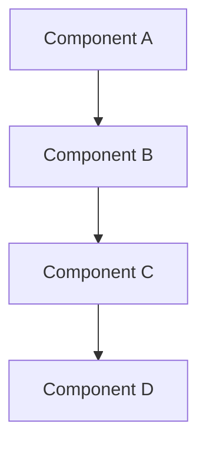
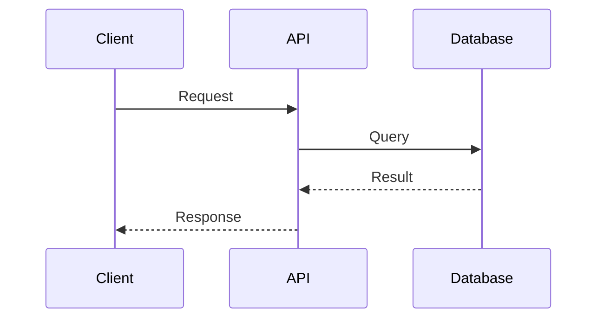
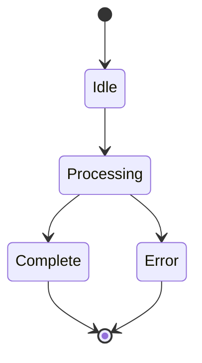
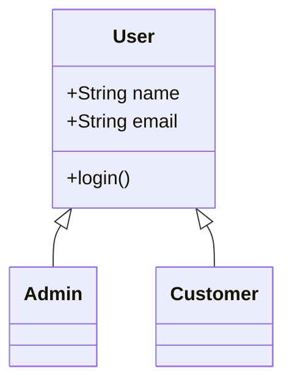
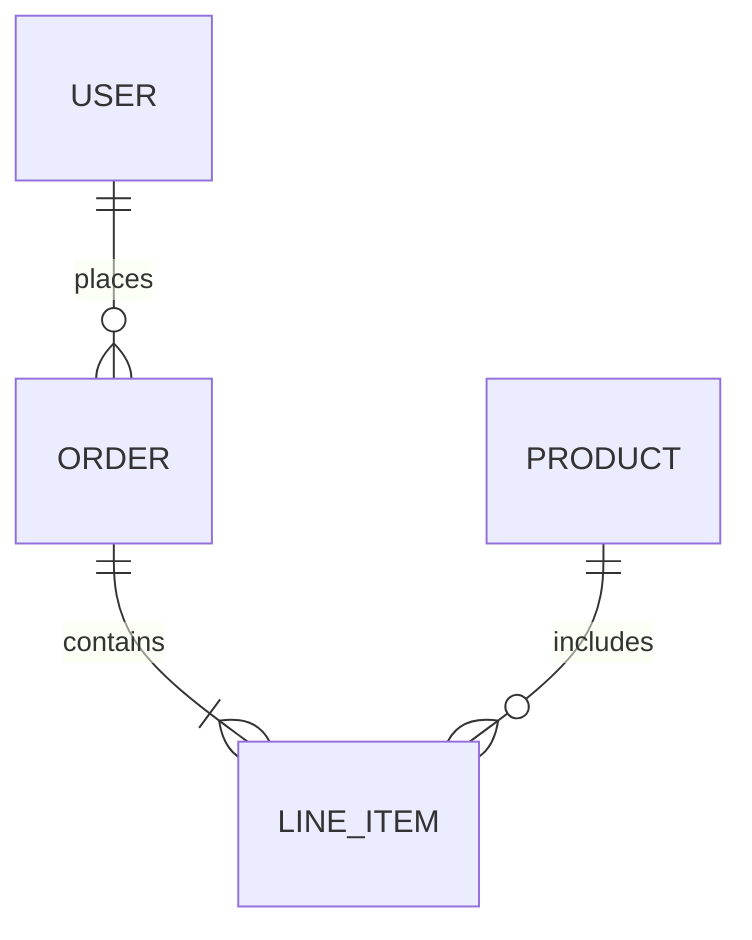
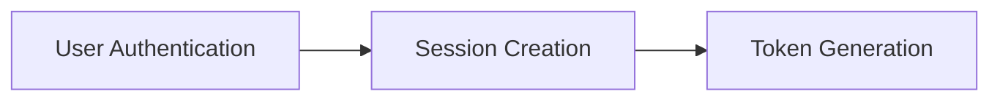
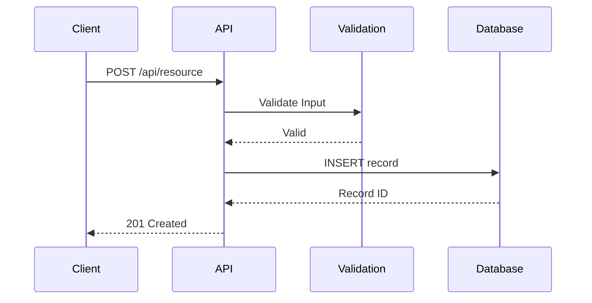
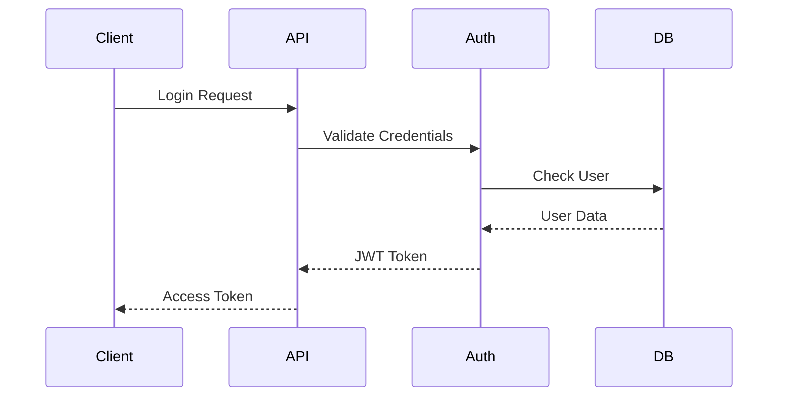
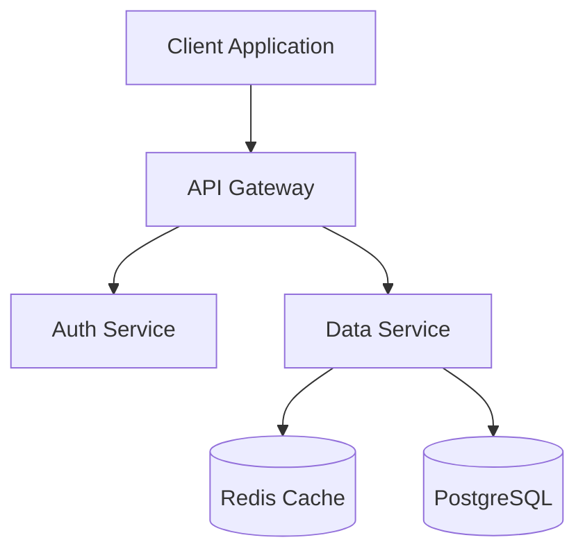
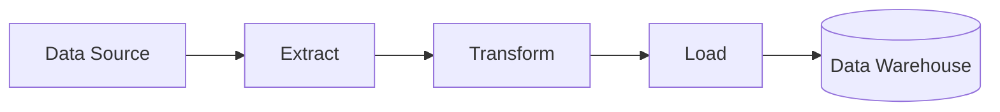

# Mermaid Diagram Integration Guide

**Purpose**: Standard guidance for incorporating Mermaid diagrams into documentation commands.

## Standard Diagram Types

### Architecture Diagrams

Use for visualizing system components and their relationships:

**Variations**:
- `graph TD` - Top-down
- `graph LR` - Left-right
- `graph BT` - Bottom-top
- `graph RL` - Right-left

### Sequence Diagrams

Use for visualizing API flows, authentication sequences, and request/response patterns:

### State Diagrams

Use for visualizing application states and transitions:

### Class Diagrams

Use for visualizing data models and relationships:

### Entity Relationship Diagrams

Use for visualizing database schemas:

## When to Include Mermaid Diagrams

### ✅ Include Mermaid For:

- **System Architecture**: Component relationships, service dependencies
- **API Documentation**: Request/response flows, authentication sequences
- **Data Flow**: How data moves through the system
- **Process Workflows**: Multi-step processes and decision trees
- **Database Schemas**: Entity relationships and table structures
- **State Machines**: Application state transitions
- **Component Integration**: How different services interact

### ❌ Skip Mermaid For:

- **Simple Linear Processes**: Single-step operations
- **Trivial Relationships**: Two components with single connection
- **Single-File Documentation**: Small, self-contained modules
- **Code Examples**: Use code blocks instead
- **Lists of Items**: Use markdown lists instead

## Best Practices

### 1. Keep Diagrams Simple

- **Limit nodes**: 5-10 nodes maximum per diagram
- **One concept**: Focus on single aspect of system
- **Clear labels**: Use descriptive, concise names
- **Logical flow**: Top-to-bottom or left-to-right

### 2. Use Clear Labels

**Good**: Descriptive component names
**Bad**: Generic labels like "Step 1", "Process A"

### 3. Mobile-Friendly Rendering

- Test diagrams render correctly on GitHub mobile
- Avoid extremely wide diagrams
- Use vertical layouts for complex flows
- Keep text readable at mobile sizes

### 4. Maintain Consistency

- Use same diagram style across project
- Follow project color/styling conventions
- Use consistent terminology and naming
- Match diagram structure to codebase architecture

### 5. Keep Diagrams Updated

- Update when architecture changes
- Remove deprecated components
- Reflect current implementation
- Mark deprecated paths explicitly

## Integration Patterns

### Documentation Commands

Commands that commonly use Mermaid diagrams:

- `/docs:generate` - System architecture, component relationships
- `/docs:api` - API flows, authentication sequences
- `/docs:update` - Updated architecture diagrams
- `/explain:architecture` - System design visualization

### Diagram Selection Guide

| Documentation Type | Recommended Diagram | Example Use Case |
|-------------------|---------------------|------------------|
| System Overview | Graph (TD/LR) | Component architecture |
| API Documentation | Sequence | Request/response flow |
| Authentication | Sequence | Login/token flow |
| Database Schema | ERD | Table relationships |
| State Management | State Diagram | Application states |
| Data Processing | Graph (LR) | ETL pipeline |
| Service Integration | Graph (TD) | Microservices architecture |

## Common Patterns

### API Request Flow

### Authentication Sequence

### Service Architecture

### Data Transformation Pipeline

## Accessibility Considerations

- Provide alt text descriptions for screen readers
- Use high-contrast colors
- Include textual descriptions alongside diagrams
- Ensure diagrams have descriptive titles
- Test rendering with accessibility tools

## References

- [Mermaid Official Documentation](https://mermaid.js.org/)
- [GitHub Mermaid Support](https://github.blog/2022-02-14-include-diagrams-markdown-files-mermaid/)
- [Diátaxis Documentation Framework](https://diataxis.fr/)
